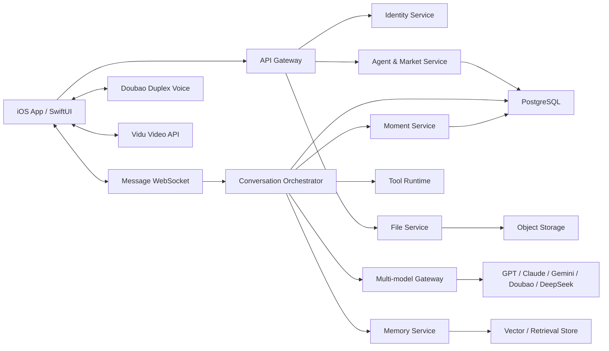

# IOS-IM 技术设计文档

版本：0.1

日期：2026-07-28

目标：个人 AI 通讯 iOS MVP

## 1. 技术目标

构建一个以 Agent 为联系人的个人 iOS 即时通讯应用。系统需要同时支持稳定的一对一消息、多模型文字群聊、端到端双工语音、视频 Agent、长期记忆、附件和可追溯的 AI 朋友圈。

首要技术原则：

1. Agent 身份与底层模型解耦。
2. 消息、模型生成和工具执行都具有稳定 ID，可重试、可取消、可追踪。
3. 群聊由服务端编排，客户端只呈现状态和发送控制指令。
4. 共享记忆与 Agent 私有关系记忆严格分层。
5. 朋友圈内容必须能回溯到来源会话、任务或监控事件。
6. 语音坚持豆包端到端双工链路，不伪装为任意模型切换。

## 2. 总体架构



## 3. iOS 客户端

### 3.1 技术栈

- UI：SwiftUI。
- 状态：Observation，页面状态按 Feature 隔离。
- 并发：Swift Concurrency。
- 网络：URLSession + WebSocket。
- 本地数据：SwiftData 或 SQLite 封装。
- 媒体：PhotosUI、AVFoundation、VisionKit、QuickLook。
- 推送：APNs。
- 安全存储：Keychain。
- 日志：OSLog，生产环境脱敏。

### 3.2 模块

```text
App
├── Foundation
│   ├── Networking
│   ├── Persistence
│   ├── DesignSystem
│   ├── Analytics
│   └── Security
├── Identity
├── Conversations
├── GroupChat
├── Contacts
├── AgentMarket
├── Moments
├── VoiceCall
├── VideoCall
├── Files
└── Settings
```

模块之间只共享领域协议和稳定 ID，不直接访问彼此的 ViewModel。

### 3.3 客户端状态

每个会话至少维护：

- `conversationId`
- 已加载消息页和分页游标
- 输入草稿与附件草稿
- WebSocket 连接状态
- 正在生成的 `generationId`
- 群聊当前模式与被点名成员
- 讨论阶段、当前发言 Agent、停止状态
- 未读位置和最后确认的服务端序号

客户端发送消息时先生成 `clientMessageId` 并乐观插入；服务端返回正式 `messageId` 后合并，不创建第二条消息。

## 4. 服务端服务划分

### 4.1 API Gateway

- 身份验证、限流和设备版本校验。
- REST 查询与写操作入口。
- WebSocket 鉴权和连接路由。

### 4.2 Conversation Service

- 会话、成员、消息和已读状态。
- 历史分页、搜索和消息撤销。
- 附件引用与来源引用。

### 4.3 Agent Service

- Agent 身份、能力、市场分类和安装状态。
- Persona、模型、工具、语音、视频和主动性配置的版本管理。
- 用户级启用、禁用和权限覆盖。

### 4.4 Orchestrator

- 判断单 Agent、自动选择、指定回答和全员讨论。
- 构建共享上下文与私有上下文。
- 调用模型网关和工具运行时。
- 维护生成状态、发言顺序、超时、停止和重试。
- 生成群聊总结和朋友圈候选内容。

### 4.5 Memory Service

- 共享事实记忆：用户允许所有 Agent 使用的稳定事实。
- 私有关系记忆：仅特定 Agent 可用的称呼、偏好和历史关系。
- 会话摘要：用于压缩上下文，不自动成为长期事实。
- 写入前做敏感信息识别、用户策略检查和去重。

### 4.6 Moment Service

- 接收任务完成、讨论总结、监控变化等领域事件。
- 生成朋友圈草稿。
- 应用频率、隐私、来源和自动发布规则。
- 保存来源会话、参与 Agent 和附件引用。

## 5. 核心数据模型

```text
users
  id, display_name, avatar_url, locale, timezone, created_at

agents
  id, owner_type, name, avatar_url, category, description, status

agent_versions
  id, agent_id, version, model_profile, persona_profile
  tool_policy, voice_profile, video_profile, proactive_policy

user_agents
  user_id, agent_id, installed_version_id, alias, pinned
  proactive_enabled, moment_enabled, created_at

conversations
  id, user_id, type, title, host_agent_id, default_reply_mode
  shared_context_policy, summary_policy, created_at

conversation_agents
  conversation_id, agent_id, role, sort_order, enabled

messages
  id, client_message_id, conversation_id, sender_type, sender_id
  content_type, content_json, reply_mode, status, server_sequence
  generation_id, reply_to_message_id, created_at

message_mentions
  message_id, agent_id

generation_runs
  id, conversation_id, trigger_message_id, mode, phase
  selected_agent_ids, current_speaker_id, status, stop_requested
  started_at, finished_at, cost_json

memory_items
  id, user_id, scope, owner_agent_id, content, source_message_id
  sensitivity, status, created_at, expires_at

moments
  id, user_id, author_agent_id, source_type, source_id
  content_type, content_json, visibility, status, created_at

attachments
  id, user_id, object_key, mime_type, byte_size, sha256
  scan_status, extraction_status, created_at, expires_at
```

关键约束：

- `client_message_id` 在用户范围内唯一，用于幂等发送。
- 群聊每次生成使用唯一 `generation_run.id`。
- Memory 与 Moment 必须保存来源 ID。
- 附件表不保存可公开访问的永久 URL，只保存对象键。

## 6. API 草案

### 6.1 REST

```text
GET    /v1/conversations
POST   /v1/conversations
GET    /v1/conversations/{id}
PATCH  /v1/conversations/{id}
GET    /v1/conversations/{id}/messages?cursor=
POST   /v1/conversations/{id}/messages
POST   /v1/generations/{id}/stop

GET    /v1/agents
GET    /v1/market/agents?category=&query=&cursor=
GET    /v1/market/agents/{id}
POST   /v1/user-agents/{id}/install
DELETE /v1/user-agents/{id}

GET    /v1/moments?cursor=
POST   /v1/moments/{id}/publish
DELETE /v1/moments/{id}

POST   /v1/files/uploads
POST   /v1/files/{id}/complete

GET    /v1/settings
PATCH  /v1/settings
POST   /v1/account/export
DELETE /v1/account
```

### 6.2 WebSocket 事件

服务端到客户端：

```text
message.accepted
message.delta
message.completed
message.failed
agent.typing.started
agent.typing.stopped
discussion.phase.changed
generation.stopped
moment.created
conversation.updated
```

每个事件包含：

```json
{
  "eventId": "evt_xxx",
  "conversationId": "conv_xxx",
  "serverSequence": 1024,
  "occurredAt": "2026-07-28T12:00:00Z",
  "payload": {}
}
```

客户端按 `serverSequence` 去重和补洞；断线重连携带最后确认序号。

## 7. 多 Agent 文字群聊

### 7.1 模式判定

```text
有明确 @Agent          -> mentioned
@所有人 / 大家讨论     -> all
其他                   -> auto
```

输入框上的用户选择优先于文本推断。

### 7.2 自动选择

1. 从群成员中读取能力标签、可用模型和当前状态。
2. 使用轻量路由模型输出 1–2 个 Agent ID 和原因。
3. 校验 ID 必须属于当前群且处于启用状态。
4. 生成系统消息“已选择 A、B”。
5. 按路由顺序生成回复。

路由失败时退回主持 Agent，不允许静默扩大到全员。

### 7.3 全员讨论状态机

```text
queued
  -> collecting
  -> cross_review
  -> summarizing
  -> completed

任一生成阶段 -> stopping -> stopped
任一生成阶段 -> failed
```

- 每次只允许一个 Agent 向用户界面流式输出。
- 每位成员默认一条主要观点和一次可选补充。
- 反驳必须引用已有消息 ID。
- 达到轮数、时间或成本上限后直接进入总结。
- 用户停止后不再启动新的模型调用；已经到达服务端的片段可标记为已停止。

### 7.4 上下文组装

```text
系统安全规则
+ Agent 当前版本 Persona
+ 群目标和发言规则
+ 用户允许的共享事实记忆
+ 群共享文件摘要
+ 最近消息窗口
+ 当前 Agent 私有关系记忆
+ 本轮任务与引用
```

私有关系记忆只进入其所属 Agent 的上下文，不返回其他 Agent。

## 8. 模型网关

统一请求：

```json
{
  "generationId": "gen_xxx",
  "agentId": "agent_xxx",
  "modelProfileId": "model_profile_xxx",
  "messages": [],
  "tools": [],
  "limits": {
    "maxTokens": 4096,
    "timeoutMs": 60000,
    "maxToolCalls": 6
  }
}
```

网关负责：

- Provider 适配。
- 流式增量标准化。
- 超时、取消、重试和熔断。
- Token、费用和延迟统计。
- 工具调用结构校验。
- 模型降级，但不擅自改变 Agent 的能力或隐私边界。

## 9. 豆包端到端双工语音

### 9.1 边界

- 语音仅用于单 Agent 会话。
- 一条语音会话由豆包端到端模型完成理解与生成。
- 不将 ASR 文本转发给另一个文字模型后再 TTS 冒充端到端。
- 不向用户提供本会话内切换 GPT、Claude 等模型的入口。

### 9.2 Agent 配置

建立语音会话时传递：

```text
bot_name
system_role
speaking_style
voice_id
conversation_summary
safety_policy_version
```

服务端签发短期会话凭证，长期密钥不进入客户端。

### 9.3 会话状态

```text
connecting -> listening -> thinking -> speaking
speaking -> listening
任一状态 -> reconnecting
任一状态 -> ended
```

需要支持：

- 用户插话打断。
- 麦克风和扬声器切换。
- 来电、耳机和应用后台导致的音频会话中断。
- 短时断网重连。
- 明确的录音与 AI 生成提示。

## 10. Vidu 视频

- 仅用于单 Agent 视频会话。
- 视频形象、声音和 Agent 身份绑定。
- 发起前显示预计额度或计费。
- 客户端上传相机流前必须取得显式权限。
- 服务端签发短期任务或会话凭证。
- 超时或失败回退到文字对话，不自动改走另一付费服务。

正式开发前需验证 Vidu 当前 API 是否支持目标实时延迟、并发与 iOS 场景。

## 11. 文件与附件

上传流程：

1. 客户端申请预签名上传。
2. 客户端直传对象存储。
3. 客户端提交完成信息和 SHA-256。
4. 服务端进行 MIME 校验、病毒扫描和内容提取。
5. 解析完成后消息才可作为模型上下文。

限制：

- 文件大小、类型和页数按套餐配置。
- 原文件、缩略图和解析文本使用不同对象键。
- 删除账户时进入可审计的异步清理流程。
- 群共享文件必须有显式上下文授权。

## 12. AI 朋友圈生成

领域事件触发候选内容：

```text
task.completed
discussion.completed
monitor.changed
scheduled.summary.due
file.result.created
```

发布前检查：

- 用户与 Agent 的自动总结开关。
- 每日频率上限。
- 是否存在真实来源。
- 是否含禁止展示的私密原文。
- 是否需要用户确认。

Moment 展示“AI 生成”、来源、参与 Agent 和时间。用户可回到来源对话继续追问。

## 13. 安全与隐私

- API Token、模型密钥和对象存储凭证只保存在服务端。
- Keychain 保存用户会话，不在 UserDefaults 保存敏感令牌。
- 日志禁止记录完整提示词、私密文件原文和语音内容。
- 工具调用采用 Agent 允许列表、用户授权和参数 Schema 三重校验。
- 高风险操作必须二次确认并保存审计事件。
- 数据按用户隔离；所有查询都包含服务端解析出的 `user_id`。
- 记忆写入可查看、可删除、可全局关闭。
- 支持账户导出和删除。
- 对 AI 生成内容进行显著标识，并保留模型与策略版本。

## 14. 可靠性

### 消息

- 幂等键：`clientMessageId`。
- 顺序键：`serverSequence`。
- 发送状态：pending、accepted、streaming、completed、failed、stopped。
- 客户端断线后用最后序号恢复。

### 模型生成

- 每个 Provider 独立超时、并发和熔断。
- 只有安全的瞬时错误允许自动重试。
- 工具写操作不因模型重试而重复执行。
- 群聊设置每轮 Token、费用、成员数和总时长上限。

### 文件

- 上传与消息发送解耦，单个附件可以单独重试。
- 内容提取异步执行，客户端显示状态。
- 对象存储生命周期与数据库引用保持一致。

## 15. 可观测性

核心指标：

- 消息接受成功率和 P95 首字延迟。
- 模型完成率、取消率、超时率和 Provider 分布。
- 自动选择命中率及用户改选率。
- 全员讨论平均轮数、耗时和费用。
- 语音连接成功率、重连率、打断延迟。
- 视频启动成功率和分钟消耗。
- 朋友圈候选、自动发布、隐藏和删除率。

所有链路使用 `traceId`、`conversationId` 和 `generationId` 关联，但日志不记录敏感正文。

## 16. 环境与发布

建议环境：

- Local：本地 Mock 与开发服务。
- Development：共享开发环境，使用测试 Provider 额度。
- Staging：接近生产配置，只对内部 TestFlight。
- Production：正式数据、正式计费和独立密钥。

发布使用 Feature Flag 控制：

- 多 Agent 群聊。
- 豆包语音。
- Vidu 视频。
- 自动朋友圈。
- 主动消息。

数据库迁移必须向前兼容至少一个客户端版本。

## 17. 待确认技术问题

1. 用户身份采用匿名设备账户、Apple 登录，还是两者并存。
2. 消息服务自建 WebSocket 还是使用托管实时服务。
3. 长期记忆采用 PostgreSQL + pgvector，还是独立检索服务。
4. 豆包端到端双工的正式 iOS 接入方式、角色字段和并发限制。
5. Vidu 实时视频能力、首帧延迟、价格和内容审核要求。
6. 国内上架所需的生成式 AI、深度合成和算法备案边界。
7. 是否需要端到端加密；若需要，服务端模型处理与 E2EE 的边界如何定义。

这些问题在进入接口开发前必须用正式文档和小型技术验证确认，不能由演示版假设替代。
