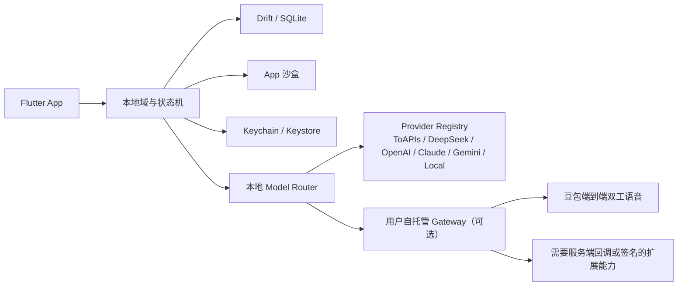

# IOS-IM 技术设计文档

版本：2.0
日期：2026-07-28
状态：开源、本地优先基线

## 1. 技术目标

Halo 是无账号、无官方后台依赖的个人 AI 通讯应用，同时支持 iOS 与 Android。

1. 安装后直接进入应用。
2. 对话、Agent、记忆和附件默认保存在本机。
3. 用户在设置中自行配置一个或多个模型 Provider 与 API Key。
4. 支持 ToAPIs、厂商官方 API、自定义 OpenAI-compatible 服务和本地模型。
5. 豆包端到端语音、Vidu 等需要签名或临时凭证的服务通过用户自托管 Gateway。
6. 首版文字群聊，语音与视频仅支持一对一 Agent。

## 2. 总体架构



不存在 Halo 官方 Identity Service、消息云存储、平台 Token 账本或支付服务。

## 3. Flutter 客户端

### 技术栈

- UI：Flutter + 自有 Design System。
- 状态：Riverpod。
- 路由：go_router，无认证守卫。
- 网络：Dio、WebSocket、SSE。
- 本地数据：Drift / SQLite。
- 安全存储：flutter_secure_storage 封装 iOS Keychain 与 Android Keystore。
- 媒体：PhotosUI / Photo Picker、AVFoundation / Media3、CameraX。
- 日志：结构化且默认脱敏。

### 模块

```text
lib/
├── app/
├── foundation/
│   ├── database/
│   ├── files/
│   ├── network/
│   ├── security/
│   └── design_system/
└── features/
    ├── conversations/
    ├── group_chat/
    ├── expert_team/
    ├── agent_market/
    ├── circle/
    ├── memory/
    ├── providers/
    ├── local_data/
    ├── voice/
    └── video/
```

## 4. 数据模型

核心实体：

- `AgentProfile`：身份、提示词、工具、模型引用、声音和视频形象。
- `Conversation`：单聊、群聊、系统会话或任务会话。
- `Message`：内容、状态、引用、附件和生成来源。
- `AgentMemory`：共享事实或 Agent 私有关系记忆。
- `ProviderConfig`：非敏感 Provider 元数据和 Vault 引用。
- `Run`：一次模型生成、工具执行或群聊编排。
- `AgentMessage`：一次 Run 内专家之间的结构化提问、委派、交付、批评或核验请求。
- `CirclePost`：专家主动分享，或由对话、任务、定时任务、监控产生的圈层动态。
- `CirclePublishingPolicy`：按 Agent 保存是否允许发布到圈层；默认允许。关闭后不影响该 Agent 的对话、任务、定时任务和监控，也不删除历史动态。

API Key 与 Gateway 令牌不属于数据库模型，只以 Vault 引用读取。

## 5. Provider 抽象

```dart
abstract interface class ModelProvider {
  ProviderCapabilities get capabilities;
  Stream<ModelEvent> generate(ModelRequest request);
  Future<ConnectionResult> testConnection();
  Future<List<ModelDescriptor>> listModels();
}
```

业务代码不得引用厂商 SDK 类型。Provider 适配器负责鉴权、请求格式、流式事件、错误归一化和用量解析。

本地 Router 的输入包括：

- Agent 指定 Provider / 模型。
- 文字、图像、工具、实时语音或视频能力。
- 用户默认路由规则。
- Provider 是否已配置和当前健康状态。

MVP 建立 `ProviderRegistry` 与多 Adapter 架构。ToAPIs 负责聚合模型与图片/视频；DeepSeek、OpenAI、Anthropic、Gemini 可使用官方 Key；其他服务优先通过自定义 OpenAI-compatible Adapter 接入。模型引用必须同时包含 `providerId` 与 `modelId`。总体合同见 [多模型 Provider 接入架构](06-multi-provider-model-access.md)，ToAPIs 专项接口见 [ToAPIs 模型中转站接入方案](05-toapis-provider-integration.md)。

## 6. 群聊编排

群聊状态机运行在客户端：

- `auto`：本地 Router 选择 1–2 个 Agent。
- `mentioned`：只运行被点名 Agent。
- `all`：按队列运行全部 Agent，允许限定轮次的补充和反驳，最后生成总结。

每个 Run 必须有稳定 ID、阶段、取消信号和落库状态。达到轮数、时间或模型用量上限时强制总结或终止。

LangGraph 不再是 MVP 的强制服务端依赖；后续若需要复杂图执行，可作为可选本地/自托管 Runner 接入。

## 7. 本地存储

| 数据 | 存储 |
|---|---|
| 会话、消息、Agent、记忆、任务 | SQLite |
| 图片、语音、视频、文件 | App 沙盒 |
| API Key、Gateway 令牌 | Keychain / Keystore |
| 缩略图、临时转码 | Cache |

数据库必须带 schema version 和迁移测试。附件通过内容哈希去重，删除会话时使用引用计数避免误删共享文件。

## 8. 导入导出

导出包含：

- 版本化 manifest。
- 结构化 JSON 或 SQLite 快照。
- 附件与哈希清单。

导出不包含：

- API Key。
- Gateway 令牌。
- 缓存、缩略图和临时文件。

导入先校验版本、大小、哈希和空间余量；默认合并并为冲突实体生成新 ID。

## 9. 自托管 Gateway

Gateway 是独立开源可选组件，提供：

- `/healthz` 与版本协商。
- 短期凭证签发。
- 服务端签名。
- WebSocket / SSE 协议适配。
- 用户可选的统一网络出口。

它不保存 Halo 对话、记忆或附件，不实现账户和平台计费。推荐 Docker Compose 交付，配置通过环境变量或本地 Secret 文件注入。

## 10. 安全

- Keychain 使用设备级保护，不默认进入可迁移备份。
- 日志禁止记录完整密钥、Prompt、消息正文和附件正文。
- 导出前扫描常见密钥格式。
- 网络请求设置证书校验、超时、重试上限和取消。
- Provider 连接测试不发送用户对话。
- 清除数据、覆盖导入和移除密钥必须显式确认。

## 11. 测试

- 单元：Router、状态机、Repository、Vault 引用和导出过滤。
- Widget：四 Tab、Provider 设置、本地数据和群聊模式。
- 集成：真实 Provider 沙盒、弱网、流式中断恢复、Gateway 版本不兼容。
- 安全：日志脱敏、备份泄漏、剪贴板和 Keychain 可访问级别。

详细边界见 [开源本地优先架构](04-local-first-open-source-architecture.md)。
