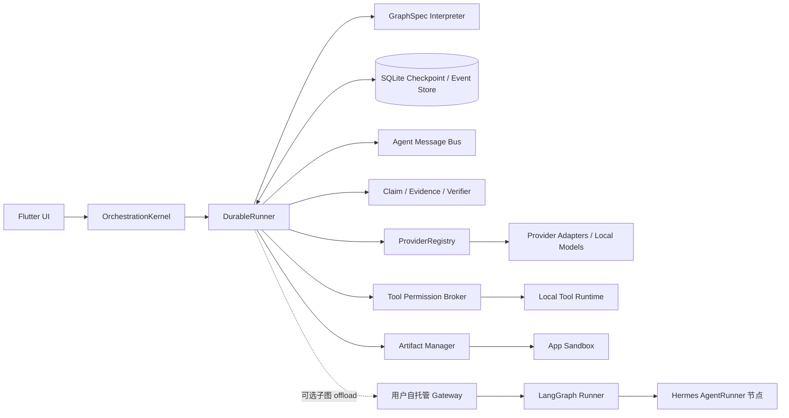

# Halo 本地多 Agent 编排架构

版本：2.0
日期：2026-07-29
状态：本地优先实施基线；LangGraph 仅作为可选自托管 Gateway 扩展

## 1. 目标与边界

Halo 的文字多 Agent 编排默认完全运行在 Flutter / Dart 客户端，不要求账号、Halo 托管后台或远端编排服务。本文定义：

- Flutter / Dart `OrchestrationKernel`。
- 可序列化、可迁移的 `GraphSpec`。
- 基于 SQLite Checkpoint / Event Store 的 `DurableRunner`。
- `ProviderRegistry` 与统一模型事件。
- 受控的 `Agent Message Bus`。
- `Claim / Evidence / Verifier` 事实可信链路。
- `Tool Permission Broker` 与 `Artifact Manager`。
- 可选的用户自托管 Gateway / LangGraph 子图执行。
- Hermes 作为重型 `AgentRunner` 节点时的边界。

群聊保留三种回复模式：

1. `auto`：本地 Router 从当前群成员中选择最合适的 1–2 个 Agent。
2. `mentioned`：只运行结构化 `mentionedAgentIds` 中的 Agent。
3. `all`：当前群成员依次发表观点，在有限轮次内补充或反驳，最后生成总结。

本文只覆盖文字群聊和由文字任务触发的工具、核验与成果生成。一对一实时语音、图片和视频生成使用各自的 Provider 能力；它们可以产生事件和 Artifact，但不进入实时群聊发言循环。

相关基线：

- [总体技术方案](01-system-technical-design.md)
- [开源本地优先架构](04-local-first-open-source-architecture.md)
- [多模型 Provider 接入架构](06-multi-provider-model-access.md)
- [Agent 事实可信与证据协议](07-agent-truthfulness-evidence-protocol.md)

## 2. 核心决策

### 2.1 本地是默认执行面与数据真相源

`OrchestrationKernel` 在 Flutter 进程内解释 `GraphSpec`，`DurableRunner` 负责节点调度、Checkpoint、事件落库、取消和恢复。会话、Run、AgentMessage、Claim、Evidence 和 Artifact 元数据默认保存在本机 SQLite；文件正文保存在 App 沙盒；Provider Key 保存在 Keychain / Keystore。

普通群聊、路由、模型调用、工具授权和事实核验不得因为没有 Gateway 而失效。

### 2.2 GraphSpec 是合同，Runner 是实现

业务流程不硬编码成散落的页面回调，也不绑定某个图框架。每个可执行流程都由带版本的 `GraphSpec` 描述；本地 Runner 和可选 Gateway Runner 使用同一节点语义、状态 Schema 与事件协议。

GraphSpec 只允许声明式节点和受限条件表达式，不允许携带任意宿主语言、脚本或远端代码。

### 2.3 可选 Gateway 只接管明确 offload 的子图

用户配置并启用自托管 Gateway 后，Kernel 才能把满足条件的子图交给 Gateway。一次节点执行只能有一个执行所有者：本地或 Gateway。Gateway 不自动获得整个数据库、私有记忆或资产库访问权。

LangGraph 可以实现 Gateway 内部的 Durable Runner，但不是 Flutter 客户端、GraphSpec 或本地状态存储的必需依赖。

### 2.4 Hermes 只是一种重型 AgentRunner

Hermes 可以在自托管 Gateway 中承担深度研究、长上下文、多工具循环等重型 `agent.run` 节点。它不能：

- 取代 `OrchestrationKernel`。
- 直接修改 Run 权威状态。
- 绕过 Tool Permission Broker。
- 读取未授权私有记忆或资产。
- 自行决定群聊成员、预算、发布或长期记忆写入。

## 3. 总体架构



| 组件 | 职责 | 不负责 |
|---|---|---|
| `OrchestrationKernel` | 校验 GraphSpec、建立 Run、选择执行所有者、暴露启动/停止/恢复 API | 模型厂商协议、文件正文存储 |
| `DurableRunner` | 调度节点、持久化状态、预算、重试、取消、恢复 | 自行扩大权限或补写事实 |
| `GraphSpec Interpreter` | 解释节点、边和受限条件 | 执行任意代码 |
| SQLite Store | Event、Checkpoint、Outbox、执行收据与索引 | 保存 Provider Key |
| `ProviderRegistry` | 模型能力发现、Adapter 生命周期、统一流式事件 | 判断事实是否可信 |
| Agent Message Bus | 专家间结构化通讯、队列、预算、去重 | 自由私聊或跨 Run 后台会话 |
| Trust Pipeline | Claim 提取、证据解析、独立核验、发布闸门 | 用多数投票代替证据 |
| Tool Permission Broker | 工具能力、参数、授权、幂等和审计 | 代替工具执行结果 |
| Artifact Manager | 资产授权、哈希、血缘、临时文件和原子提交 | 枚举未授权文件 |
| Gateway Runner | 执行显式 offload 子图并返回统一事件 | 成为 Halo 账户、消息或附件中心 |

## 4. GraphSpec

### 4.1 可序列化结构

GraphSpec 使用可导出 JSON。以下对象包含 Validator 要求的全部必填字段，是可直接通过校验的最小完整图：

```json
{
  "schemaVersion": 1,
  "graphId": "halo.noop",
  "graphVersion": 1,
  "stateSchemaRef": {
    "schemaId": "halo.orchestration.run-state",
    "version": 1
  },
  "entryNodeId": "load_context",
  "terminalNodeIds": ["done"],
  "nodes": [
    {
      "id": "load_context",
      "type": "context.load",
      "config": {},
      "timeoutMs": 5000,
      "retryPolicy": {
        "maxAttempts": 1,
        "backoff": "none",
        "retryableErrors": []
      },
      "sideEffectPolicy": "none"
    },
    {
      "id": "done",
      "type": "event.emit",
      "config": {
        "eventType": "run.completed"
      },
      "timeoutMs": 1000,
      "retryPolicy": {
        "maxAttempts": 1,
        "backoff": "none",
        "retryableErrors": []
      },
      "sideEffectPolicy": "localTransaction"
    }
  ],
  "edges": [
    {
      "from": "load_context",
      "to": "done",
      "priority": 0
    }
  ],
  "limits": {
    "maxNodeExecutions": 2,
    "maxWallTimeMs": 10000,
    "maxParallelNodes": 1
  },
  "requiredCapabilities": ["sqlite.checkpoint"],
  "integrity": {
    "contentHash": "sha256:261374d7a900ebc271a42a1bb2c93cb8228c62bd91178b4464b3e5c8a1e59788"
  }
}
```

规则：

- `graphId + graphVersion + contentHash` 唯一确定可执行定义。
- `stateSchemaRef.schemaId + stateSchemaRef.version` 指定节点读写的状态合同；本地与 Gateway 必须先验证支持该精确版本，不能按“字段大致相同”执行。
- Run 创建后冻结 GraphSpec 引用；升级后的新版本只影响新 Run。
- Node ID 在同一 GraphSpec 内唯一，Edge 必须引用存在的节点。
- `terminalNodeIds` 非空、必须引用无出边节点；每个可达的非终止节点至少有一条出边。
- Kernel 在运行前检查不可达节点、无出口循环、能力缺失和预算上限。
- 从外部导入的 GraphSpec 必须先校验 Schema、大小、节点白名单和哈希。

### 4.2 Canonicalization 与完整性

`integrity.contentHash` 按以下唯一算法生成和验证：

1. 解析 JSON，拒绝重复键、非法 Unicode、非有限数值和超出 Schema 的数值。
2. 从对象中删除 JSON Pointer `/integrity/contentHash`；保留其余字段，包括空的 `integrity` 对象。
3. 按 RFC 8785 JSON Canonicalization Scheme（JCS）序列化，不做 Unicode 归一化。
4. 对 canonical UTF-8 bytes 计算 SHA-256。
5. 以小写十六进制写为 `sha256:<64 hex>`。

签名、缓存键、本地/Gateway capability negotiation 和 GraphSpec 去重都使用同一 canonical bytes。Validator 必须用上述算法复算哈希；不能信任导入对象自带的哈希。

### 4.3 本地支持的节点类型

| 节点类型 | 语义 | Checkpoint 边界 |
|---|---|---|
| `context.load` | 冻结群成员、消息窗口、共享上下文和允许的私有记忆引用 | 完成后 |
| `mode.resolve` | 解析 `auto / mentioned / all` 与事实回答模式 | 完成后 |
| `agent.select` | 确定性过滤后调用轻量 Router，选择当前群成员 | 完成后 |
| `queue.build` | 构建发言、Review 或协作队列 | 完成后 |
| `queue.next` | 原子领取下一个未完成工作项 | 领取时与完成时 |
| `agent.run` | 通过 AgentRunner + ProviderRegistry 执行一次具名 Agent Turn | 调用前、终态后 |
| `agent.persistMessage` | 只把消息写为 `draft` 或 `pending_verification`，不得提前完成或发布 | 草稿提交时 |
| `bus.validate` | 校验专家通讯目标、Payload、权限和预算 | 完成后 |
| `bus.publish` | 持久化 AgentMessage 并加入接收方队列 | 原子提交时 |
| `claim.extract` | 把事实性输出拆成原子 Claim | 完成后 |
| `evidence.resolve` | 从授权消息、Asset、网页或工具结果解析 EvidenceRef | 每批证据后 |
| `claim.verify` | 由独立 Verifier 核验 Claim | 每批 Claim 后 |
| `claim.revise` | 允许原作者依据核验结果修订一次 | 完成后 |
| `discussion.summarize` | 只基于 Claim Ledger 与已标注观点生成总结 | 完成后 |
| `publish.gate` | 检查引用、风险、用户确认、圈层权限和记忆规则；通过后原子完成或发布 | 决策与状态转换同事务 |
| `tool.request` | 向 Tool Permission Broker 提交结构化调用 | 授权前、收据后 |
| `artifact.commit` | 校验哈希并原子提交输出文件 | 提交前、提交后 |
| `budget.check` | 检查 Token、时间、轮数、通讯和工具预算 | 每次分支前 |
| `loop.guard` | 按因果链和 Payload 哈希阻断重复循环 | 计数更新后 |
| `branch` | 根据受限表达式选择一条边 | 完成后 |
| `join` | 等待指定分支达到终态并合并引用 | 完成后 |
| `event.emit` | 发出用户可见的阶段或进度事件 | 与 Event 同事务 |
| `gateway.subgraph` | 将声明的子图交给已启用 Gateway | 移交前、回执后 |

本地 Runner 不支持任意脚本节点、动态下载代码节点或未注册工具节点。需要的新能力必须先注册为带 Schema、权限和恢复策略的节点类型。

### 4.4 `when` 条件语言

条件语言使用以下 EBNF；空白仅允许出现在 Token 之间：

```ebnf
expression   = orExpr ;
orExpr       = andExpr, { "||", andExpr } ;
andExpr      = unaryExpr, { "&&", unaryExpr } ;
unaryExpr    = [ "!" ], primary ;
primary      = "(", expression, ")"
             | "exists", "(", path, ")"
             | "isNull", "(", path, ")"
             | "contains", "(", path, ",", literal, ")"
             | path, comparator, literal ;
comparator   = "==" | "!=" | "<" | "<=" | ">" | ">=" ;
path         = "$", { ".", identifier | "[", unsignedInteger, "]" } ;
literal      = jsonString | signedInt64 | "true" | "false" | "null" ;
identifier   = ( letter | "_" ), { letter | digit | "_" } ;
letter       = ? ASCII U+0041..U+005A or U+0061..U+007A ? ;
digit        = ? ASCII U+0030..U+0039 ? ;
```

`letter` 明确定义为 ASCII `A–Z / a–z`，即 U+0041–U+005A 或 U+0061–U+007A；`digit` 明确定义为 ASCII `0–9`，即 U+0030–U+0039。`jsonString` 使用 RFC 8259 字符串；`signedInt64` 为十进制、禁止前导零且数值必须位于 `-2^63` 到 `2^63-1`；`unsignedInteger` 为零或无前导零的正整数。

正式语义：

- Path 必须能由 `stateSchemaRef` 静态解析；动态键、通配符、函数调用、正则表达式、浮点数和时间隐式转换均不支持。
- `== / !=` 要求字段与 literal 的 Schema 类型相同；`< / <= / > / >=` 只允许 signed 64-bit integer。
- `contains(path, literal)` 的 Path 必须是元素类型与 literal 相同的数组，按值精确匹配。
- `exists(path)` 是唯一允许查询可选字段是否缺失的操作；`isNull(path)` 要求字段存在且 Schema 允许 null。
- 直接读取缺失字段产生 `condition_missing_field`；类型不匹配产生 `condition_type_error`；溢出、非法语法或未知 Path 在 GraphSpec 校验阶段拒绝。
- `!`、`&&`、`||` 按上面优先级从左到右求值，并使用确定性短路；不读取被短路的分支。
- 同一节点的条件出边必须有互不重复的 `priority`，按升序评估，首个为 true 的边胜出。每个节点最多一条省略 `when` 的默认边，且默认边最后评估。
- 条件错误使当前节点以结构化错误失败，不静默当作 false，也不选择默认边。
- 求值不得读取本机时间、随机数、环境变量或远端状态。同一 State、GraphSpec 和 Schema 必须在 Dart 与 Gateway 得到相同结果。

### 4.5 条件、循环与 Validator

- Edge 的 `when` 省略表示默认边；存在 `when` 时必须符合 4.4。
- 每条条件边都必须有稳定且唯一的优先级；Validator 拒绝同一节点的重复优先级。
- 循环必须经过 `budget.check` 和 `loop.guard`。
- `all` 模式默认最多两轮：一次主要观点、一次补充或反驳。
- `agent.run`、`tool.request` 和 `gateway.subgraph` 不允许成为无预算循环的一部分。
- 超过 GraphSpec 或 Run 预算后进入 `budget_exhausted` 路径，不再创建新 Generation 或工具调用。

## 5. 状态数据结构

所有状态必须可编码为版本化 JSON；运行状态只保存小型控制字段和稳定引用，不内嵌附件正文、完整网页或长记忆。

### 5.1 RunState

| 字段 | 类型 | 说明 |
|---|---|---|
| `schemaVersion` | integer | 状态 Schema 版本 |
| `runId` | string | 稳定 Run ID |
| `graphRef` | object | `graphId / graphVersion / contentHash` |
| `conversationId` | string | 会话 ID |
| `triggerMessageId` | string | 触发消息 ID |
| `replyMode` | enum | `auto / mentioned / all` |
| `answerMode` | enum | `creative / grounded / high_stakes` |
| `status` | enum | `created / running / pausing / paused / stopping / stopped / completed / failed / needs_user_action` |
| `phase` | enum | `routing / collecting / collaborating / reviewing / verifying / summarizing / publishing` |
| `memberIds` | string[] | 本轮冻结的群成员 |
| `mentionedAgentIds` | string[] | 结构化 Mention |
| `selectedAgentIds` | string[] | 实际参与者 |
| `executableAgentIds` | string[] | 按 Reply Mode 冻结的基础可执行集合 |
| `authorizedExtensionAgentIds` | string[] | 用户在本 Run 内另行授权的扩展专家，默认空 |
| `workQueue` | WorkItem[] | 发言、Review 和协作任务 |
| `currentWorkItemId` | string or null | 当前工作项 |
| `roundIndex` | integer | 当前讨论轮次 |
| `budget` | BudgetState | 冻结上限与已用量 |
| `contextSnapshotRef` | string | 共享上下文快照引用 |
| `responseMessageIds` | string[] | 本 Run 产生的用户可见消息 |
| `agentMessageIds` | string[] | 专家通讯引用 |
| `claimIds` | string[] | Claim Ledger 引用 |
| `artifactIds` | string[] | 输入输出 Artifact 引用 |
| `activeNodeIds` | string[] | 正在执行的节点 |
| `completedNodeIds` | string[] | 已完成的节点 |
| `stopRequested` | boolean | 停止信号 |
| `stateVersion` | integer | 乐观锁版本 |
| `nextEventSeq` | integer | 下一个 Run 内事件序号 |
| `error` | object or null | 结构化失败 |
| `createdAt / updatedAt` | timestamp | 本机 UTC 时间 |

`BudgetState` 至少包含：

```json
{
  "maxRounds": 2,
  "maxTokens": 48000,
  "usedTokens": 0,
  "maxToolCalls": 24,
  "usedToolCalls": 0,
  "maxAgentMessages": 20,
  "usedAgentMessages": 0,
  "maxPairRoundTrips": 2,
  "maxWallTimeMs": 180000,
  "startedAt": "2026-07-29T00:00:00Z"
}
```

### 5.2 WorkItem

```json
{
  "workItemId": "wi_01",
  "kind": "primary_turn",
  "agentId": "agent_arch",
  "causeId": "message_01",
  "status": "queued",
  "attempt": 0,
  "dedupeKey": "run_01:primary_turn:agent_arch:round_0",
  "inputRefs": ["context_snapshot_01"],
  "generationId": null
}
```

`kind` 可为 `primary_turn / review_turn / collaboration_request / verification_request / summary`。队列领取依赖 `dedupeKey` 和状态迁移，恢复后不能重复派发已完成工作项。

### 5.3 AgentProfileSnapshot

Run 只引用冻结快照：

```json
{
  "agentId": "agent_arch",
  "versionId": "v12",
  "personaRef": "persona_12",
  "capabilityTags": ["architecture", "code_review"],
  "modelPolicyRef": "model_policy_04",
  "toolPolicyRef": "tool_policy_03",
  "privateMemoryNamespace": "memory:user:agent_arch",
  "enabled": true
}
```

Agent 身份不等于模型。切换 Provider 或模型不能改变 `agentId`、Persona、工具权限或私有记忆命名空间。

## 6. OrchestrationKernel 与 DurableRunner

### 6.1 Kernel API

Flutter 领域层只依赖以下语义接口：

```dart
abstract interface class OrchestrationKernel {
  Future<RunHandle> startRun(StartRunCommand command);
  Stream<OrchestrationEvent> watchRun(String runId, {int afterSeq = 0});
  Future<void> requestStop(String runId);
  Future<ResumeResult> resumeRun(String runId);
  Future<RunSnapshot> getRun(String runId);
}
```

`startRun` 在同一事务内创建 Run、冻结 GraphSpec 和 Agent 配置快照、写入首个 Checkpoint 与 `run.created` 事件。相同 `clientCommandId` 重发只返回已有 Run。

### 6.2 节点执行事务

纯本地节点在一个 SQLite 事务内写入领域数据、节点终态 Event、Outbox 和新 Checkpoint。任何跨进程边界的 Provider、Tool 或 Gateway 调用必须使用“两事务 durable intent”，不能把数据库事务跨越网络调用：

**事务 A：提交 Intent**

1. 从最新 Checkpoint 读取状态并验证 `stateVersion`。
2. 原子领取节点执行权。
3. 生成稳定的 `intentId`，以及该协议支持的 `idempotencyKey`、`generationId` 或 `offloadId`。
4. 持久化请求摘要、目标、预算、attempt、执行所有者和 `status=prepared`。
5. 同事务写入 `node.started`、Checkpoint 和 Outbox，然后提交。

只有事务 A 成功后才能发起外部调用。调用期间：

- Provider 和 Gateway 请求必须携带已持久化的稳定 ID。
- Tool 必须携带 Broker 签发的 Grant 与 `idempotencyKey`。
- 流式 delta 与草稿按条数、字节数或最多 500 ms 的有界批次提交到 Event Store；App 转后台或收到停止请求时立即 flush。

**事务 B：提交 Receipt**

1. 校验外部响应对应同一 Intent 和稳定 ID。
2. 持久化 Receipt、用量、结果引用或结构化错误。
3. 同事务写入节点终态 Event、领域数据、Outbox 和新 Checkpoint。
4. 更新 Run 状态并调度下一条满足条件的边，然后提交。

事务 A 成功而事务 B 未完成时，恢复器从 Intent 查询本地 Receipt 或远端状态；支持幂等的协议使用原稳定 ID 重试，不创建第二个逻辑调用。无法查询且不支持幂等的未知结果按 14.1 进入 `interrupted` 或 `needs_user_action`，不能假定调用未发生。

### 6.3 SQLite Store

建议表边界：

| 表 | 用途 |
|---|---|
| `orchestration_graph_specs` | GraphSpec 版本与哈希 |
| `orchestration_runs` | Run 索引、状态和当前版本 |
| `orchestration_checkpoints` | 节点边界的完整或增量状态 |
| `orchestration_events` | 每个 Run 单调递增的事件流 |
| `orchestration_node_attempts` | 节点尝试、执行所有者、错误与耗时 |
| `external_call_intents` | Provider、Tool、Gateway 调用前已提交的 durable intent 与稳定 ID |
| `orchestration_outbox` | UI、Gateway 或后台任务待投递事件 |
| `gateway_event_mappings` | `(offloadId, originSeq)` 到本地权威 `(eventId, seq)` 的映射 |
| `agent_messages` | 结构化专家通讯 |
| `tool_invocations` | 工具授权、幂等键和结果收据 |
| `claims` / `evidence_refs` | 事实与证据账本 |
| `artifact_refs` | Artifact 元数据、血缘与引用 |

约束：

- SQLite 使用 WAL；所有迁移必须有回滚前备份与迁移测试。
- `(runId, seq)`、`eventId`、`dedupeKey` 和工具 `idempotencyKey` 均有唯一约束。
- Event 是审计与恢复依据，Run 表是查询用物化视图。
- Checkpoint 带 `schemaVersion`；恢复前先执行显式迁移。
- 历史 Event 不因物化视图重建而改写。

## 7. 三种群聊流程

### 7.1 统一主流程

```text
START
  → context.load
  → mode.resolve
  → agent.select / validate_mentions / build_all_queue
  → budget.check
  → queue.next
  → agent.run
  → agent.persistMessage
  → bus.validate / bus.publish（存在协作请求时）
  → loop.guard
  → queue.next（仍有工作时）
  → claim.extract
  → evidence.resolve
  → claim.verify
  → claim.revise（有冲突且预算允许时）
  → discussion.summarize（all 模式或用户要求时）
  → publish.gate
  → message.complete / circle.publish（Gate 通过时）
  → END
```

`agent.persistMessage` 只允许把 Agent 输出和总结写为 `draft`；包含待核验 Claim 时状态为 `pending_verification`。它不能写 `completed`、不能产生 `agent.message.completed`，也不能发布到长期记忆或圈层。

Citation / Publish Gate 通过后，Runner 在同一 SQLite 事务内：

1. 把聊天消息由 `draft / pending_verification` 转为 `completed`。
2. 若用户已授权圈层发布，把对应成果由候选状态转为 `published`。
3. 写入引用快照和 Gate 决策。
4. 分配 Event 序号并写入 `publish.gate.passed`、`agent.message.completed`，以及适用时的 `circle.post.published`。
5. 写入 Outbox 与 Checkpoint。

Gate 未通过时保持 `pending_verification` 或转为结构化 `blocked`，只发 `publish.gate.blocked`；补充证据后可从 Gate 重试，无需重跑 Agent。

### 7.2 模式可执行集合不变量

`mode.resolve` 只判定 Reply Mode 与 Answer Mode，不冻结可执行集合，也不得创建 Agent WorkItem。基础 `executableAgentIds` 必须在各模式完成其成员解析后分别冻结：

```text
replyMode == auto
  → agent.select 成功后冻结 executableAgentIds == selectedAgentIds

replyMode == mentioned
  → validate_mentions 成功后冻结 executableAgentIds == 合法且去重后的 mentionedAgentIds

replyMode == all
  → build_all_queue 成功后冻结 executableAgentIds == context.load 冻结的 memberIds
```

- 三个模式节点都先在同一事务内写入并冻结 `executableAgentIds`，提交成功后才允许后续步骤创建任何 Agent WorkItem；`build_all_queue` 在冻结前只生成队列计划，不落 Agent WorkItem。
- Router、Queue、Review 和 Message Bus 创建普通 Agent WorkItem 前都必须验证 `agentId ∈ executableAgentIds`。
- Verifier、Claim Extractor 和 Synthesizer 是系统节点，不伪装成群成员，也不加入该集合。
- 运行中若要调用集合外专家，必须暂停为 `needs_user_action`，展示其身份、目的、数据范围和新增预算。用户授权后只写入 `authorizedExtensionAgentIds`，且其 WorkItem 标记为 `extension`；不得改写基础集合，也不得让扩展专家获得普通群聊发言或 `all` 成员身份。
- 未获授权的扩展请求以 `agent.collaboration.rejected` 终止，不因自然语言委派或 Gateway/Hermes 内部计划而绕过。

### 7.3 `auto`

1. 排除禁用、无可用模型、能力不匹配的成员。
2. Router 只能从过滤后的当前群成员中返回 1–2 个 ID、顺序和理由。
3. Router 输出必须通过 Schema 校验。
4. Router 失败时回退群主持 Agent，不扩大为全员。
5. 某个 Agent 失败时不自动换一个人格代答；仅在无可见输出且模型策略允许时切换该 Agent 的候补模型。

### 7.4 `mentioned`

- 只接受结构化 `mentionedAgentIds`；显示文本只用于辅助解析。
- 被点名 Agent 必须属于本轮冻结成员且处于启用状态。
- 至少一个、最多四个。
- 未被点名 Agent 不因 Review、总结或自然语言暗示而获得普通发言权；系统 Verifier 和 Synthesizer 不作为群成员展示。

### 7.5 `all`

- `all` 只代表当前群成员，不代表市场中的全部专家模板。
- 群成员上限八个，推荐 3–6 个。
- 每个成员最多一次主要观点和一次补充或反驳。
- UI 默认按稳定队列逐条流式展示；后台只并行执行不会影响发言顺序且无副作用的准备节点。
- Review 必须引用目标消息 ID；无新增事实、分歧或风险时返回结构化 `skip`。
- 部分成员失败时保留已完成发言，继续可用成员，并在总结中明确缺席。

## 8. AgentRunner、ProviderRegistry 与 Hermes

### 8.1 AgentRunner 合同

`agent.run` 只接收经过 Kernel 裁剪的 `AgentRunRequest`：

- AgentProfileSnapshot。
- 本轮任务与 Reply / Answer Mode。
- 共享上下文引用和当前 Agent 私有记忆引用。
- 前序消息与 Claim 引用。
- 允许的 Tool Capability。
- Token、时间、工具和通讯预算。
- 稳定 `generationId` 与 `causationId`。

输出为统一事件流：

- `started`
- `textDelta`
- `reasoningDelta`
- `toolRequest`
- `agentMessageRequested`
- `claimProposed`
- `usage`
- `completed`
- `failed`

AgentRunner 不直接写 SQLite。所有输出先回到 DurableRunner，由 Runner 校验、持久化并推进 Graph。

### 8.2 ProviderRegistry

ProviderRegistry 依据 `providerId + modelId` 解析 Adapter，冻结 `RunModelSnapshot`，统一厂商流式事件、错误和用量。Router 在调用前按文字、视觉、工具、结构化输出和上下文能力过滤。

降级规则遵循 [多模型 Provider 接入架构](06-multi-provider-model-access.md)：

- 只在没有用户可见输出且错误可重试时自动切换候补模型。
- 认证、余额、权限、参数和内容安全错误不跨 Provider 重试。
- 已开始输出后保留部分结果，不把另一个模型结果拼接成同一条完成消息。
- 工具副作用与模型重试解耦，不能重复执行。

### 8.3 Hermes 节点

Hermes 通过 `AgentRunnerAdapter` 接入，推荐只在 Gateway 内运行。适用场景包括长上下文研究、多步骤代码分析、需要较多工具循环的任务。

Kernel 发送最小化的 `AgentRunRequest`；Hermes 返回统一事件和结构化结果。Hermes 的内部计划、子任务和临时记忆只能存在于该节点授权的工作空间与预算内。节点完成、失败或停止后，只有显式返回的 Message、Claim、Evidence、Tool Receipt 和 Artifact 可以进入 Halo 的权威状态。

## 9. Agent Message Bus

专家可以在同一 Run 内提问、委派、交付、批评、请求证据或核验，但必须通过结构化 Message Bus：

```json
{
  "messageId": "am_01",
  "runId": "run_01",
  "conversationId": "conv_01",
  "fromAgentId": "agent_product",
  "toAgentIds": ["agent_arch"],
  "type": "task_request",
  "payload": {
    "task": "检查该方案的离线恢复风险",
    "inputRefs": ["message_12", "claim_07"]
  },
  "evidenceRefIds": [],
  "replyToAgentMessageId": null,
  "visibility": "collaboration_log",
  "causationId": "generation_05",
  "dedupeKey": "run_01:agent_product:agent_arch:task_request:9f1a6c42",
  "createdAt": "2026-07-29T00:00:00Z"
}
```

规则：

- 类型仅允许 `question / answer / task_request / task_result / critique / evidence_request / verification_result / handoff / skip`。
- 接收方必须属于 `executableAgentIds`；集合外专家只有完成 7.2 的用户授权后，才能以 `authorizedExtensionAgentIds` 中的扩展 WorkItem 接收消息。
- `group` 进入群聊时间线；`collaboration_log` 进入可查看的专家协作过程。
- Payload 只允许当前任务授权的 Message、Claim、Evidence 和 Asset 引用。
- 不传递发送方的私有关系记忆；接收方只加载自己的私有命名空间。
- 每个 Run 默认最多 20 条 AgentMessage，同一专家对最多两次往返。
- `from + to + type + payloadHash` 重复时复用原 Message，不重复入队。
- 自然语言中的“让另一个专家继续执行”不能绕过结构化请求。
- 接收方失败返回结构化失败；发送方不能伪造接收方结果。
- AgentMessage 只能作为待核验线索，不能因为另一个 Agent 表示同意而提升证据等级。

## 10. Tool Permission Broker

所有工具调用，无论来自本地 AgentRunner、Gateway、LangGraph 或 Hermes，都必须提交：

```json
{
  "invocationId": "ti_01",
  "runId": "run_01",
  "agentId": "agent_arch",
  "toolId": "calendar.create_event",
  "arguments": {},
  "requestedScopes": ["calendar.write"],
  "risk": "side_effect",
  "idempotencyKey": "run_01:node_14:tool_01",
  "inputArtifactIds": [],
  "expiresAt": "2026-07-29T00:05:00Z"
}
```

Broker 顺序：

1. 验证工具是否已注册及参数 Schema。
2. 验证 Agent ToolPolicy、Run 预算、用户授权范围和数据引用。
3. 对写入、发送、删除、购买、日历等副作用展示确认或匹配用户已保存规则。
4. 签发一次性本地 Capability Grant；Gateway 只能获得范围更小、短期有效的 Grant。
5. 执行并持久化 Receipt，包括状态、输出摘要、Artifact ID 和幂等键。

Gateway 子图中的工具必须在 OffloadManifest 中归入三类之一：

| 类别 | 执行位置 | 授权与离线语义 |
|---|---|---|
| `gateway_tool` | Gateway 的受控 Tool Runtime | offload 前由本地 Broker 预授权，把短期 Grant、参数边界和幂等键写入 Manifest；Gateway 不能扩大 Scope |
| `local_tool` | 用户设备 | Gateway 只可发回工具请求，由本地 Broker 与本地 Runtime 执行；设备离线时不得回调、排队代执行或改由 Gateway 执行，子图暂停 |
| `permission_escalation` | 不执行，先暂停 | 运行中出现 Manifest 外工具、参数范围或数据 Scope 时，Run 转为 `needs_user_action` 并暂停，等待本地用户明确授权或拒绝 |

`local_tool` 回调必须引用 `offloadId + intentId`，本地执行结果以 Receipt 返回；Gateway 只消费 Receipt，不能声称设备工具已经执行。设备重新在线后也不会自动恢复新增权限请求，必须由用户在本地继续 Run。

只读工具在明确的可重试错误下可以重试。副作用工具若结果未知，进入 `needs_user_action`，不得自动再次执行。外部网页或文件中的提示词不能修改权限、预算或授权规则。

## 11. Artifact Manager

Artifact Manager 是 Agent、工具与文件沙盒之间的唯一入口：

- 输入必须使用已授权 `artifactId`，Agent 不能枚举整个资产库。
- 元数据保存相对路径、MIME、大小、SHA-256、创建来源和引用关系。
- 临时下载或生成先写临时区，校验大小、类型、哈希和空间后原子移动。
- Message、Claim、Evidence、Tool Receipt 和 CirclePost 通过引用表关联 Artifact。
- 相同内容按哈希去重，物理删除遵守引用计数。
- Gateway 上传只发送 offload manifest 中列出的 Artifact；下载结果重新校验哈希。
- Checkpoint 只保存 Artifact 引用，不保存二进制正文或临时 URL。

Artifact 提交在崩溃后出现临时文件时，恢复器根据 Receipt 决定完成原子移动或清理未引用临时文件，不能生成重复资产。

## 12. Claim、Evidence 与 Verifier

事实可信链路遵循 [Agent 事实可信与证据协议](07-agent-truthfulness-evidence-protocol.md)：

```text
Agent Draft
→ Claim Extractor
→ Evidence Resolver
→ Independent Verifier
→ Conflict Revision
→ Constrained Synthesizer
→ Citation & Publish Gate
```

### 12.1 Claim

```json
{
  "id": "claim_01",
  "runId": "run_01",
  "authorAgentId": "agent_research",
  "text": "一个可独立判断真假的原子断言",
  "type": "fact",
  "risk": "medium",
  "temporalScope": "2026-07-29",
  "evidenceRefIds": ["evidence_01"],
  "verificationStatus": "unverified",
  "verifierRunId": null,
  "verificationNotes": null
}
```

### 12.2 EvidenceRef

Evidence 必须能定位回用户消息、本地 Asset、网页原始页面、工具结果、数据库记录或测试结果，并保存抓取时间与内容哈希。模型参数知识、搜索摘要或另一个 Agent 的自信陈述不是证据。

### 12.3 Verifier 与发布

- `creative` 允许无来源创意，但必须标为建议、假设或观点。
- `grounded` 的关键事实必须绑定证据。
- `high_stakes` 优先一手来源、多源核验和用户确认；资料不足时拒绝确定结论。
- Verifier 不参与原始观点生成，中高风险优先使用不同 Provider 或模型家族。
- Verifier 不能凭自身参数知识把无证据 Claim 判为 `supported`。
- 多个 Agent 重复同一说法只生成去重 Claim，不提高证据等级。
- 总结器只能读取 Claim、VerificationStatus、EvidenceRef 和已标注观点，不得引入新事实。
- `unverified / contradicted / unverifiable / stale` 的事实不能以确定口吻进入成果卡、长期事实记忆或圈层。
- 预算不足时先核验高风险 Claim，其余明确标为待确认。

## 13. 事件协议

### 13.1 事件信封

```json
{
  "eventId": "evt_01",
  "runId": "run_01",
  "conversationId": "conv_01",
  "seq": 17,
  "type": "agent.message.completed",
  "occurredAt": "2026-07-29T00:00:01Z",
  "graphRef": {
    "graphId": "halo.group-chat",
    "graphVersion": 3
  },
  "nodeId": "publish_gate",
  "attempt": 1,
  "causationId": "generation_05",
  "correlationId": "client_command_01",
  "stateVersion": 12,
  "payload": {}
}
```

协议规则：

- `seq` 在单个 Run 内从 1 单调递增；`eventId` 全局唯一。
- 客户端以 `(runId, seq)` 去重，并通过 `afterSeq` 重放。
- 同一事务产生的领域数据、Event 和 Checkpoint 使用相同 `stateVersion`。
- Event Payload 只放增量、状态和引用，不放 Key、完整私有记忆或大文件。
- 本地 UI 使用 Dart Stream 订阅权威事件信封；Gateway 不能分配 `eventId`、Run `seq` 或本地 `stateVersion`。
- 未知事件类型按可忽略扩展处理；未知主版本拒绝执行并提示升级。

### 13.2 Gateway 远端帧与本地序号

Gateway 通过 SSE 或 WebSocket 返回远端帧：

```json
{
  "offloadId": "offload_01",
  "originSeq": 9,
  "remoteCursor": "opaque-cursor-09",
  "type": "agent.message.delta",
  "occurredAt": "2026-07-29T00:00:01Z",
  "payload": {}
}
```

Gateway 的序号字段只有单个 offload 内单调递增的 `originSeq` 和不透明 `remoteCursor`。本地接收后必须：

1. 以唯一约束 `(offloadId, originSeq)` 去重。
2. 在 SQLite 事务内分配新的本地 `eventId` 和该 Run 的下一 `seq`。
3. 写入权威 Event、`gateway_event_mappings`、最新 `remoteCursor`、草稿物化状态和 Outbox。
4. 只向 UI 暴露本地权威事件信封。

远端重连使用 `remoteCursor`，本地重放使用 `afterSeq`，两者不能混用。多个本地节点和 Gateway offload 并发产生事件时，最终顺序只由本地 Event Store 的事务提交顺序决定。

### 13.3 关键事件

```text
run.created
run.started
run.pause.requested
run.paused
run.resume.started
run.stop.requested
run.stopped
run.completed
run.failed
run.needs_user_action

node.started
node.checkpointed
node.completed
node.retry_scheduled
node.failed

run.mode.resolved
run.agents.selected
agent.turn.started
agent.message.delta
agent.message.draft.persisted
agent.message.pending_verification
agent.message.completed
agent.message.interrupted

agent.collaboration.requested
agent.collaboration.accepted
agent.collaboration.completed
agent.collaboration.rejected

claim.created
claim.evidence.resolved
claim.verified
claim.conflicted
discussion.summary.draft.persisted
publish.gate.passed
publish.gate.blocked
circle.post.published

tool.permission.requested
tool.permission.resolved
tool.completed
tool.outcome_unknown

artifact.created
artifact.committed
artifact.failed

gateway.offload.started
gateway.offload.accepted
gateway.offload.completed
gateway.offload.failed
```

流式 `delta` 可以批量持久化以降低写放大，但用户已看到的文本必须同时进入本地草稿物化状态。恢复时从最后持久化的 `seq` 继续，不重复展示。

## 14. Checkpoint 与恢复语义

### 14.1 恢复分类

| 节点类别 | 中断后的处理 |
|---|---|
| 纯计算、路由、校验 | 从最近 Checkpoint 安全重算 |
| Provider Intent 已提交、尚无可见输出 | 先按 `generationId / idempotencyKey` 查询 Receipt 或远端状态；确认无结果且协议幂等时复用原 ID 重试 |
| Provider 调用，已有部分输出 | 保存为 `interrupted`；用户可选择续写或重试，不与新模型输出伪装成同一完成消息 |
| 只读工具 Intent 已提交 | 先查 Receipt；无 Receipt 且工具合同幂等时按 RetryPolicy 复用 Invocation 与原幂等键 |
| 副作用工具，有完成 Receipt | 读取 Receipt，绝不重复执行 |
| 副作用工具，结果未知 | 进入 `needs_user_action`，由用户确认查询状态、接受现状或重新执行 |
| AgentMessage 已持久化 | 依据 `dedupeKey` 恢复队列，不重复派发 |
| Artifact 已有提交 Receipt | 复用 Artifact；只有临时文件时校验后提交或清理 |
| Gateway Intent 已提交 | 使用原 `offloadId` 与 `remoteCursor` 查询；已接受但状态未知时不同时启动本地副本 |

### 14.2 App 重启恢复

1. 扫描 `running / pausing / stopping` 的 Run。
2. 校验 GraphSpec 和 Checkpoint Schema 可用。
3. 从最新成功 Checkpoint 重建 WorkQueue、预算和节点终态。
4. 对每个在途 NodeAttempt 从 durable Intent 查询本地 Receipt、Provider 状态、Tool Receipt 或 Offload Receipt。
5. 根据上表恢复、标记中断或请求用户决定。
6. 先重放未投递 Outbox，再继续调度新节点。

恢复器使用本地执行租约和 `stateVersion` 乐观锁，保证同一节点不会被两个 isolate 同时领取。

### 14.3 停止

- `requestStop` 先原子写入 `stopRequested` 与 `run.stop.requested`。
- Runner 不再领取新工作项，并向当前 Provider 或 Gateway 发送尽力取消。
- 已完成领域写入和 Tool Receipt 保留。
- 未完成草稿标记 `interrupted`，不删除用户已看到的内容。
- 所有活跃节点进入终态后写入最终 Checkpoint 和 `run.stopped`。
- App 被系统终止时，下一次启动继续完成上述停止流程。

### 14.4 失败

- 单 Agent 失败：保留失败占位与错误，不由其他人格静默代答。
- `all` 部分失败：继续可用成员，最终总结列出缺席。
- 路由失败：回退主持 Agent。
- 总结失败：保留全部讨论与 Claim，可单独重试总结，不重跑整场讨论。
- Verifier 失败：相关 Claim 保持未核验。
- 工具不可用：降级为待核验，不用模型记忆补洞。
- 预算耗尽：停止新发言和通讯，优先生成简版总结；若总结预算也不足则以已有结果结束。
- 无法迁移的 Checkpoint：保留原始数据并把 Run 标记为需要升级，不猜测状态。

## 15. Gateway / LangGraph Offload

### 15.1 允许 offload 的条件

只有用户已配置、测试并主动启用 Gateway，且至少满足一项时才建议 offload：

- 任务需要超出移动系统后台存活窗口的可靠长运行。
- 用户要求跨设备接续同一个 Run。
- 子图需要只有 Gateway 才具备的网络位置、回调、短期凭证或受控工作空间。
- 节点需要 Hermes 等不适合在移动端运行的重型 AgentRunner。
- 输入规模、并行度、内存或计算量超过本地设备能力。
- GraphSpec 声明的节点能力本地不可用，但 Gateway 的 capability handshake 明确支持。

普通文字群聊、常规模型调用、本地文件问答、基础工具和事实核验默认留在本地。

### 15.2 OffloadManifest

移交前 Kernel 生成不可变 Manifest：

- `offloadId`、Run / Graph / Node 引用。
- 子图定义与哈希。
- 最小状态切片。
- 允许的 Agent、Provider 能力、预算，以及按 `gateway_tool / local_tool` 分类的工具 Scope。
- 显式 Artifact 清单与内容哈希。
- Event 协议版本、截止时间和取消令牌。
- 返回结果 Schema 与数据保留策略。

Gateway 只能执行 Manifest 中的子图。新增工具、成员、文件或预算必须发回本地并把 Run 暂停为 `needs_user_action`；用户拒绝或设备离线时不能继续该分支。

### 15.3 执行所有权与回传

- 发出网络请求前，本地先提交包含稳定 `offloadId` 的 Gateway Intent；恢复与重试始终复用该 ID。
- `gateway.offload.accepted` 落库后，该子图由 Gateway 持有执行租约，本地不得并行执行副本。
- Gateway 只返回带 `originSeq / remoteCursor` 的远端帧；本地 Event Store 去重、分配唯一权威 Run `seq`，并持久化两套游标的映射。
- Gateway 断线时先按 `offloadId` 查询或重连；不能仅因超时就复制执行。
- Gateway 请求 `local_tool` 时，设备在线才可由本地 Broker 执行；设备离线时子图暂停，Gateway 不得代执行或假造 Receipt。
- Gateway 返回结果后，本地再次校验 Graph、Artifact 哈希、Tool Receipt、Claim 和预算，再提交 Checkpoint。
- Gateway 永远不成为完整会话、长期记忆、Provider Key 或资产库的权威存储。
- Gateway 的内部持久化实现由部署者选择，Halo 协议不指定服务器数据库。

### 15.4 LangGraph 适配

Gateway 可把 GraphSpec 编译为 LangGraph StateGraph：

- GraphSpec Node 映射为白名单 Runnable。
- RunState 映射为语言无关 JSON State。
- 条件边必须逐项实现 4.4 的语法、类型、缺失字段、错误和短路语义，并通过 Dart/Gateway 共用契约向量。
- LangGraph Checkpoint 只服务 Gateway 子图；本地 SQLite 仍保存 Halo Run 的移交与回执。
- LangGraph 内部事件转换为本文事件信封后才能返回客户端。

## 16. 预算、循环与记忆隔离

默认上限：

```text
最大群成员：8
自动选择人数：1–2
全员讨论推荐成员：3–6
最大讨论轮数：2
单 Run 最大专家通讯：20 条
同一专家对最大往返：2 次
单 Agent 最大工具调用：6
单 Run 最大持续时间：180 秒
本地最大并行 Agent 节点：1
本地最大并行无副作用节点：2
```

具体 Token 和成本上限由用户 Provider 策略与 GraphSpec 共同冻结，运行中只能收紧不能放宽。

记忆分层：

| 层级 | 可见范围 | 写入规则 |
|---|---|---|
| 会话窗口 | 当前群成员 | 按消息引用读取 |
| 群共享上下文 | 当前群成员 | 用户共享或群流程确认 |
| 用户共享事实 | 用户授权的 Agent | 外部事实需核验 |
| Agent 私有关系记忆 | 单个 Agent | 只注入该 Agent |
| Run 临时工作记忆 | 对应 Node / Agent | Run 结束后按策略清理 |
| 系统审计数据 | 本地 Kernel | 默认脱敏 |

群聊时不能把 A 的私有关系记忆注入 B、Verifier、总结器、Gateway 或 Hermes。需要共享的内容必须由用户明确共享，或先形成候选事实并经过共享与核验策略。GraphSpec、AgentMessage 和 Tool Request 都只能传递引用，Resolver 在执行时再次做命名空间检查。

## 17. 安全与隐私

- Provider Key 和 Gateway Token 只存 Keychain / Keystore，GraphSpec、Event、Checkpoint 和日志只保存 SecretRef。
- 日志不记录完整 Prompt、消息正文、私有记忆、文件正文或敏感工具参数。
- Gateway 启用前展示目的地、传输数据类型、保留策略和证书状态。
- Offload 使用 TLS、短期令牌、请求签名和 Artifact 哈希。
- 导出包含 GraphSpec、Run、Event、Checkpoint 和 Artifact 引用，但不包含密钥、临时 Grant 或缓存。
- 外部内容始终作为不可信数据块，不能改变系统指令、工具权限、事实核验或发布规则。
- 清除 Run、覆盖导入、删除 Artifact 和移除 Provider 必须显式确认。

## 18. 里程碑

### M0：可持久化编排内核

- 定义带 `stateSchemaRef` 的 GraphSpec、RunState、Event Schema 和版本迁移。
- 实现 RFC 8785 canonical hash、本地节点注册表、4.4 条件语言和 Graph 校验。
- 建立 SQLite Run / Checkpoint / Event / NodeAttempt / Outbox / ExternalIntent。
- 完成启动、停止、崩溃恢复和确定性重放测试。

验收：不连接 Gateway 也能执行并恢复一个包含分支、循环上限和取消的本地图。

### M1：三种群聊与多 Provider

- 接入 ProviderRegistry、AgentRunner 和统一流式事件。
- 实现 `auto / mentioned / all`、稳定队列与总结。
- 实现模式可执行集合不变量、草稿状态和 Gate 后原子完成事件。
- 固化 AgentProfileSnapshot、ModelSnapshot 和预算。
- 完成断流、候补模型、部分输出和部分成员失败处理。

验收：三种模式均可在飞行模式下恢复已落库状态；恢复联网后不会重复消息或 Generation。

### M2：专家协作、工具与 Artifact

- 实现 Agent Message Bus、通讯预算、往返上限和去重。
- 实现 Tool Permission Broker、Capability Grant、Receipt 和未知结果处理。
- 实现 Artifact Manager、哈希、临时区、血缘和引用计数。
- 完成私有记忆、文件引用和副作用恢复测试。

验收：专家可受控委派与交付；崩溃恢复不重复派发、发消息、写日历或提交 Artifact。

### M3：事实可信链路

- 实现 Answer Mode、Claim Extractor、Evidence Resolver 和独立 Verifier。
- 实现冲突修订、Constrained Synthesizer 和 Citation / Publish Gate。
- 接入长期记忆与圈层写入限制。
- 建立事实、冲突、过期、错误前提和提示词注入评测集。

验收：无证据 Claim 不能显示为已核验；总结不能引入 Ledger 外的新事实。

### M4：自托管 Gateway、LangGraph 与 Hermes

- 实现 capability handshake、OffloadManifest、执行租约、`originSeq` 映射和游标恢复。
- 实现 Gateway 三类工具合同与设备离线暂停。
- 在 Gateway 中实现 GraphSpec → LangGraph 适配。
- 以 AgentRunnerAdapter 接入 Hermes。
- 完成长任务、断网重连、Gateway 重启、取消和 Artifact 回传测试。

验收：关闭或移除 Gateway 后，M0–M3 本地能力仍可使用；Gateway 子图状态未知时不会启动重复副本。

## 19. 测试策略

### 单元测试

- GraphSpec Schema、RFC 8785 canonical hash、State Schema 版本、不可达节点、条件冲突和无预算循环。
- `when` 的语法、类型、缺失字段、错误、短路、signed int64 边界与 Dart/Gateway 一致性。
- 三种回复模式优先级、Mention 校验、Selector 候选限制和 `executableAgentIds` 不变量。
- Budget、LoopGuard、AgentMessage 去重和私有记忆过滤。
- Provider 降级、Tool Policy、Artifact 哈希和 Claim 发布闸门。
- Checkpoint Schema 迁移与 Event 序号唯一性。

### 集成测试

- 三种群聊模式完整状态转换。
- 任意节点失败后的恢复路径。
- App 被终止后从 Checkpoint 恢复，不重复消息、通讯、工具或 Artifact。
- 在 Intent 提交后、外部调用中、Receipt 提交前分别注入崩溃，验证稳定 ID 查询或幂等重试。
- 已有部分模型输出、工具结果未知和 Gateway 状态未知三类恢复。
- 消息核验前只能是 `draft / pending_verification`，Gate 通过后状态与完成/发布 Event 同事务提交。
- 多 Agent 一致但没有证据时仍标记待核验。
- Verifier 不能用自身参数知识替代来源。
- 总结器不能引入 Claim Ledger 之外的事实。
- Gateway 断线重连与 LangGraph 事件转换。

### 契约测试

- GraphSpec、RunState 和 Event JSON 生成 Dart DTO 并往返无损。
- 每个 Provider Adapter 通过统一 ModelEvent conformance suite。
- Gateway capability、offload、cancel、resume 和 event cursor 协议兼容。
- Gateway 重复 `originSeq` 不产生重复本地 Event；并发远端帧只由本地 Store 分配权威 Run `seq`。
- `gateway_tool / local_tool / permission_escalation` 在设备在线、离线和新增 Scope 下的暂停与授权合同。
- Hermes、普通 AgentRunner 和本地模型返回相同输出合同。
- Tool 与 Artifact Receipt 的幂等键在重试后保持唯一。

## 20. 验收标准

1. 没有 Gateway 时，用户可以完成三种文字群聊模式。
2. `@某 Agent` 不触发其他群成员，`@所有人` 不扩展到市场模板。
3. GraphSpec、RunState 和事件均可序列化、迁移、导出和回放。
4. GraphSpec 的 JCS 哈希和 `when` 求值在 Dart 与 Gateway 结果一致。
5. App 崩溃、系统终止、断网和 Provider 失败不会创建重复消息或副作用。
6. 所有外部调用在发出前已有 durable Intent；恢复不创建第二个逻辑调用。
7. 核验前消息不会提前完成或发布；Gate 通过后完成状态和 Event 原子提交。
8. 三种 Reply Mode 的基础可执行 Agent 集合严格满足 7.2，集合外扩展需要用户授权。
9. Agent 私有记忆不会跨成员、Verifier、总结器、Gateway 或 Hermes 泄露。
10. 专家通讯可查看、可停止、可恢复并受预算与循环上限约束。
11. 每个工具副作用都有授权决策、幂等键和结果收据。
12. 每个 Artifact 都有哈希、来源、引用和原子提交状态。
13. 每条已核验事实都能定位到 Evidence；资料不足时明确降级或拒答。
14. ProviderRouter 只负责模型选择，不把跨模型一致当作事实证明。
15. Gateway 只执行显式授权子图，不能扩大工具、文件、成员和预算范围。
16. Gateway 远端帧不携带权威 Run `seq`，本地保存 origin 到权威事件的唯一映射。
17. 设备离线时 Gateway 不能回调或代执行 `local_tool`。
18. Hermes 只作为 AgentRunner 节点，不能接管编排、权限、事实或本地数据真相。
19. M0–M3 不依赖 LangGraph；M4 的 Gateway 可以替换或关闭。
