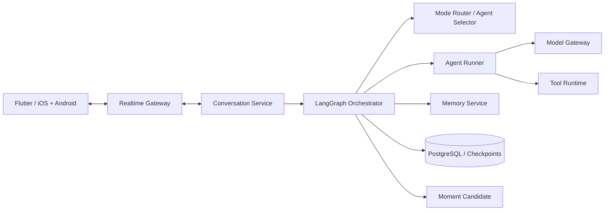

# IOS-IM 多 Agent 编排技术方案

版本：1.0  
日期：2026-07-28  
状态：已决策，MVP 按本方案实施

## 1. 目标与边界

本方案解决个人 AI 通讯产品中的文字多 Agent 群聊：

1. 普通消息：自动选择最合适的 1–2 个群成员回答。
2. `@某个 Agent`：仅被点名成员回答。
3. `@所有人` 或“大家讨论”：群成员依次发表观点，可补充和反驳，最后生成群聊总结。

首版不做语音群聊或视频群聊。一对一语音使用豆包端到端双工链路，一对一视频使用 Vidu，两者不进入 LangGraph 讨论流程。

## 2. 架构决策

编排核心使用服务端 LangGraph。Flutter 客户端不执行路由模型，不持有 Provider 密钥，也不维护权威讨论状态。



选择 LangGraph 的原因：

- 群聊流程同时包含确定性规则和模型判断，不适合完全交给一个主 Agent 自由发挥。
- Graph State 能显式保存成员、阶段、预算、已完成发言和停止状态。
- Checkpoint 支持中断恢复、失败重试和人工停止。
- Router、并行节点、条件边和子图能覆盖三种回复模式。

Hermes Agent 可以作为某个重型 Agent 节点的执行器，但不能成为群聊状态的唯一真相来源。

## 3. 领域对象

### 3.1 AgentProfile

```python
class AgentProfile(TypedDict):
    agent_id: str
    version_id: str
    name: str
    capability_tags: list[str]
    system_prompt: str
    personality_prompt: str
    model_profile_id: str
    tool_policy_id: str
    private_memory_namespace: str
    enabled: bool
```

Agent 身份不等于模型。模型更换不能改变 `agent_id`，Persona、工具和记忆策略以不可变版本记录。

### 3.2 GroupRunState

```python
class GroupRunState(TypedDict):
    run_id: str
    conversation_id: str
    trigger_message_id: str
    mode: Literal["auto", "mentioned", "all"]
    member_ids: list[str]
    mentioned_agent_ids: list[str]
    selected_agent_ids: list[str]
    speaker_queue: list[str]
    current_speaker_id: str | None
    phase: Literal[
        "routing", "collecting", "cross_review",
        "summarizing", "completed", "stopping",
        "stopped", "failed"
    ]
    round_index: int
    max_rounds: int
    token_budget: int
    used_tokens: int
    response_message_ids: list[str]
    shared_context_snapshot_id: str
    stop_requested: bool
    error_code: str | None
```

State 只保存稳定 ID 和小型控制数据；附件正文、完整消息和长记忆通过 ID 按需读取。

## 4. 模式判定

优先级从高到低：

1. 输入框显式选择的模式。
2. 结构化 Mention 数据。
3. 文本中的“@所有人”“大家讨论”等明确指令。
4. 默认 `auto`。

客户端必须发送结构化字段，服务端不依赖对显示文本做唯一判断：

```json
{
  "clientMessageId": "cm_01",
  "content": [{"type": "text", "text": "从商业和技术角度判断"}],
  "replyControl": {
    "mode": "mentioned",
    "mentionedAgentIds": ["agent_product", "agent_arch"]
  }
}
```

服务端校验：

- 被点名 Agent 必须属于当前会话且处于启用状态。
- `mentioned` 至少包含一个、最多包含四个 Agent。
- `all` 只代表当前群成员，不代表 AI 市场全部 50 位专家。
- 群成员首版最多八个；超过限制返回可展示错误。

## 5. Graph 节点

```text
START
  → load_context
  → resolve_mode
      ├─ auto      → select_agents
      ├─ mentioned → validate_mentions
      └─ all       → build_all_queue
  → prepare_turn
  → run_agent
  → persist_message
  → next_speaker?
      ├─ yes → prepare_turn
      └─ no  → cross_review?
                  ├─ yes → build_review_queue → run_agent
                  └─ no
  → summarize?
      ├─ yes → summarize_discussion
      └─ no
  → emit_completion
  → END
```

### 5.1 `load_context`

- 读取群成员和当前配置版本。
- 冻结本轮共享上下文快照。
- 读取最近消息窗口、群目标和共享文件摘要。
- 不读取任何其他 Agent 的私有关系记忆。

### 5.2 `select_agents`

先执行确定性过滤，再调用轻量路由模型：

1. 排除禁用、离线或无可用模型的成员。
2. 根据能力标签、群角色和最近是否已经发言形成候选。
3. 路由模型只返回候选中的 1–2 个 ID、顺序和理由。
4. 使用 JSON Schema 校验输出。
5. 路由失败时选择群主持 Agent；不得静默扩大为全员。

### 5.3 `run_agent`

每次只运行一个具名 Agent，并生成独立 `generation_id`。上下文由以下部分组成：

```text
全局安全规则
+ Agent Persona 固定版本
+ 群目标与本轮模式
+ 共享事实记忆
+ 群共享文件摘要
+ 最近消息窗口
+ 当前 Agent 私有关系记忆
+ 本轮任务、前序观点和允许的工具
```

虽然模型请求可以在服务端并发执行，但首版 UI 一次只流式展示一个 Agent，保证发言顺序稳定和用户可理解。

### 5.4 `cross_review`

仅 `all` 模式可进入：

- 每个成员最多一次主要观点和一次补充/反驳。
- Review 输入只包含需要评论的消息 ID、摘要和可引用原文。
- 反驳消息必须保存 `reply_to_message_id`。
- 如果没有新增事实、分歧或风险，Agent 返回结构化 `skip=true`。
- 默认最多两轮；达到时间、Token 或调用次数限制后进入总结。

### 5.5 `summarize_discussion`

总结 Agent 是系统角色，不出现在通讯录：

- 汇总共识、分歧、证据、风险和下一步。
- 每项结论保存来源消息 ID。
- 总结先生成群聊成果卡；用户确认后才能发布到 AI 朋友圈。
- 朋友圈自动总结开关开启时，也必须经过隐私和频率策略。

## 6. 上下文与记忆

| 层级 | 可见范围 | 示例 |
|---|---|---|
| 会话窗口 | 当前群成员 | 最近消息和附件摘要 |
| 群共享上下文 | 当前群成员 | 群目标、共享文件、已确认结论 |
| 用户共享事实 | 用户授权的全部 Agent | 时区、稳定偏好 |
| Agent 私有关系记忆 | 单个 Agent | 私人称呼、关系历史 |
| 系统审计数据 | 服务端 | Prompt 版本、调用成本、策略结果 |

群聊时不能把 A 的私有记忆注入 B 的上下文。需要共享的内容必须由用户明确共享，或者先生成候选事实并经过共享策略。

## 7. 实时事件协议

关键事件：

```text
run.created
run.mode.resolved
run.agents.selected
agent.turn.started
agent.message.delta
agent.message.completed
discussion.phase.changed
discussion.summary.completed
run.stopping
run.stopped
run.completed
run.failed
```

每个事件包含 `eventId`、`runId`、`conversationId`、`serverSequence` 和 `occurredAt`。客户端按序号去重；断线重连后从最后确认序号补发。

## 8. 停止、失败与重试

- 用户停止：立即设置 `stop_requested`，不再启动新 Agent；向正在运行的 Provider 发送取消。
- 单 Agent 失败：标记对应占位消息失败；`auto` 模式不自动换人格替答。
- `all` 部分失败：保留已完成发言，继续可用成员，最终总结明确缺席成员。
- 路由失败：回退主持 Agent。
- 总结失败：保留讨论消息并提供单独重试总结，不重跑整场讨论。
- 服务重启：从最近 Checkpoint 恢复，所有工具写操作必须使用幂等键。

## 9. 成本控制

每次 Run 在启动前冻结预算：

```text
最大群成员：8
自动选择人数：1–2
全员讨论默认成员：3–6
最大讨论轮数：2
单 Agent 最大工具调用：6
单 Run 最大持续时间：180 秒
```

预算耗尽时停止新增发言并尝试生成简版总结。市场中的 50 位专家仅是可安装配置，不会同时实例化或被 `@所有人` 调用。

## 10. 测试策略

### 单元测试

- 模式优先级和 Mention 校验。
- Selector 只能返回群成员。
- 预算和轮数终止。
- 私有记忆隔离。
- 停止后不再创建新 Generation。

### Graph 集成测试

- 三种模式完整状态转换。
- 任意节点失败后的恢复路径。
- Checkpoint 恢复不重复写消息。
- 总结引用仅指向本 Run 的消息。

### 契约测试

- Flutter 客户端与服务端共享事件 JSON Schema，并生成 Dart DTO。
- Provider 流式事件统一转换。
- 同一 `clientMessageId` 重发只产生一条用户消息。

## 11. 验收标准

1. 用户发送前能看见当前回复模式。
2. `@某 Agent` 不会触发其他成员。
3. 自动选择始终为一至两个可用群成员。
4. 全员讨论的发言顺序、阶段和停止状态可见。
5. Agent 私有记忆不会跨成员泄露。
6. 断线、重试和服务重启不会创建重复消息。
7. 每次模型及工具调用都能归属到 Agent、Run、用户和成本记录。
