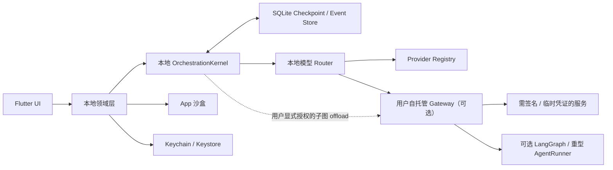

# Halo 开源本地优先架构

## 架构基线

Halo 官方不运行用户账户、消息存储、模型代理或计费后台。应用在没有 Gateway 的情况下，可以使用用户自己配置的 ToAPIs、厂商官方 API、自定义兼容服务或本地模型。

## 客户端模块

- `conversation`：单聊、群聊、消息状态和流式输出。
- `agents`：Agent 配置、市场内置目录、专家团和按专家圈层发布权限。
- `circle`：不分类的专家动态流，按发布时间倒序保存主动分享、对话总结、任务、定时任务和监控结果。
- `memory`：共享事实、私有关系记忆与检索索引。
- `providers`：Provider 适配器、能力描述、连接测试和路由。
- `vault`：Keychain / Keystore 密钥读写。
- `storage`：SQLite、附件、迁移、导入和导出。
- `assets`：用户导入与模型生成文件、缩略图、内容哈希、引用计数和聊天记录分类。
- `gateway`：可选 Gateway 健康检查、版本协商、短期凭证和用户显式授权的子图 offload。

业务模块只引用 `ModelProvider`、`SecretVault` 和 `GatewayClient` 接口，不直接依赖具体厂商 SDK。

## 数据边界

| 数据 | 默认位置 | 可导出 |
|---|---|---|
| 对话、Agent、记忆 | SQLite | 是 |
| 图片、语音、文件 | App 沙盒 | 是 |
| API Key | Keychain / Keystore | 否 |
| Gateway 令牌 | Keychain / Keystore | 否 |
| 缓存与缩略图 | Cache | 否 |

## 请求路径

1. 本地 Router 根据 Agent、能力、各 Provider 模型目录和用户设置选择 `providerId + modelId`。
2. 客户端从 Vault 临时读取对应 Provider Key 并通过 Registry 请求 Adapter。
3. 需要签名、临时凭证或用户显式授权的重型子图时，请求用户自托管 Gateway；普通群聊不依赖 Gateway。
4. Provider、工具和 Gateway 调用前先在本地提交 durable intent 与稳定幂等 ID，调用后另一个事务提交 Receipt 和终态。
5. 流式 delta 与 `draft / pending_verification` 消息按条数、字节数或最多 500 ms 的有界批次写入本地 SQLite；完成、中断、退后台和停止时立即 flush，不能只在结束时落库。
6. Citation / Publish Gate 通过后，消息状态、完成/发布事件和 Checkpoint 在同一事务提交。
7. 日志只记录 Provider ID、模型、延迟、状态码和用量，不记录密钥与完整正文。

ToAPIs 的模型目录、Chat Completions、异步图片/视频任务、限流恢复和 Key 安全规则见 [ToAPIs 模型中转站接入方案](05-toapis-provider-integration.md)。
跨 Provider 的注册、能力归一化、模型路由和降级规则见 [多模型 Provider 接入架构](06-multi-provider-model-access.md)。

## 聊天记录与资产库

产品层不提供独立文件管理 Tab。单聊和群聊从资料页进入“查找聊天记录”，按全部、图片与视频、文件、链接和 AI 成果分类。

底层 `AssetRepository` 统一保存用户导入文件和模型生成成果：

- 数据库只保存沙盒相对路径。
- SHA-256 用于内容去重。
- Message、CirclePost、Memory 和 Task 通过引用表关联 Asset。
- 模型生成的临时 URL 完成后立即下载，本地文件成为长期真相源。
- 缩略图、首帧和预览属于可重建缓存。
- 删除引用和删除物理文件是两个不同操作。
- Agent 只能通过已授权的 `assetId` 读取文件，不能枚举整个资产库。

详细交互和数据模型见 [聊天记录与文件资产设计](../04-feature-specs/04-chat-history-assets-design.md)。

## Gateway 边界

Gateway 只承担：

- 短期凭证签发。
- 请求签名。
- WebSocket / SSE 协议适配。
- 用户主动启用的网络代理。
- 用户显式授权的 GraphSpec 子图 offload，包括可选 LangGraph 与重型 AgentRunner。

子图 offload 必须使用最小状态切片、稳定 `offloadId`、冻结预算和显式 Artifact 清单。Gateway 只返回 `originSeq / remoteCursor`；本地 Event Store 负责分配唯一权威 Run 序号并保存映射。Gateway 工具必须在 offload 前分类为已由本地 Broker 预授权的 `gateway_tool` 或只能设备执行的 `local_tool`；运行中新增 Scope 时暂停为 `needs_user_action`，设备离线时不得回调或代执行本地工具。

Gateway 不承担：

- Halo 账号和登录。
- 消息、记忆或附件云存储。
- 平台 Token 和支付。
- 官方集中式 Agent 市场后台。

## 安全要求

- Keychain 项目使用 `ThisDeviceOnly` 级别，避免默认进入系统备份。
- 敏感字段禁止写入 SQLite、UserDefaults、日志和分析 SDK。
- 网络层支持证书校验、请求超时、重试上限和用户可见错误。
- 导出流程在生成后再次扫描密钥格式。
- 清除数据、导入覆盖和移除密钥均须显式确认。

## 开发顺序

1. Flutter 壳、路由与本地数据库。
2. Provider Registry、Vault、通用 OpenAI-compatible 与首批官方 Adapter。
3. 单聊与流式消息状态机。
4. 群聊编排、记忆和任务。
5. 导入导出。
6. 自托管 Gateway、语音和视频。
