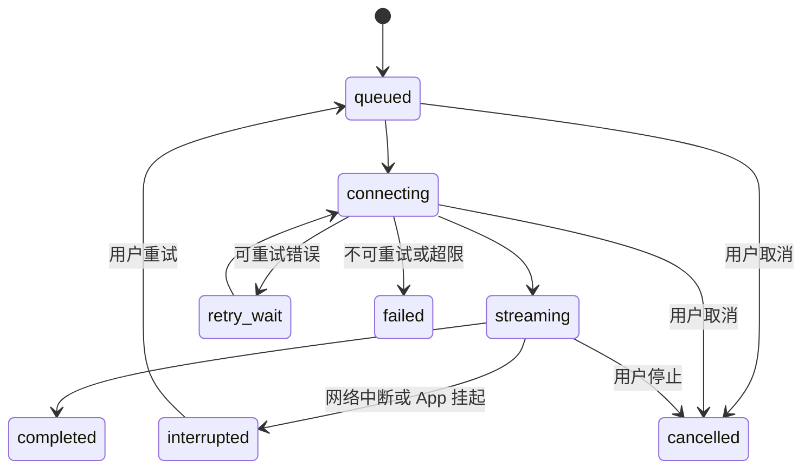
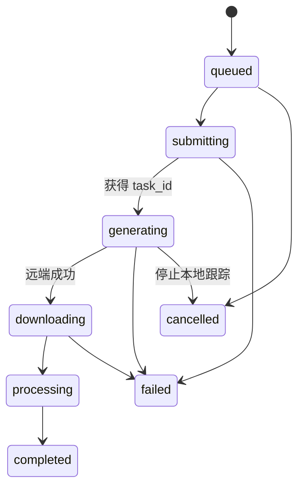

# ToAPIs 模型中转站接入方案

版本：1.0
日期：2026-07-28
状态：预置 Provider 专项方案

## 1. 决策

ToAPIs 是 Halo 预置并推荐展示的聚合 Provider，可承载文字大模型、图片生成和视频生成。用户在“设置 → 模型服务 → ToAPIs”中填写自己的 API Key，客户端直接访问 ToAPIs 公共 API。

```text
Base URL: https://toapis.com/v1
Authorization: Bearer <用户自己的 ToAPIs API Key>
```

ToAPIs 不是唯一 Provider。用户可以同时配置 DeepSeek、OpenAI、Anthropic、Gemini、自定义 OpenAI-compatible 和本地模型；总体边界见 [多模型 Provider 接入架构](06-multi-provider-model-access.md)。

本方案不接入项量 2.0 的 `/v1/relay/*`、`sk-h65-*` Key、公司账户、员工预算、平台充值或运营后台。项目提供的《67_中转站 ToAPIs / OpenAI 兼容 / 多模态接口对接文档》用于参考接口形状、异步任务状态机、限流和资产落盘经验，不作为 Halo 的服务端依赖。

豆包端到端双工语音是独立 Provider，不经过 ToAPIs 文字模型编排。未来如有不适合移动端持有长期密钥、需要 Webhook 或长时间后台执行的能力，再进入用户自托管 Gateway。

## 2. 选择理由

- 一个 Key 覆盖多家文字模型及图片、视频能力，适合个人用户。
- 文本接口兼容 OpenAI Chat Completions，客户端实现成本低。
- `GET /v1/models?type=all` 可按当前 Key 动态发现可用模型。
- 图片和视频使用统一异步任务接口，便于复用本地 `Run` 与 `GenerationArtifact` 状态机。
- Agent 身份与模型解耦：50 个专家只引用能力策略和模型偏好，不绑定某一家厂商 SDK。

## 3. 设置页

ToAPIs 是首批预置并推荐展示的模型服务之一。页面字段：

| 字段 | 默认值 | 存储 |
|---|---|---|
| 服务名称 | ToAPIs | SQLite |
| Base URL | `https://toapis.com/v1` | SQLite |
| API Key | 空 | Keychain / Keystore |
| 默认文字模型 | 连接成功后选择 | SQLite |
| 默认图片模型 | 连接成功后选择 | SQLite |
| 默认视频模型 | 连接成功后选择 | SQLite |
| 模型目录版本与缓存时间 | 自动生成 | SQLite |
| 连接状态 | 未配置 / 检测中 / 可用 / 异常 | 内存 + SQLite 摘要 |

交互规则：

1. API Key 默认掩码显示，粘贴后直接写入安全存储。
2. “测试连接”依次调用 `GET /models?type=all` 和 `GET /balance`，不发送用户对话。
3. 测试成功后按 `supported_endpoint_types` 分类展示模型。
4. Key 无效时不保存“可用”状态；已经保存的旧 Key 不因一次网络失败被删除。
5. “移除 Key”需要确认，只删除安全存储中的密钥与连接状态，不删除历史消息和成果。
6. 设置页可展示 Token 剩余额度和已用额度，但不提供充值、支付或订单入口；充值跳转 ToAPIs 官方站点。
7. Base URL 放入“高级设置”。正式版默认只允许 HTTPS；自定义地址必须再次确认。

## 4. Provider 边界

业务层只使用自有接口：

```dart
abstract interface class ModelProvider {
  ProviderCapabilities get capabilities;
  Future<ConnectionResult> testConnection();
  Future<List<ModelDescriptor>> listModels({ModelKind? kind});
  Stream<ModelEvent> generateText(ModelRequest request);
  Future<GenerationTask> generateMedia(MediaRequest request);
  Future<GenerationTask> getMediaTask(String remoteTaskId);
  Future<ProviderBalance?> getBalance();
}
```

`ToApisProvider` 负责：

- 从 `SecretVault` 临时读取 Key，并注入 Bearer Header。
- Chat Completions 请求、SSE 解析、取消、usage 解析。
- 模型目录拉取、能力归一化和缓存。
- 图片/视频任务提交、轮询、限流退避和恢复。
- ToAPIs 错误映射为应用统一错误。
- 生成结果下载到本地资产库。

它不负责：

- Agent 选择、规划、反驳或总结。
- Prompt 编译和记忆检索。
- 工具授权。
- 长期保存消息正文或完整 API Key。
- 充值、计费结算和用户账户。

## 5. 接口映射

| 能力 | ToAPIs 接口 | Halo 用法 |
|---|---|---|
| 模型发现 | `GET /models?type=all` | 获取当前 Key 可用的文字、图片、视频和音频模型 |
| 文字流式对话 | `POST /chat/completions` | 单聊、群聊 Agent 发言、总结和 Router 判断 |
| Responses | `POST /responses` | 后续按模型能力启用；不作为 MVP 必需路径 |
| 图片生成 | `POST /images/generations` | 创建 `GenerationArtifact` 并进入异步任务状态机 |
| 视频生成 | `POST /videos/generations` | 创建 `GenerationArtifact` 并进入异步任务状态机 |
| 图片任务查询 | `GET /images/generations/{task_id}` | App 前台轮询或 Gateway 兜底 |
| 视频任务查询 | `GET /videos/generations/{task_id}` | App 前台轮询或 Gateway 兜底 |
| Token 余额 | `GET /balance` | 设置页展示当前 Key 额度 |

模型 ID 不写死为永久事实。内置推荐模型仅作首次配置兜底，实际选择必须与模型目录交集后才能调用。

## 6. Agent 编排中的模型路由

Agent Profile 保存的是模型策略，不直接保存供应商 SDK 对象：

```text
modelPolicy:
  preferredCapabilities: [reasoning, tools, vision]
  qualityTier: premium
  latencyPreference: balanced
  preferredModelIds: [...]
  fallbackModelIds: [...]
```

每次 Run 的解析顺序：

1. 读取 Agent 的能力和模型偏好。
2. 与 ToAPIs 当前 Key 的模型目录求交集。
3. 校验所需 endpoint type。
4. 应用用户的默认模型、成本上限和会话级覆盖。
5. 固化为本次 Run 的 `providerId`、`modelId` 和模型目录版本。
6. 开始执行后不因目录刷新静默更换模型；只有可重试失败且尚未输出内容时才允许进入候补模型。

群聊中不同 Agent 可以使用不同 ToAPIs 模型。模型降级不能改变 Agent 的身份、提示词版本、记忆边界和工具权限。

## 7. 文本流式状态



已产生可见输出后不得自动切换另一模型继续拼接，避免回答语义和 Agent 人设漂移。中断内容以 `partial` 状态保存，用户可选择“继续”或“重新生成”。

## 8. 图片与视频任务



规则：

- `remoteTaskId`、模型、输入资产、来源消息和 Agent 必须立即落库。
- iOS 无法保证 App 长时间在后台持续轮询。App 回到前台后恢复未完成任务；需要可靠后台完成时交给可选 Gateway。
- 轮询间隔至少 5–10 秒并加入随机抖动。
- `429`、`503` 优先遵循 `Retry-After`，否则使用有上限的指数退避。
- Webhook 不能直接回调移动 App；只有自托管 Gateway 才能接收并验签 Webhook。
- 远端成功 URL 不是长期真相源。完成后立即下载、校验 MIME/大小/哈希并原子写入 `AssetRepository`。
- App 清理远端任务跟踪不等于取消上游已提交任务，UI 必须区分“停止等待”和“远端已取消”。

## 9. Key 与隐私

- 完整 Key 只进入 iOS Keychain / Android Keystore，使用设备级不可迁移保护。
- SQLite 只保存 `secretRef`、尾号、创建时间和最近测试状态。
- Key 不进入日志、分析 SDK、崩溃报告、剪贴板历史、导出包或截图测试夹具。
- 网络日志必须移除 `Authorization`，请求正文默认不记录。
- App 不提供 ToAPIs 用户名和密码登录，只接受用户自行创建的 API Key。
- 文本、图片和视频输入会发送给 ToAPIs 及其实际上游模型。首次启用时必须明确提示该数据边界。
- 用户移除 Key 后，历史消息仍可查看，但新的模型任务不可运行。

## 10. 错误归一化

| HTTP / 情况 | 应用错误 | 用户动作 |
|---|---|---|
| 400 | `invalidRequest` / `unsupportedEndpoint` | 检查模型与参数 |
| 401 | `invalidCredential` | 重新填写 Key |
| 402 | `insufficientBalance` | 前往 ToAPIs 管理额度 |
| 403 | `modelNotAllowed` | 更换当前 Key 可用模型 |
| 404 | `modelOrTaskNotFound` | 刷新模型目录或检查任务 |
| 413 | `assetTooLarge` | 压缩或更换素材 |
| 422 | `contentRejected` | 修改内容 |
| 429 | `rateLimited` | 按 `Retry-After` 等待 |
| 5xx | `providerUnavailable` | 有界重试或稍后再试 |
| SSE 中断 | `streamInterrupted` | 保存部分内容并允许继续 |
| 本地空间不足 | `localStorageFull` | 清理空间后重新下载 |

错误气泡显示可操作原因，不显示上游密钥、完整请求体、内部堆栈或未经处理的服务端响应。

## 11. 缓存与健康状态

- 模型目录成功响应缓存 24 小时，手动刷新或模型不可用时提前失效。
- 离线时可以浏览上次目录，但发起请求前必须标记其为缓存数据。
- 连接状态不是永久布尔值，至少包含 `unknown`、`checking`、`healthy`、`degraded`、`unauthorized`、`offline`。
- 余额默认进入设置页时刷新，失败不阻断正常对话。
- Provider 健康状态按 Base URL + Key 引用隔离，不能在不同 Key 间复用。

## 12. 测试与完成标准

### 契约测试

- `GET /models?type=all` 的字段缺失、未知 endpoint type 和空列表。
- Chat Completions 流式增量、usage、`[DONE]`、错误帧和半包。
- 图片、视频提交与任务成功、失败、未知状态。
- 401、402、403、413、422、429、5xx 映射。
- `Retry-After` 秒数与 HTTP 日期两种格式。

### 安全测试

- SQLite、日志、导出包和崩溃样本不含完整 Key。
- Keychain 可访问级别与设备备份行为。
- 自定义 Base URL 的 HTTPS 和确认规则。
- Authorization Header 在调试网络日志中被脱敏。

### 集成验收

1. 用户在设置中填写 Key，测试后看到当前 Key 可用模型。
2. 可以选择默认文字、图片和视频模型。
3. 单聊和三种群聊模式可以通过 `ToApisProvider` 流式输出，也可以与其他 Provider 混合编排。
4. 不同 Agent 可在同一群聊使用不同模型。
5. 图片或视频任务重启 App 后可以恢复查询，并把成果下载到本地聊天记录。
6. Key 无效、余额不足、限流和上游异常均有明确恢复动作。
7. 导出数据和删除 Provider 后不会泄漏 Key。

## 13. 资料来源

- [ToAPIs 快速开始](https://docs.toapis.com/docs/cn/quickstart)
- [ToAPIs 模型列表接口](https://docs.toapis.com/docs/cn/api-reference/chat/list-models)
- [ToAPIs 异步任务 Webhook](https://docs.toapis.com/docs/cn/api-reference/webhooks/task-webhooks)
- [ToAPIs 异步任务速率限制](https://docs.toapis.com/docs/cn/api-reference/rate-limits/async-tasks)
- 外部参考：《67_中转站 ToAPIs / OpenAI 兼容 / 多模态接口对接文档 v1》。该文档描述项量 2.0 relay；Halo 只复用其中与 ToAPIs 兼容的接口和可靠性经验。
