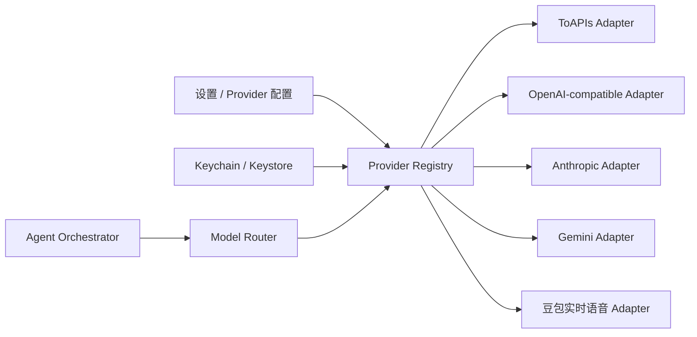

# 多模型 Provider 接入架构

版本：1.0
日期：2026-07-28
状态：MVP 核心架构

## 1. 目标

Halo 不把 Agent 绑定到 ToAPIs 或任何单一模型厂商。ToAPIs 是预置的聚合 Provider，用户也可以直接配置各厂商官方 Key、第三方 OpenAI-compatible 中转站和本地模型服务。

产品目标不是在首版手写全世界每一家 API，而是建立稳定的 Provider 协议族：

1. 新 Provider 不修改对话、Agent、群聊和记忆代码。
2. 多个 Provider 可以同时启用。
3. 每个 Agent、每个能力和每次 Run 都可以选择不同的 Provider 与模型。
4. 模型目录、工具调用、视觉输入、推理输出和用量统一归一化。
5. 未适配的服务可以通过通用 OpenAI-compatible 配置或新增 Adapter 接入。

## 2. Provider 分层

### 2.1 首批内置

| Provider | 接入方式 | 主要能力 |
|---|---|---|
| ToAPIs | OpenAI-compatible + ToAPIs 多模态扩展 | 多厂商文字、图片、视频 |
| DeepSeek | 官方 OpenAI-compatible API | 文字、推理、工具 |
| OpenAI | 官方 Chat Completions / Responses | 文字、视觉、推理、工具 |
| Anthropic | 官方 Messages API | 文字、视觉、推理、工具 |
| Google Gemini | 官方 generateContent / streamGenerateContent | 文字、视觉、工具 |
| 自定义 OpenAI-compatible | 用户填写 Base URL、Key、模型 ID | 取决于服务端 |
| 豆包端到端语音 | 独立实时协议 | 一对一全双工语音 |

### 2.2 通过通用兼容层接入

OpenRouter、硅基流动、Moonshot、智谱兼容接口、Ollama、LM Studio、vLLM 和用户自建中转站优先使用 `OpenAICompatibleProvider`。兼容层允许配置：

- Base URL。
- API Key 或无 Key。
- 自定义 Header。
- 模型列表路径或手工模型列表。
- Chat Completions / Responses 能力。
- SSE 格式差异开关。
- Tool Call、Reasoning、Vision 和 JSON Schema 支持声明。

不能因为接口名字兼容就假设能力完全一致。每个连接必须通过探测结果和用户声明生成 `ProviderCapabilities`。

### 2.3 后续原生 Adapter

当兼容层无法正确覆盖流式推理、缓存、文件、批处理或厂商特有工具时，新增原生 Adapter。Adapter 是独立包，不允许把厂商类型泄漏到领域层。

## 3. 核心模型

```text
ProviderConfig
  id, adapterType, displayName, baseUrl
  secretRef, enabled, priority
  capabilityOverrides, healthState

ModelDescriptor
  providerId, modelId, displayName
  inputModalities, outputModalities
  endpointTypes, toolSupport, structuredOutputSupport
  contextWindow, maxOutputTokens
  pricingHint, availability, catalogVersion

ModelRef
  providerId, modelId

AgentModelPolicy
  primaryModelRef
  fallbackModelRefs
  taskOverrides
  qualityTier, latencyPreference, costPreference

RunModelSnapshot
  providerId, modelId, adapterVersion
  catalogVersion, capabilitySnapshot
```

`modelId` 不是全局唯一，必须和 `providerId` 组成 `ModelRef`。例如同一个 `deepseek-chat` 可以同时存在于 DeepSeek 官方、ToAPIs 和自建服务中。

## 4. 统一接口

```dart
abstract interface class ModelProvider {
  String get providerId;
  ProviderCapabilities get capabilities;

  Future<ConnectionResult> testConnection();
  Future<List<ModelDescriptor>> listModels({ModelKind? kind});

  Stream<ModelEvent> generateText(ModelRequest request);
  Future<GenerationTask> generateMedia(MediaRequest request);
  Future<GenerationTask> getMediaTask(String remoteTaskId);
  Future<void> cancelMediaTask(String remoteTaskId);

  Future<ProviderBalance?> getBalance();
}
```

不是所有 Provider 都实现所有方法。能力不支持时返回结构化 `unsupportedCapability`，Router 在执行前过滤，不靠请求失败试错。

统一 `ModelEvent` 至少覆盖：

- `started`
- `textDelta`
- `reasoningDelta`
- `toolCallStarted`
- `toolCallArgumentsDelta`
- `toolCallCompleted`
- `usage`
- `completed`
- `failed`

Provider Adapter 负责把各厂商的 role、content block、finish reason、tool call ID、usage 和错误转换成统一事件。

## 5. Provider Registry



Registry 的职责：

- 创建和销毁 Adapter。
- 隔离每个 Provider 的 Key、Base URL、模型目录和健康状态。
- 支持同类型多个实例，例如两个不同 OpenAI-compatible 中转站。
- 对外只暴露统一 Provider 接口。
- Provider 配置变化时取消旧实例的新请求，但不破坏已落库历史。

## 6. 模型路由

路由是确定性过滤与策略打分的组合：

1. 根据任务筛选能力：文字、视觉输入、工具、结构化输出、图片、视频或实时语音。
2. 排除未启用、无 Key、模型不可用和健康状态不可用的 Provider。
3. 应用会话或 Agent 显式指定的 `ModelRef`。
4. 应用任务覆盖，例如 Router、小结、深度研究、生图使用不同模型。
5. 按质量、延迟、成本偏好和用户 Provider 优先级打分。
6. 固化 `RunModelSnapshot` 后开始请求。

用户显式选择优先于自动路由。自动路由必须能解释“为什么选了这个 Agent”和“为什么使用这个模型”，但不展示 Key 或内部 Prompt。

跨 Provider 一致不能直接证明事实正确。Provider Router 负责执行模型策略，事实是否成立由 Claim、Evidence 和 Verifier 协议判定，详见 [Agent 事实可信与证据协议](07-agent-truthfulness-evidence-protocol.md)。

### 降级规则

- 只在无可见输出且错误可重试时自动切换候补模型。
- 401、402、403、内容安全拒绝和参数错误不跨 Provider 重试。
- 429、超时和 5xx 可以按用户策略进入候补。
- 已开始输出后保存部分内容，不把另一模型结果拼在后面。
- 工具执行有副作用时，模型重试不能重复执行工具；工具调用必须使用幂等键。

## 7. Agent 与模型的关系

50 个专家模板不写死某个厂商。模板包含：

- 所需能力。
- 推荐质量等级。
- 默认任务模型策略。
- 可选推荐 `ModelRef`。
- 最大上下文与用量策略。

安装 Agent 时，根据用户已经配置的 Provider 解析可用模型。如果首选模型不存在：

1. 推荐同能力候选。
2. 允许用户手工指定。
3. 保存用户选择，不修改原始专家模板。

同一群聊允许：

- 产品经理使用 Claude。
- 技术架构师使用 GPT 或 DeepSeek。
- 数据分析师使用 Gemini。
- 总结节点使用成本较低的 ToAPIs 模型。

Agent 身份、Prompt、记忆和工具权限不随 Provider 切换。

## 8. 设置页

“模型服务”页面展示多个 Provider 卡片：

- ToAPIs。
- DeepSeek。
- OpenAI。
- Anthropic Claude。
- Google Gemini。
- 自定义 OpenAI-compatible。
- 豆包端到端语音。

每张卡显示：

- 已配置 / 未配置 / 异常。
- 可用模型数量。
- 默认能力。
- 最近检测时间。
- Key 尾号，不显示完整 Key。

用户可以：

- 添加多个自定义 Provider。
- 测试连接。
- 刷新模型目录。
- 选择全局默认文字、图片、视频和 Router 模型。
- 为单个 Agent 覆盖模型。
- 调整 Provider 优先级。
- 禁用 Provider 而不删除配置。
- 删除 Key 与配置。

## 9. 密钥与数据边界

- 每个 Provider Key 单独保存到 Keychain / Keystore。
- SQLite 保存 `secretRef`，不保存完整 Key。
- 自定义 Header 中的敏感值也必须进入 Vault。
- Provider 的隐私说明、请求目的地和数据处理方必须在启用前展示。
- 本地模型允许无 Key，但仍要限制局域网明文 HTTP；非 HTTPS 地址需要显式确认。
- 导出包不包含任何 Provider Key、自定义敏感 Header 或 Gateway Token。

## 10. 实施顺序

### M0：Provider 内核

- `ProviderRegistry`、`ModelProvider`、`ModelEvent`、统一错误。
- Vault、模型目录缓存、健康状态。
- 自定义 OpenAI-compatible Adapter。

### M1：首批文字模型

- ToAPIs。
- DeepSeek。
- OpenAI。
- Anthropic。
- Gemini。
- 单聊流式、停止、重试和 usage。

### M2：Agent 与群聊路由

- `ModelRef` 与 AgentModelPolicy。
- 每 Agent 覆盖。
- 多 Provider 群聊和候补模型。

### M3：多模态

- ToAPIs 图片与视频。
- 视觉输入与文件引用。
- 豆包端到端语音。

### M4：开放扩展

- 可导入的 Provider 配置模板。
- Adapter conformance test kit。
- 自托管 Gateway 与可靠长任务。

## 11. 验收标准

1. ToAPIs、DeepSeek、OpenAI、Anthropic、Gemini 可以分别配置和同时启用。
2. 用户可以添加至少两个自定义 OpenAI-compatible Provider 实例。
3. 模型选择始终保存 `providerId + modelId`。
4. 同一群聊中的不同 Agent 可以来自不同 Provider。
5. 禁用或删除 Provider 不影响历史消息展示。
6. Router 不会选择缺少任务能力的模型。
7. 自动降级遵守“未输出才切换”和工具幂等规则。
8. 日志、SQLite、导出包和崩溃报告不包含任何完整 Key。
9. 新增一个 Adapter 不需要修改对话、群聊、记忆和 Agent 领域代码。
