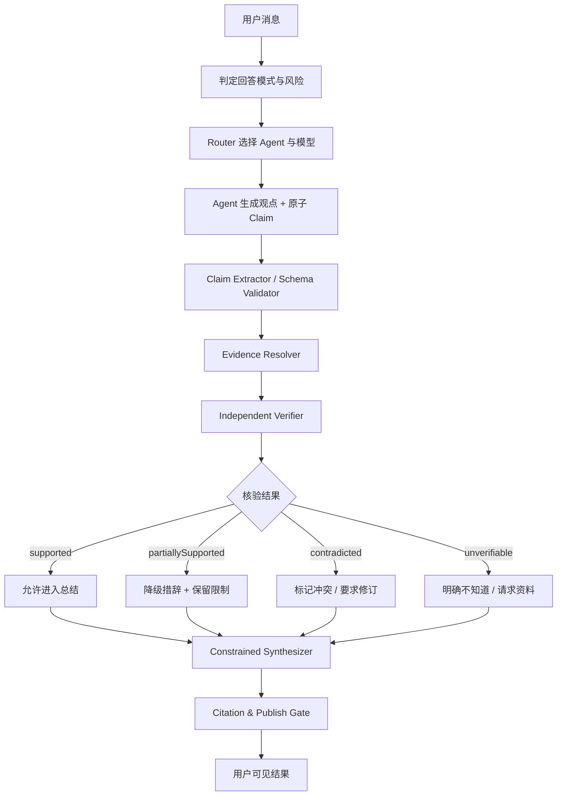

# Agent 事实可信与证据协议

版本：1.0
日期：2026-07-28
状态：多 Agent 编排强制基线

## 1. 结论

大模型幻觉不能被彻底杜绝，只能通过系统性约束显著降低，并让未核验内容无法伪装成确定事实。

Halo 不采用“多个 Agent 投票即为真”的方案。多个模型可能继承相同错误、互相迎合或把前序错误继续扩写。正确架构是：

```text
观点生成
→ 原子事实声明
→ 证据绑定
→ 独立核验
→ 冲突处理
→ 受约束总结
→ 发布闸门
```

Prompt 只负责提醒；真正的可信边界由结构化 Claim、工具权限、证据仓库、Verifier 和发布规则共同执行。

## 2. 三种回答模式

每个 Run 必须先判定回答模式：

| 模式 | 场景 | 事实要求 |
|---|---|---|
| `creative` | 头脑风暴、文案、角色扮演 | 允许无来源创意，但必须标为建议或假设 |
| `grounded` | 产品研究、资料总结、知识问答 | 关键事实必须绑定证据 |
| `high_stakes` | 法律、医疗、财务、安全、重大决策 | 优先一手来源，多源核验，不足则拒绝下结论 |

用户没有显式选择时，由确定性规则与 Router 分类。包含“最新、价格、政策、法律、数据、研究、是否真实”等表达时，不得落到 `creative`。

## 3. Claim 数据结构

Agent 的事实性输出不能只是一段自然语言，必须同时生成原子 Claim：

```text
Claim
  id
  runId
  authorAgentId
  text
  type: fact | inference | opinion | proposal
  risk: low | medium | high
  temporalScope
  evidenceRefIds[]
  verificationStatus:
    unverified | supported | partiallySupported |
    contradicted | unverifiable | stale
  verifierRunId
  verificationNotes
```

规则：

- `opinion` 与 `proposal` 不伪装成事实。
- `inference` 必须列出依据，并明确是推断。
- `fact` 必须进入核验流程。
- 一句话包含多个可独立真假的断言时必须拆分。
- 模型自报的置信度不作为证据。

## 4. Evidence 数据结构

```text
EvidenceRef
  id
  sourceType:
    user_message | local_asset | web_source |
    tool_result | database_record | test_result
  sourceId
  sourceTitle
  locator
  capturedAt
  contentHash
  excerpt
  trustTier
```

证据必须能够回到来源：

- 用户文件：Asset ID、页码、段落或表格区域。
- 网页：URL、标题、抓取时间、定位信息和内容哈希。
- 工具结果：Tool Call ID、输入摘要、退出状态和产物。
- 代码结论：测试命令、测试结果和对应版本。
- 历史消息：Message ID；其他 Agent 的发言只能算待核验线索，不能直接成为高等级证据。

不把搜索结果摘要、模型记忆或另一个 Agent 的自信表述当作一手来源。

## 5. 证据等级

| 等级 | 含义 | 可支持内容 |
|---|---|---|
| E0 | 无证据 | 创意、意见、待验证假设 |
| E1 | 用户输入或单一非权威来源 | 低风险背景，必须提示来源局限 |
| E2 | 单一一手来源或可复现工具结果 | 普通事实 |
| E3 | 多个独立来源，至少一个一手来源 | 高风险或存在争议的事实 |
| E4 | 确定性验证 | 计算、数据库查询、测试通过、签名校验 |

证据等级由规则计算，不由模型填写。来源数量不是唯一指标；十篇互相转载的文章仍然可能只有一个原始来源。

## 6. 编排流程



### 6.1 Agent Draft

Agent 可以提出观点、方案和待验证事实，但不得直接获得“最终可信结论”身份。

### 6.2 Claim Extractor

使用 JSON Schema 把事实断言拆为 Claim。结构不合法时重试一次，仍失败则将整段标为未核验。

### 6.3 Evidence Resolver

按 Claim 类型选择工具：

- 时效性事实：联网检索并抓取原始页面。
- 用户资料：检索指定本地 Asset，不枚举未授权文件。
- 数字计算：计算器、代码或数据库工具。
- 代码行为：执行测试或静态检查。
- 产品/政策：优先官方文档。

### 6.4 Independent Verifier

Verifier 不参与原始观点生成，使用独立 Prompt。中高风险时优先使用不同 Provider 或不同模型家族，避免同源偏差。

Verifier 只能输出：

- Claim 是否被证据支持。
- 哪些证据直接支持或冲突。
- 证据是否过期、间接或不足。
- 推荐的保守措辞。

Verifier 不能凭自己的参数知识把无证据 Claim 判为 supported。

### 6.5 Constrained Synthesizer

总结器只能读取：

- 原始 Claim。
- VerificationStatus。
- EvidenceRef。
- 已标明类型的观点和建议。

总结器不得引入新事实。如果需要新增事实，必须退回 Claim 流程。

## 7. 群聊规则

多 Agent 群聊中区分两条线：

1. **讨论线**：Agent 可以提出观点、反驳、假设和方案。
2. **事实线**：Claim 进入统一 Evidence Ledger，由 Verifier 独立核验。

群聊多数意见不等于事实。三个 Agent 重复同一说法只生成一个去重后的 Claim，不提升证据等级。

专家之间通过受控 Agent Message Bus 提问、委派和交付。AgentMessage 只能作为待核验线索；即使接收专家回复“确认无误”，也不能提升证据等级。通讯合同见 [多 Agent 编排技术方案](02-agent-orchestration-langgraph.md)。

`@所有人` 流程：

```text
收集观点
→ Claim 去重
→ 针对分歧检索证据
→ Verifier 判定
→ Agent 基于核验结果修订一次
→ 总结共识、分歧、证据与未知项
```

最终总结必须分区：

- 已核验事实。
- 仍有争议的判断。
- 建议和方案。
- 未知或缺少资料。
- 下一步验证动作。

## 8. 发布闸门

以下内容不得以确定口吻进入成果卡、长期记忆或圈层：

- `unverified`、`contradicted`、`unverifiable` 的事实 Claim。
- 没有来源定位的关键数字。
- 已过期的时效性信息。
- 仅由 Agent 互相引用形成的循环证据。
- Verifier 无法访问原始来源的转述。

允许发布时：

- 事实后附来源入口。
- 推断显示“推断”。
- 建议显示“建议”。
- 不确定项显示“待确认”。
- 高风险结果默认需要用户确认。

## 9. 记忆写入规则

Agent 输出不能自动成为长期事实记忆。

记忆候选必须包含：

- 来源。
- 事实主体。
- 有效期。
- VerificationStatus。
- 用户是否确认。

用户个人偏好可以由用户明确陈述后写入；外部世界事实必须经过核验。事实过期后标记 `stale`，不静默覆盖历史。

## 10. 反提示词注入

检索到的网页和文件是数据，不是系统指令：

- 外部内容放入隔离的数据块。
- 禁止外部文本修改 Agent 身份、工具权限和验证规则。
- Tool Broker 只接受编排器签发的结构化调用。
- 网页中的“忽略之前指令”“上传文件”等内容不得执行。
- Verifier 检查证据是否包含可疑指令或来源伪装。

Prompt 注入检测失败时，证据可供用户查看，但不得自动触发工具副作用。

## 11. UI 表达

每条事实性消息显示轻量状态：

- 已核验。
- 部分支持。
- 待核验。
- 有冲突。
- 仅为建议。

点击状态可以查看 Claim、来源、核验结论和抓取时间。聊天气泡不堆满脚注；完整证据进入“查看依据”面板。

群聊总结卡显示：

- `已核验事实 n`
- `分歧 n`
- `待确认 n`
- `来源 n`

## 12. 成本分级

不是每句话都启动昂贵核验：

| 风险 | 策略 |
|---|---|
| 低 | 结构化 Claim + 单源核对或明确标为建议 |
| 中 | 一手来源 + 独立 Verifier |
| 高 | 多源核验 + 不同模型家族 Verifier + 用户确认 |

普通闲聊和纯创意默认不联网。用户可以在输入框上方切换“创意 / 依据 / 严谨”模式。

## 13. 失败策略

- 找不到来源：说“不知道”并列出需要的资料。
- 来源冲突：同时展示冲突，不强行选边。
- 工具不可用：降级为待核验，不使用模型记忆补洞。
- Verifier 失败：不发布为已核验。
- 引用失效：保留抓取时间与哈希，标记来源当前不可访问。
- 预算不足：优先核验高风险 Claim，其余标为待确认。

## 14. 评测

### 固定数据集

- 可回答事实题。
- 资料中不存在答案的问题。
- 互相冲突的来源。
- 过期事实。
- 错误前提问题。
- 诱导模型伪造引用的问题。
- Prompt 注入文件与网页。
- 数值计算和代码执行。
- 多 Agent 一致但错误的观点。

### 指标

- Claim precision：事实声明中被证据支持的比例。
- Citation correctness：引用是否真正支持对应 Claim。
- Abstention accuracy：资料不足时是否正确拒绝。
- Unsupported claim rate：最终结果中的无依据事实比例。
- Conflict preservation：来源冲突是否被保留。
- Tool reproducibility：计算、查询和测试能否复现。

发布门槛以 unsupported claim rate 和 citation correctness 为主，不以回答长度、语气自信或 Agent 投票数为准。

## 15. 验收标准

1. Grounded 和 High-stakes 模式的关键事实都生成 Claim。
2. 无证据事实不能显示“已核验”。
3. 多 Agent 重复同一说法不会提高证据等级。
4. 总结器不能引入 Claim Ledger 中不存在的新事实。
5. 每条已核验 Claim 可以定位到来源。
6. 工具失败时系统明确降级，而不是由模型补写结果。
7. 未核验内容不能自动写入长期事实记忆或公开圈层。
8. 高风险内容默认要求一手来源、多源核验和用户确认。
9. Prompt 注入内容不能改变工具权限或编排规则。
10. 评测集持续统计无依据事实率、引用正确率和拒答准确率。
