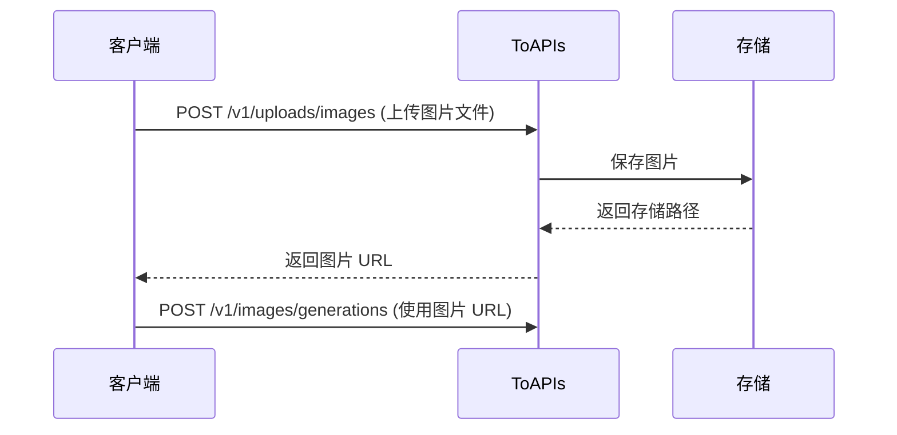

> ## Documentation Index
> Fetch the complete documentation index at: https://docs.toapis.com/llms.txt
> Use this file to discover all available pages before exploring further.

# 快速开始

> 使用 ToAPIs 调用文本、图像和视频模型

# 快速开始

ToAPIs 提供 OpenAI 兼容的文本接口，以及统一的异步图像、视频生成接口。本指南使用当前可用的模型完成第一次调用。

## 第一步：获取 API 密钥

1. 访问 [API 密钥管理页面](https://toapis.com/console/token)
2. 登录账户并创建 API 密钥
3. 立即安全保存密钥；密钥只显示一次

## 第二步：选择模型

| 类型 | 推荐入门模型    | 说明                                        |
| ---- | --------------- | ------------------------------------------- |
| 文本 | `gpt-5.6-terra` | 性能与成本均衡，适合通用对话和 Agent 工作流 |
| 图像 | `gpt-image-2`   | 支持文生图和 `reference_images` 参考图生成  |
| 视频 | `sora-2-vvip`   | 支持文生视频、图生视频和角色引用            |

完整可用型号以 [模型列表接口](./api-reference/chat/list-models) 和各模型文档为准。

## 第三步：发送请求

### 文本生成

```bash theme={null}
curl --request POST \
  --url https://toapis.com/v1/chat/completions \
  --header "Authorization: Bearer YOUR_API_KEY" \
  --header "Content-Type: application/json" \
  --data '{
    "model": "gpt-5.6-terra",
    "messages": [
      {"role": "user", "content": "你好，请介绍一下你自己"}
    ]
  }'
```

### 图像生成

```bash theme={null}
curl --request POST \
  --url https://toapis.com/v1/images/generations \
  --header "Authorization: Bearer YOUR_API_KEY" \
  --header "Content-Type: application/json" \
  --data '{
    "model": "gpt-image-2",
    "prompt": "一只可爱的熊猫，电影感光线",
    "size": "1:1",
    "resolution": "1k",
    "n": 1
  }'
```

### 视频生成

```bash theme={null}
curl --request POST \
  --url https://toapis.com/v1/videos/generations \
  --header "Authorization: Bearer YOUR_API_KEY" \
  --header "Content-Type: application/json" \
  --data '{
    "model": "sora-2-vvip",
    "prompt": "海浪拍打着海岸，电影感镜头",
    "duration": 12,
    "aspect_ratio": "16:9"
  }'
```

## 第四步：查询异步任务

文本请求会直接返回结果；图像和视频请求会返回任务 ID。请按任务类型使用对应查询接口：

```bash theme={null}
# 图像任务
curl https://toapis.com/v1/images/generations/YOUR_TASK_ID \
  -H "Authorization: Bearer YOUR_API_KEY"

# 视频任务
curl https://toapis.com/v1/videos/generations/YOUR_TASK_ID \
  -H "Authorization: Bearer YOUR_API_KEY"
```

## 配置任务 Webhook

在 Token 编辑页配置默认 HTTPS callback URL 并生成签名密钥。提交异步任务时可携带同源 `callback_url`。接收端按 `X-ToAPIs-Webhook-*` 对原始请求体做 HMAC-SHA256 验签，并按 event ID 幂等处理；轮询仅作为兜底。遇到 `429` 时读取 `Retry-After`，不要固定高频重试。参阅 [任务 Webhook](/docs/cn/api-reference/webhooks/task-webhooks)。

## 下一步

<CardGroup cols={2}>
  <Card title="查看 API 文档" icon="book" href="./index">
    查看全部接口、模型和参数。
  </Card>

  <Card title="Claude Code 集成" icon="code" href="./integrations/claude-code">
    在 Claude Code 中使用 ToAPIs。
  </Card>

  <Card title="Codex 集成" icon="terminal" href="./integrations/codex">
    通过 CC Switch 在 Codex 中使用 ToAPIs。
  </Card>
</CardGroup>


> ## Documentation Index
> Fetch the complete documentation index at: https://docs.toapis.com/llms.txt
> Use this file to discover all available pages before exploring further.

# Claude Code 配置指南

> 在 Claude Code 中使用 ToAPIs 作为 API 后端

## 准备工作

在开始之前，请确保：

1. **已安装 Claude Code**

   通过 npm 或 pnpm 安装 Claude Code CLI：

   ```bash theme={null}
   # npm
   npm install -g @anthropic-ai/claude-code

   # pnpm
   pnpm install -g @anthropic-ai/claude-code
   ```

   或访问 [Claude Code 官方文档](https://docs.anthropic.com/claude-code) 获取最新安装方式

2. **已获取 ToAPIs API 密钥**

   登录 [ToAPIs 控制台](https://toapis.com/console/token) 获取您的 API 密钥（以 `sk-` 开头）

**提示：** 如果还没有 ToAPIs 账户，请先在 [ToAPIs](https://toapis.com) 注册并获取 API 密钥。

## 配置方式

Claude Code 支持多种方式配置自定义 API 端点，您可以将 ToAPIs 作为 Anthropic API 的替代后端。

Claude Code 使用两个不同的 JSON 文件：**onboarding 状态** 与 **环境变量** 需分别写入对应文件才能生效。

### 先确认 onboarding 已完成

在用户主目录下的 `~/.claude.json` 中设置已完成引导（若文件不存在可创建）：

```json theme={null}
{
  "hasCompletedOnboarding": true
}
```

该文件仅用于 CLI 状态位；API 密钥与 base URL 请写在下面的 `settings.json` 中。

### 方式一：通过 settings.json 配置（推荐）

在 `~/.claude/settings.json`（全局）或项目根目录的 `.claude/settings.json`（项目级）中配置环境变量，无需修改 shell 配置文件：

```json theme={null}
{
  "env": {
    "ANTHROPIC_AUTH_TOKEN": "sk-xxxxxxxxxxxx",
    "ANTHROPIC_BASE_URL": "https://toapis.com"
  }
}
```

**全局配置**（推荐，对所有项目生效）：

```bash theme={null}
# 创建或编辑 ~/.claude/settings.json
mkdir -p ~/.claude
```

然后将上述 JSON 写入 `~/.claude/settings.json`。

**项目级配置**（仅对当前项目生效）：

在项目根目录创建 `.claude/settings.json`。项目级文件中不要包含 API Key，建议只在全局配置中写 `ANTHROPIC_AUTH_TOKEN`，项目配置中只写 `ANTHROPIC_BASE_URL`：

```json theme={null}
{
  "env": {
    "ANTHROPIC_BASE_URL": "https://toapis.com"
  }
}
```

> **注意：** `hasCompletedOnboarding` 放在 `~/.claude.json`，`env` 放在 `~/.claude/settings.json` 或 `.claude/settings.json`，不要混写到同一个文件中。

### 方式二：通过环境变量配置

适用于临时使用或 CI/CD 环境。

#### macOS / Linux

在终端中临时设置（当前会话有效）：

```bash theme={null}
export ANTHROPIC_AUTH_TOKEN="sk-xxxxxxxxxxxx"
export ANTHROPIC_BASE_URL="https://toapis.com"
claude
```

永久配置，将以下内容添加到 `~/.bashrc` 或 `~/.zshrc`：

```bash theme={null}
export ANTHROPIC_AUTH_TOKEN="sk-xxxxxxxxxxxx"
export ANTHROPIC_BASE_URL="https://toapis.com"
```

然后执行：

```bash theme={null}
source ~/.zshrc  # 或 source ~/.bashrc
```

#### Windows

在 PowerShell 中临时设置：

```powershell theme={null}
$env:ANTHROPIC_AUTH_TOKEN = "sk-xxxxxxxxxxxx"
$env:ANTHROPIC_BASE_URL = "https://toapis.com"
claude
```

永久配置（系统级）：

```powershell theme={null}
[System.Environment]::SetEnvironmentVariable("ANTHROPIC_AUTH_TOKEN", "sk-xxxxxxxxxxxx", "User")
[System.Environment]::SetEnvironmentVariable("ANTHROPIC_BASE_URL", "https://toapis.com", "User")
```

### 方式三：使用 `.env` 文件

在您的项目根目录创建 `.env` 文件：

```bash theme={null}
ANTHROPIC_AUTH_TOKEN=sk-xxxxxxxxxxxx
ANTHROPIC_BASE_URL=https://toapis.com
```

**注意：** 请将 `.env` 添加到 `.gitignore`，避免泄露 API 密钥。

### 配置说明

| 配置项                     | 填写内容                                  |
| -------------------------- | ----------------------------------------- |
| **ANTHROPIC\_AUTH\_TOKEN** | 您的 ToAPIs API 密钥（`sk-xxxxxxxxxxxx`） |
| **ANTHROPIC\_BASE\_URL**   | `https://toapis.com`                      |

## 验证配置

配置完成后，运行以下命令验证连接是否正常：

```bash theme={null}
claude --version
```

然后启动 Claude Code：

```bash theme={null}
claude
```

如果配置正确，Claude Code 将通过 ToAPIs 连接到 Claude 模型并正常响应。

## 推荐模型

通过 ToAPIs 您可以使用以下 Claude 模型：

| 模型名称          | 模型 ID                     | 特点                         |
| ----------------- | --------------------------- | ---------------------------- |
| Claude Opus 4.6   | `claude-opus-4-6`           | 最强大，适合复杂任务         |
| Claude Sonnet 4.6 | `claude-sonnet-4-6`         | 性能与速度平衡，推荐日常使用 |
| Claude Haiku 4.5  | `claude-haiku-4-5-20251001` | 快速响应，适合简单任务       |

切换模型可使用 `/model` 命令，或在启动时通过 `--model` 参数指定：

```bash theme={null}
claude --model claude-sonnet-4-6
```

## 常见问题

### Q1: 出现 `Authentication error` 或 `401 Unauthorized`？

**解决方案：**

1. 检查 `ANTHROPIC_AUTH_TOKEN` 是否正确设置，确认以 `sk-` 开头
2. 在 [ToAPIs 控制台](https://toapis.com/console/token) 确认密钥未过期
3. 确认账户余额充足

### Q2: 出现 `Connection refused` 或无法连接？

**解决方案：**

1. 确认 `ANTHROPIC_BASE_URL` 设置为 `https://toapis.com`
2. 检查网络连接，确保能访问 `https://toapis.com`
3. 如在国内，可能需要配置代理

### Q3: 如何查看当前环境变量配置？

```bash theme={null}
echo $ANTHROPIC_AUTH_TOKEN
echo $ANTHROPIC_BASE_URL
```

### Q4: 常见错误码说明

| 错误信息                    | 原因               | 解决方法          |
| --------------------------- | ------------------ | ----------------- |
| `401 Unauthorized`          | API 密钥无效或过期 | 重新获取 API 密钥 |
| `429 Too Many Requests`     | 请求频率超限       | 稍等片刻后重试    |
| `500 Internal Server Error` | 服务器临时故障     | 等待几分钟后重试  |
| `insufficient_quota`        | 账户余额不足       | 前往控制台充值    |

## 使用技巧

### 1. 在项目中快速启动

进入项目目录后直接运行 `claude`，Claude Code 会自动读取项目上下文：

```bash theme={null}
cd /your/project
claude
```

### 2. 常用命令

| 命令                | 说明             |
| ------------------- | ---------------- |
| `/help`             | 查看帮助信息     |
| `/model`            | 切换模型         |
| `/clear`            | 清空当前对话     |
| `/exit` 或 `Ctrl+C` | 退出 Claude Code |

### 3. 与代码协作

Claude Code 能够读取和修改项目文件，常用场景：

* **代码审查** - 让 Claude Code 审查您的代码并提出改进建议
* **生成代码** - 描述需求，Claude Code 直接生成并写入文件
* **调试错误** - 粘贴错误信息，获取调试建议
* **重构代码** - 让 Claude Code 优化代码结构

## 支持与帮助

如果您在使用过程中遇到任何问题：

* 📚 [ToAPIs 文档中心](https://docs.toapis.com)
* 📚 [Claude Code 官方文档](https://docs.anthropic.com/claude-code)
* 💬 [Discord 社区](https://discord.gg/hvnszCrJ73)
* 🐦 [Twitter @toapisai](https://x.com/toapisai)

***

\[## 开始使用 ToAPIs

立即注册 ToAPIs，获取您的 API 密钥，在 Claude Code 中开启高效编程之旅！]\([https://toapis.com](https://toapis.com))


> ## Documentation Index
> Fetch the complete documentation index at: https://docs.toapis.com/llms.txt
> Use this file to discover all available pages before exploring further.

# Claude Code 配置指南

> 在 Claude Code 中使用 ToAPIs 作为 API 后端

## 准备工作

在开始之前，请确保：

1. **已安装 Claude Code**

   通过 npm 或 pnpm 安装 Claude Code CLI：

   ```bash theme={null}
   # npm
   npm install -g @anthropic-ai/claude-code

   # pnpm
   pnpm install -g @anthropic-ai/claude-code
   ```

   或访问 [Claude Code 官方文档](https://docs.anthropic.com/claude-code) 获取最新安装方式

2. **已获取 ToAPIs API 密钥**

   登录 [ToAPIs 控制台](https://toapis.com/console/token) 获取您的 API 密钥（以 `sk-` 开头）

**提示：** 如果还没有 ToAPIs 账户，请先在 [ToAPIs](https://toapis.com) 注册并获取 API 密钥。

## 配置方式

Claude Code 支持多种方式配置自定义 API 端点，您可以将 ToAPIs 作为 Anthropic API 的替代后端。

Claude Code 使用两个不同的 JSON 文件：**onboarding 状态** 与 **环境变量** 需分别写入对应文件才能生效。

### 先确认 onboarding 已完成

在用户主目录下的 `~/.claude.json` 中设置已完成引导（若文件不存在可创建）：

```json theme={null}
{
  "hasCompletedOnboarding": true
}
```

该文件仅用于 CLI 状态位；API 密钥与 base URL 请写在下面的 `settings.json` 中。

### 方式一：通过 settings.json 配置（推荐）

在 `~/.claude/settings.json`（全局）或项目根目录的 `.claude/settings.json`（项目级）中配置环境变量，无需修改 shell 配置文件：

```json theme={null}
{
  "env": {
    "ANTHROPIC_AUTH_TOKEN": "sk-xxxxxxxxxxxx",
    "ANTHROPIC_BASE_URL": "https://toapis.com"
  }
}
```

**全局配置**（推荐，对所有项目生效）：

```bash theme={null}
# 创建或编辑 ~/.claude/settings.json
mkdir -p ~/.claude
```

然后将上述 JSON 写入 `~/.claude/settings.json`。

**项目级配置**（仅对当前项目生效）：

在项目根目录创建 `.claude/settings.json`。项目级文件中不要包含 API Key，建议只在全局配置中写 `ANTHROPIC_AUTH_TOKEN`，项目配置中只写 `ANTHROPIC_BASE_URL`：

```json theme={null}
{
  "env": {
    "ANTHROPIC_BASE_URL": "https://toapis.com"
  }
}
```

> **注意：** `hasCompletedOnboarding` 放在 `~/.claude.json`，`env` 放在 `~/.claude/settings.json` 或 `.claude/settings.json`，不要混写到同一个文件中。

### 方式二：通过环境变量配置

适用于临时使用或 CI/CD 环境。

#### macOS / Linux

在终端中临时设置（当前会话有效）：

```bash theme={null}
export ANTHROPIC_AUTH_TOKEN="sk-xxxxxxxxxxxx"
export ANTHROPIC_BASE_URL="https://toapis.com"
claude
```

永久配置，将以下内容添加到 `~/.bashrc` 或 `~/.zshrc`：

```bash theme={null}
export ANTHROPIC_AUTH_TOKEN="sk-xxxxxxxxxxxx"
export ANTHROPIC_BASE_URL="https://toapis.com"
```

然后执行：

```bash theme={null}
source ~/.zshrc  # 或 source ~/.bashrc
```

#### Windows

在 PowerShell 中临时设置：

```powershell theme={null}
$env:ANTHROPIC_AUTH_TOKEN = "sk-xxxxxxxxxxxx"
$env:ANTHROPIC_BASE_URL = "https://toapis.com"
claude
```

永久配置（系统级）：

```powershell theme={null}
[System.Environment]::SetEnvironmentVariable("ANTHROPIC_AUTH_TOKEN", "sk-xxxxxxxxxxxx", "User")
[System.Environment]::SetEnvironmentVariable("ANTHROPIC_BASE_URL", "https://toapis.com", "User")
```

### 方式三：使用 `.env` 文件

在您的项目根目录创建 `.env` 文件：

```bash theme={null}
ANTHROPIC_AUTH_TOKEN=sk-xxxxxxxxxxxx
ANTHROPIC_BASE_URL=https://toapis.com
```

**注意：** 请将 `.env` 添加到 `.gitignore`，避免泄露 API 密钥。

### 配置说明

| 配置项                     | 填写内容                                  |
| -------------------------- | ----------------------------------------- |
| **ANTHROPIC\_AUTH\_TOKEN** | 您的 ToAPIs API 密钥（`sk-xxxxxxxxxxxx`） |
| **ANTHROPIC\_BASE\_URL**   | `https://toapis.com`                      |

## 验证配置

配置完成后，运行以下命令验证连接是否正常：

```bash theme={null}
claude --version
```

然后启动 Claude Code：

```bash theme={null}
claude
```

如果配置正确，Claude Code 将通过 ToAPIs 连接到 Claude 模型并正常响应。

## 推荐模型

通过 ToAPIs 您可以使用以下 Claude 模型：

| 模型名称          | 模型 ID                     | 特点                         |
| ----------------- | --------------------------- | ---------------------------- |
| Claude Opus 4.6   | `claude-opus-4-6`           | 最强大，适合复杂任务         |
| Claude Sonnet 4.6 | `claude-sonnet-4-6`         | 性能与速度平衡，推荐日常使用 |
| Claude Haiku 4.5  | `claude-haiku-4-5-20251001` | 快速响应，适合简单任务       |

切换模型可使用 `/model` 命令，或在启动时通过 `--model` 参数指定：

```bash theme={null}
claude --model claude-sonnet-4-6
```

## 常见问题

### Q1: 出现 `Authentication error` 或 `401 Unauthorized`？

**解决方案：**

1. 检查 `ANTHROPIC_AUTH_TOKEN` 是否正确设置，确认以 `sk-` 开头
2. 在 [ToAPIs 控制台](https://toapis.com/console/token) 确认密钥未过期
3. 确认账户余额充足

### Q2: 出现 `Connection refused` 或无法连接？

**解决方案：**

1. 确认 `ANTHROPIC_BASE_URL` 设置为 `https://toapis.com`
2. 检查网络连接，确保能访问 `https://toapis.com`
3. 如在国内，可能需要配置代理

### Q3: 如何查看当前环境变量配置？

```bash theme={null}
echo $ANTHROPIC_AUTH_TOKEN
echo $ANTHROPIC_BASE_URL
```

### Q4: 常见错误码说明

| 错误信息                    | 原因               | 解决方法          |
| --------------------------- | ------------------ | ----------------- |
| `401 Unauthorized`          | API 密钥无效或过期 | 重新获取 API 密钥 |
| `429 Too Many Requests`     | 请求频率超限       | 稍等片刻后重试    |
| `500 Internal Server Error` | 服务器临时故障     | 等待几分钟后重试  |
| `insufficient_quota`        | 账户余额不足       | 前往控制台充值    |

## 使用技巧

### 1. 在项目中快速启动

进入项目目录后直接运行 `claude`，Claude Code 会自动读取项目上下文：

```bash theme={null}
cd /your/project
claude
```

### 2. 常用命令

| 命令                | 说明             |
| ------------------- | ---------------- |
| `/help`             | 查看帮助信息     |
| `/model`            | 切换模型         |
| `/clear`            | 清空当前对话     |
| `/exit` 或 `Ctrl+C` | 退出 Claude Code |

### 3. 与代码协作

Claude Code 能够读取和修改项目文件，常用场景：

* **代码审查** - 让 Claude Code 审查您的代码并提出改进建议
* **生成代码** - 描述需求，Claude Code 直接生成并写入文件
* **调试错误** - 粘贴错误信息，获取调试建议
* **重构代码** - 让 Claude Code 优化代码结构

## 支持与帮助

如果您在使用过程中遇到任何问题：

* 📚 [ToAPIs 文档中心](https://docs.toapis.com)
* 📚 [Claude Code 官方文档](https://docs.anthropic.com/claude-code)
* 💬 [Discord 社区](https://discord.gg/hvnszCrJ73)
* 🐦 [Twitter @toapisai](https://x.com/toapisai)

***

\[## 开始使用 ToAPIs

立即注册 ToAPIs，获取您的 API 密钥，在 Claude Code 中开启高效编程之旅！]\([https://toapis.com](https://toapis.com))


> ## Documentation Index
> Fetch the complete documentation index at: https://docs.toapis.com/llms.txt
> Use this file to discover all available pages before exploring further.

# Claude Code 配置指南

> 在 Claude Code 中使用 ToAPIs 作为 API 后端

## 准备工作

在开始之前，请确保：

1. **已安装 Claude Code**

   通过 npm 或 pnpm 安装 Claude Code CLI：

   ```bash theme={null}
   # npm
   npm install -g @anthropic-ai/claude-code

   # pnpm
   pnpm install -g @anthropic-ai/claude-code
   ```

   或访问 [Claude Code 官方文档](https://docs.anthropic.com/claude-code) 获取最新安装方式

2. **已获取 ToAPIs API 密钥**

   登录 [ToAPIs 控制台](https://toapis.com/console/token) 获取您的 API 密钥（以 `sk-` 开头）

**提示：** 如果还没有 ToAPIs 账户，请先在 [ToAPIs](https://toapis.com) 注册并获取 API 密钥。

## 配置方式

Claude Code 支持多种方式配置自定义 API 端点，您可以将 ToAPIs 作为 Anthropic API 的替代后端。

Claude Code 使用两个不同的 JSON 文件：**onboarding 状态** 与 **环境变量** 需分别写入对应文件才能生效。

### 先确认 onboarding 已完成

在用户主目录下的 `~/.claude.json` 中设置已完成引导（若文件不存在可创建）：

```json theme={null}
{
  "hasCompletedOnboarding": true
}
```

该文件仅用于 CLI 状态位；API 密钥与 base URL 请写在下面的 `settings.json` 中。

### 方式一：通过 settings.json 配置（推荐）

在 `~/.claude/settings.json`（全局）或项目根目录的 `.claude/settings.json`（项目级）中配置环境变量，无需修改 shell 配置文件：

```json theme={null}
{
  "env": {
    "ANTHROPIC_AUTH_TOKEN": "sk-xxxxxxxxxxxx",
    "ANTHROPIC_BASE_URL": "https://toapis.com"
  }
}
```

**全局配置**（推荐，对所有项目生效）：

```bash theme={null}
# 创建或编辑 ~/.claude/settings.json
mkdir -p ~/.claude
```

然后将上述 JSON 写入 `~/.claude/settings.json`。

**项目级配置**（仅对当前项目生效）：

在项目根目录创建 `.claude/settings.json`。项目级文件中不要包含 API Key，建议只在全局配置中写 `ANTHROPIC_AUTH_TOKEN`，项目配置中只写 `ANTHROPIC_BASE_URL`：

```json theme={null}
{
  "env": {
    "ANTHROPIC_BASE_URL": "https://toapis.com"
  }
}
```

> **注意：** `hasCompletedOnboarding` 放在 `~/.claude.json`，`env` 放在 `~/.claude/settings.json` 或 `.claude/settings.json`，不要混写到同一个文件中。

### 方式二：通过环境变量配置

适用于临时使用或 CI/CD 环境。

#### macOS / Linux

在终端中临时设置（当前会话有效）：

```bash theme={null}
export ANTHROPIC_AUTH_TOKEN="sk-xxxxxxxxxxxx"
export ANTHROPIC_BASE_URL="https://toapis.com"
claude
```

永久配置，将以下内容添加到 `~/.bashrc` 或 `~/.zshrc`：

```bash theme={null}
export ANTHROPIC_AUTH_TOKEN="sk-xxxxxxxxxxxx"
export ANTHROPIC_BASE_URL="https://toapis.com"
```

然后执行：

```bash theme={null}
source ~/.zshrc  # 或 source ~/.bashrc
```

#### Windows

在 PowerShell 中临时设置：

```powershell theme={null}
$env:ANTHROPIC_AUTH_TOKEN = "sk-xxxxxxxxxxxx"
$env:ANTHROPIC_BASE_URL = "https://toapis.com"
claude
```

永久配置（系统级）：

```powershell theme={null}
[System.Environment]::SetEnvironmentVariable("ANTHROPIC_AUTH_TOKEN", "sk-xxxxxxxxxxxx", "User")
[System.Environment]::SetEnvironmentVariable("ANTHROPIC_BASE_URL", "https://toapis.com", "User")
```

### 方式三：使用 `.env` 文件

在您的项目根目录创建 `.env` 文件：

```bash theme={null}
ANTHROPIC_AUTH_TOKEN=sk-xxxxxxxxxxxx
ANTHROPIC_BASE_URL=https://toapis.com
```

**注意：** 请将 `.env` 添加到 `.gitignore`，避免泄露 API 密钥。

### 配置说明

| 配置项                     | 填写内容                                  |
| -------------------------- | ----------------------------------------- |
| **ANTHROPIC\_AUTH\_TOKEN** | 您的 ToAPIs API 密钥（`sk-xxxxxxxxxxxx`） |
| **ANTHROPIC\_BASE\_URL**   | `https://toapis.com`                      |

## 验证配置

配置完成后，运行以下命令验证连接是否正常：

```bash theme={null}
claude --version
```

然后启动 Claude Code：

```bash theme={null}
claude
```

如果配置正确，Claude Code 将通过 ToAPIs 连接到 Claude 模型并正常响应。

## 推荐模型

通过 ToAPIs 您可以使用以下 Claude 模型：

| 模型名称          | 模型 ID                     | 特点                         |
| ----------------- | --------------------------- | ---------------------------- |
| Claude Opus 4.6   | `claude-opus-4-6`           | 最强大，适合复杂任务         |
| Claude Sonnet 4.6 | `claude-sonnet-4-6`         | 性能与速度平衡，推荐日常使用 |
| Claude Haiku 4.5  | `claude-haiku-4-5-20251001` | 快速响应，适合简单任务       |

切换模型可使用 `/model` 命令，或在启动时通过 `--model` 参数指定：

```bash theme={null}
claude --model claude-sonnet-4-6
```

## 常见问题

### Q1: 出现 `Authentication error` 或 `401 Unauthorized`？

**解决方案：**

1. 检查 `ANTHROPIC_AUTH_TOKEN` 是否正确设置，确认以 `sk-` 开头
2. 在 [ToAPIs 控制台](https://toapis.com/console/token) 确认密钥未过期
3. 确认账户余额充足

### Q2: 出现 `Connection refused` 或无法连接？

**解决方案：**

1. 确认 `ANTHROPIC_BASE_URL` 设置为 `https://toapis.com`
2. 检查网络连接，确保能访问 `https://toapis.com`
3. 如在国内，可能需要配置代理

### Q3: 如何查看当前环境变量配置？

```bash theme={null}
echo $ANTHROPIC_AUTH_TOKEN
echo $ANTHROPIC_BASE_URL
```

### Q4: 常见错误码说明

| 错误信息                    | 原因               | 解决方法          |
| --------------------------- | ------------------ | ----------------- |
| `401 Unauthorized`          | API 密钥无效或过期 | 重新获取 API 密钥 |
| `429 Too Many Requests`     | 请求频率超限       | 稍等片刻后重试    |
| `500 Internal Server Error` | 服务器临时故障     | 等待几分钟后重试  |
| `insufficient_quota`        | 账户余额不足       | 前往控制台充值    |

## 使用技巧

### 1. 在项目中快速启动

进入项目目录后直接运行 `claude`，Claude Code 会自动读取项目上下文：

```bash theme={null}
cd /your/project
claude
```

### 2. 常用命令

| 命令                | 说明             |
| ------------------- | ---------------- |
| `/help`             | 查看帮助信息     |
| `/model`            | 切换模型         |
| `/clear`            | 清空当前对话     |
| `/exit` 或 `Ctrl+C` | 退出 Claude Code |

### 3. 与代码协作

Claude Code 能够读取和修改项目文件，常用场景：

* **代码审查** - 让 Claude Code 审查您的代码并提出改进建议
* **生成代码** - 描述需求，Claude Code 直接生成并写入文件
* **调试错误** - 粘贴错误信息，获取调试建议
* **重构代码** - 让 Claude Code 优化代码结构

## 支持与帮助

如果您在使用过程中遇到任何问题：

* 📚 [ToAPIs 文档中心](https://docs.toapis.com)
* 📚 [Claude Code 官方文档](https://docs.anthropic.com/claude-code)
* 💬 [Discord 社区](https://discord.gg/hvnszCrJ73)
* 🐦 [Twitter @toapisai](https://x.com/toapisai)

***

\[## 开始使用 ToAPIs

立即注册 ToAPIs，获取您的 API 密钥，在 Claude Code 中开启高效编程之旅！]\([https://toapis.com](https://toapis.com))


> ## Documentation Index
> Fetch the complete documentation index at: https://docs.toapis.com/llms.txt
> Use this file to discover all available pages before exploring further.

# Claude Code 配置指南

> 在 Claude Code 中使用 ToAPIs 作为 API 后端

## 准备工作

在开始之前，请确保：

1. **已安装 Claude Code**

   通过 npm 或 pnpm 安装 Claude Code CLI：

   ```bash theme={null}
   # npm
   npm install -g @anthropic-ai/claude-code

   # pnpm
   pnpm install -g @anthropic-ai/claude-code
   ```

   或访问 [Claude Code 官方文档](https://docs.anthropic.com/claude-code) 获取最新安装方式

2. **已获取 ToAPIs API 密钥**

   登录 [ToAPIs 控制台](https://toapis.com/console/token) 获取您的 API 密钥（以 `sk-` 开头）

**提示：** 如果还没有 ToAPIs 账户，请先在 [ToAPIs](https://toapis.com) 注册并获取 API 密钥。

## 配置方式

Claude Code 支持多种方式配置自定义 API 端点，您可以将 ToAPIs 作为 Anthropic API 的替代后端。

Claude Code 使用两个不同的 JSON 文件：**onboarding 状态** 与 **环境变量** 需分别写入对应文件才能生效。

### 先确认 onboarding 已完成

在用户主目录下的 `~/.claude.json` 中设置已完成引导（若文件不存在可创建）：

```json theme={null}
{
  "hasCompletedOnboarding": true
}
```

该文件仅用于 CLI 状态位；API 密钥与 base URL 请写在下面的 `settings.json` 中。

### 方式一：通过 settings.json 配置（推荐）

在 `~/.claude/settings.json`（全局）或项目根目录的 `.claude/settings.json`（项目级）中配置环境变量，无需修改 shell 配置文件：

```json theme={null}
{
  "env": {
    "ANTHROPIC_AUTH_TOKEN": "sk-xxxxxxxxxxxx",
    "ANTHROPIC_BASE_URL": "https://toapis.com"
  }
}
```

**全局配置**（推荐，对所有项目生效）：

```bash theme={null}
# 创建或编辑 ~/.claude/settings.json
mkdir -p ~/.claude
```

然后将上述 JSON 写入 `~/.claude/settings.json`。

**项目级配置**（仅对当前项目生效）：

在项目根目录创建 `.claude/settings.json`。项目级文件中不要包含 API Key，建议只在全局配置中写 `ANTHROPIC_AUTH_TOKEN`，项目配置中只写 `ANTHROPIC_BASE_URL`：

```json theme={null}
{
  "env": {
    "ANTHROPIC_BASE_URL": "https://toapis.com"
  }
}
```

> **注意：** `hasCompletedOnboarding` 放在 `~/.claude.json`，`env` 放在 `~/.claude/settings.json` 或 `.claude/settings.json`，不要混写到同一个文件中。

### 方式二：通过环境变量配置

适用于临时使用或 CI/CD 环境。

#### macOS / Linux

在终端中临时设置（当前会话有效）：

```bash theme={null}
export ANTHROPIC_AUTH_TOKEN="sk-xxxxxxxxxxxx"
export ANTHROPIC_BASE_URL="https://toapis.com"
claude
```

永久配置，将以下内容添加到 `~/.bashrc` 或 `~/.zshrc`：

```bash theme={null}
export ANTHROPIC_AUTH_TOKEN="sk-xxxxxxxxxxxx"
export ANTHROPIC_BASE_URL="https://toapis.com"
```

然后执行：

```bash theme={null}
source ~/.zshrc  # 或 source ~/.bashrc
```

#### Windows

在 PowerShell 中临时设置：

```powershell theme={null}
$env:ANTHROPIC_AUTH_TOKEN = "sk-xxxxxxxxxxxx"
$env:ANTHROPIC_BASE_URL = "https://toapis.com"
claude
```

永久配置（系统级）：

```powershell theme={null}
[System.Environment]::SetEnvironmentVariable("ANTHROPIC_AUTH_TOKEN", "sk-xxxxxxxxxxxx", "User")
[System.Environment]::SetEnvironmentVariable("ANTHROPIC_BASE_URL", "https://toapis.com", "User")
```

### 方式三：使用 `.env` 文件

在您的项目根目录创建 `.env` 文件：

```bash theme={null}
ANTHROPIC_AUTH_TOKEN=sk-xxxxxxxxxxxx
ANTHROPIC_BASE_URL=https://toapis.com
```

**注意：** 请将 `.env` 添加到 `.gitignore`，避免泄露 API 密钥。

### 配置说明

| 配置项                     | 填写内容                                  |
| -------------------------- | ----------------------------------------- |
| **ANTHROPIC\_AUTH\_TOKEN** | 您的 ToAPIs API 密钥（`sk-xxxxxxxxxxxx`） |
| **ANTHROPIC\_BASE\_URL**   | `https://toapis.com`                      |

## 验证配置

配置完成后，运行以下命令验证连接是否正常：

```bash theme={null}
claude --version
```

然后启动 Claude Code：

```bash theme={null}
claude
```

如果配置正确，Claude Code 将通过 ToAPIs 连接到 Claude 模型并正常响应。

## 推荐模型

通过 ToAPIs 您可以使用以下 Claude 模型：

| 模型名称          | 模型 ID                     | 特点                         |
| ----------------- | --------------------------- | ---------------------------- |
| Claude Opus 4.6   | `claude-opus-4-6`           | 最强大，适合复杂任务         |
| Claude Sonnet 4.6 | `claude-sonnet-4-6`         | 性能与速度平衡，推荐日常使用 |
| Claude Haiku 4.5  | `claude-haiku-4-5-20251001` | 快速响应，适合简单任务       |

切换模型可使用 `/model` 命令，或在启动时通过 `--model` 参数指定：

```bash theme={null}
claude --model claude-sonnet-4-6
```

## 常见问题

### Q1: 出现 `Authentication error` 或 `401 Unauthorized`？

**解决方案：**

1. 检查 `ANTHROPIC_AUTH_TOKEN` 是否正确设置，确认以 `sk-` 开头
2. 在 [ToAPIs 控制台](https://toapis.com/console/token) 确认密钥未过期
3. 确认账户余额充足

### Q2: 出现 `Connection refused` 或无法连接？

**解决方案：**

1. 确认 `ANTHROPIC_BASE_URL` 设置为 `https://toapis.com`
2. 检查网络连接，确保能访问 `https://toapis.com`
3. 如在国内，可能需要配置代理

### Q3: 如何查看当前环境变量配置？

```bash theme={null}
echo $ANTHROPIC_AUTH_TOKEN
echo $ANTHROPIC_BASE_URL
```

### Q4: 常见错误码说明

| 错误信息                    | 原因               | 解决方法          |
| --------------------------- | ------------------ | ----------------- |
| `401 Unauthorized`          | API 密钥无效或过期 | 重新获取 API 密钥 |
| `429 Too Many Requests`     | 请求频率超限       | 稍等片刻后重试    |
| `500 Internal Server Error` | 服务器临时故障     | 等待几分钟后重试  |
| `insufficient_quota`        | 账户余额不足       | 前往控制台充值    |

## 使用技巧

### 1. 在项目中快速启动

进入项目目录后直接运行 `claude`，Claude Code 会自动读取项目上下文：

```bash theme={null}
cd /your/project
claude
```

### 2. 常用命令

| 命令                | 说明             |
| ------------------- | ---------------- |
| `/help`             | 查看帮助信息     |
| `/model`            | 切换模型         |
| `/clear`            | 清空当前对话     |
| `/exit` 或 `Ctrl+C` | 退出 Claude Code |

### 3. 与代码协作

Claude Code 能够读取和修改项目文件，常用场景：

* **代码审查** - 让 Claude Code 审查您的代码并提出改进建议
* **生成代码** - 描述需求，Claude Code 直接生成并写入文件
* **调试错误** - 粘贴错误信息，获取调试建议
* **重构代码** - 让 Claude Code 优化代码结构

## 支持与帮助

如果您在使用过程中遇到任何问题：

* 📚 [ToAPIs 文档中心](https://docs.toapis.com)
* 📚 [Claude Code 官方文档](https://docs.anthropic.com/claude-code)
* 💬 [Discord 社区](https://discord.gg/hvnszCrJ73)
* 🐦 [Twitter @toapisai](https://x.com/toapisai)

***

\[## 开始使用 ToAPIs

立即注册 ToAPIs，获取您的 API 密钥，在 Claude Code 中开启高效编程之旅！]\([https://toapis.com](https://toapis.com))


> ## Documentation Index
> Fetch the complete documentation index at: https://docs.toapis.com/llms.txt
> Use this file to discover all available pages before exploring further.

# Gemini-3.1-Flash 图像生成

> 使用 Google Gemini 3.1 Flash 模型生成图像，支持极端宽高比与 Google 搜索增强

* Google Gemini 3.1 Flash 图像生成模型（Nano banana2）
* 通过 model 参数选择 `gemini-3.1-flash-image-preview` 模型
* 支持文生图、图生图，最高 4K 分辨率输出
* 最多 14 张参考图，保持风格/角色一致性
* 支持极端宽高比（1:4、4:1、1:8、8:1）
* 集成 Google Search 搜索增强，生成更贴合真实世界的图片
* 异步任务管理，通过任务 ID 查询结果

<Warning>
  **重要变更**：为了更好的性能和成本控制，我们不再支持在 `image_urls` 中直接传入 base64 图片数据。请先使用 [上传图片接口](../../uploads/images) 上传图片，获取 URL 后再调用本接口。
</Warning>

## Authorizations

<ParamField header="Authorization" type="string" required>
  所有接口均需要使用 Bearer Token 进行认证

  获取 API Key：访问 [API Key 管理页面](https://toapis.com/console/token) 获取您的 API Key

  使用时在请求头中添加：

  ```
  Authorization: Bearer YOUR_API_KEY
  ```
</ParamField>

## Body

<ParamField body="model" type="string" default="gemini-3.1-flash-image-preview" required>
  图像生成模型名称

  示例：`"gemini-3.1-flash-image-preview"`
</ParamField>

<ParamField body="prompt" type="string" required>
  图像生成的文本描述
</ParamField>

<ParamField body="size" type="string">
  图像生成的宽高比

  支持的比例：

| 值              | 适用场景               |
| --------------- | ---------------------- |
| `1:1`           | 方形图、头像、社交媒体 |
| `3:2` / `2:3`   | 标准照片               |
| `4:3` / `3:4`   | 传统显示器比例         |
| `16:9` / `9:16` | 宽屏/竖屏视频封面      |
| `5:4` / `4:5`   | Instagram 图片         |
| `21:9`          | 超宽屏 Banner          |
| `1:4` / `4:1`   | 长条海报/横幅          |
| `1:8` / `8:1`   | 极端长图/横幅广告      |
| </ParamField>   |                        |

<ParamField body="n" type="integer" default={1}>
  生成图像的数量

  **⚠️ 注意：** 必须是纯数字（如 `1`），不要加引号，否则会报错
</ParamField>

<ParamField body="image_urls" type="object[]">
  参考图像 URL 列表，用于图生图或图像编辑

  <Expandable title="详细字段说明">
    <ParamField body="url" type="string" required>
      图像 URL 地址

      **⚠️ 仅支持 URL 格式（不再支持 base64）**
    
      * 公开可访问的图片 URL（http\:// 或 https\://）
      * 示例：`https://example.com/image.jpg`
      * 可使用 [上传图片接口](../../uploads/images) 上传本地图片获取 URL
    
      **限制：**
    
      * 单张图片不得超过 10MB
      * 支持格式：.jpeg, .jpg, .png, .webp
    </ParamField>
  </Expandable>

  **限制：** 最多 14 张图片（建议：最多 10 张物体参考 + 4 张角色参考）
</ParamField>

<ParamField body="metadata" type="object">
  元数据参数，用于传递额外的配置选项

  <Expandable title="支持的元数据字段">
    <ParamField body="resolution" type="string" default="1K">
      输出图像分辨率

      支持的值：
    
      * `0.5K` - 约 512px，低分辨率预览
      * `1K` - 约 1024px，标准分辨率（默认）
      * `2K` - 约 2048px，高分辨率
      * `4K` - 约 4096px，超高分辨率
    
      **注意：** 不同分辨率计费不同，4K 价格高于 1K
    </ParamField>
    
    <ParamField body="google_search" type="boolean" default="false">
      启用 Google 文字搜索增强
    
      * `true`：模型会先搜索网络文字信息来辅助生成图片，适合需要真实信息的场景
      * `false`：不启用（默认）
    </ParamField>
    
    <ParamField body="google_image_search" type="boolean" default="false">
      启用 Google 图片搜索增强
    
      * `true`：除了文字搜索，还会搜索参考图片来辅助生成，适合需要视觉参考的场景
      * `false`：不启用（默认）
    
      **注意：** 需要配合 `google_search: true` 一起使用
    </ParamField>
  </Expandable>
</ParamField>

## Response

<ResponseField name="id" type="string">
  任务唯一标识符，用于查询任务状态
</ResponseField>

<ResponseField name="object" type="string">
  对象类型，固定为 `generation.task`
</ResponseField>

<ResponseField name="model" type="string">
  使用的模型名称
</ResponseField>

<ResponseField name="status" type="string">
  任务状态

  * `queued` - 排队等待处理
  * `in_progress` - 处理中
  * `completed` - 成功完成
  * `failed` - 失败
</ResponseField>

<ResponseField name="progress" type="integer">
  任务进度百分比（0-100）
</ResponseField>

<ResponseField name="created_at" type="integer">
  任务创建时间戳（Unix 时间戳）
</ResponseField>

<ResponseField name="metadata" type="object">
  任务元数据
</ResponseField>

<RequestExample>
  ```bash cURL theme={null}
  curl --request POST \
    --url https://toapis.com/v1/images/generations \
    --header 'Authorization: Bearer <token>' \
    --header 'Content-Type: application/json' \
    --data '{
      "model": "gemini-3.1-flash-image-preview",
      "prompt": "赛博朋克风格的城市夜景，霓虹灯闪烁",
      "size": "16:9",
      "n": 1,
      "metadata": {
        "resolution": "2K"
      }
    }'
  ```

  ```bash cURL (图生图示例) theme={null}
  curl --request POST \
    --url https://toapis.com/v1/images/generations \
    --header 'Authorization: Bearer <token>' \
    --header 'Content-Type: application/json' \
    --data '{
      "model": "gemini-3.1-flash-image-preview",
      "prompt": "将这张照片改为水彩画风格",
      "size": "1:1",
      "n": 1,
      "image_urls": ["https://example.com/photo.jpg"],
      "metadata": {
        "resolution": "2K"
      }
    }'
  ```

  ```bash cURL (Google 搜索增强示例) theme={null}
  curl --request POST \
    --url https://toapis.com/v1/images/generations \
    --header 'Authorization: Bearer <token>' \
    --header 'Content-Type: application/json' \
    --data '{
      "model": "gemini-3.1-flash-image-preview",
      "prompt": "2024年最新款 iPhone 产品宣传图",
      "size": "16:9",
      "n": 1,
      "metadata": {
        "resolution": "2K",
        "google_search": true,
        "google_image_search": true
      }
    }'
  ```

  ```python Python theme={null}
  import requests

  response = requests.post(
      "https://toapis.com/v1/images/generations",
      headers={
          "Authorization": "Bearer your-ToAPIs-key",
          "Content-Type": "application/json"
      },
      json={
          "model": "gemini-3.1-flash-image-preview",
          "prompt": "赛博朋克风格的城市夜景，霓虹灯闪烁",
          "size": "16:9",
          "n": 1,
          "metadata": {
              "resolution": "2K"
          }
      }
  )

  task = response.json()
  print(f"任务 ID: {task['id']}")
  print(f"状态: {task['status']}")
  ```

  ```python Python (图生图) theme={null}
  import requests

  response = requests.post(
      "https://toapis.com/v1/images/generations",
      headers={
          "Authorization": "Bearer your-ToAPIs-key",
          "Content-Type": "application/json"
      },
      json={
          "model": "gemini-3.1-flash-image-preview",
          "prompt": "将这张照片改为水彩画风格",
          "size": "1:1",
          "n": 1,
          "image_urls": ["https://example.com/photo.jpg"],
          "metadata": {
              "resolution": "2K"
          }
      }
  )

  task = response.json()
  print(f"任务 ID: {task['id']}")
  print(f"状态: {task['status']}")
  ```

  ```javascript JavaScript theme={null}
  const response = await fetch('https://toapis.com/v1/images/generations', {
    method: 'POST',
    headers: {
      'Authorization': 'Bearer your-ToAPIs-key',
      'Content-Type': 'application/json'
    },
    body: JSON.stringify({
      model: 'gemini-3.1-flash-image-preview',
      prompt: '赛博朋克风格的城市夜景，霓虹灯闪烁',
      size: '16:9',
      n: 1,
      metadata: {
        resolution: '2K'
      }
    })
  });

  const task = await response.json();
  console.log(`任务 ID: ${task.id}`);
  console.log(`状态: ${task.status}`);
  ```

  ```javascript JavaScript (图生图) theme={null}
  const response = await fetch('https://toapis.com/v1/images/generations', {
    method: 'POST',
    headers: {
      'Authorization': 'Bearer your-ToAPIs-key',
      'Content-Type': 'application/json'
    },
    body: JSON.stringify({
      model: 'gemini-3.1-flash-image-preview',
      prompt: '将这张照片改为水彩画风格',
      size: '1:1',
      n: 1,
      image_urls: ['https://example.com/photo.jpg'],
      metadata: {
        resolution: '2K'
      }
    })
  });

  const task = await response.json();
  console.log(`任务 ID: ${task.id}`);
  console.log(`状态: ${task.status}`);
  ```
</RequestExample>

<ResponseExample>
  ```json 200 theme={null}
  {
    "id": "task_img_abc123def456",
    "object": "generation.task",
    "model": "gemini-3.1-flash-image-preview",
    "status": "queued",
    "progress": 0,
    "created_at": 1703884800,
    "metadata": {}
  }
  ```
</ResponseExample>


> ## Documentation Index
> Fetch the complete documentation index at: https://docs.toapis.com/llms.txt
> Use this file to discover all available pages before exploring further.

# GPT-Image-2 图像生成

> 使用 gpt-image-2 模型生成图像，支持文生图和 reference_images 图生图

* 统一的图像生成 API 接口
* 通过 `model` 参数选择 `gpt-image-2`
* 支持文生图、单图参考和多图参考生成
* 异步任务管理，通过任务 ID 查询结果

<Warning>
  **重要变更**：为了更好的性能和成本控制，我们不再支持在 `image_urls` / `reference_images` 中直接传入 base64 图片数据。请先使用 [上传图片接口](../../uploads/images) 上传图片，获取 URL 后再调用本接口。
</Warning>

## Authorizations

<ParamField header="Authorization" type="string" required>
  所有接口均需要使用 Bearer Token 进行认证

  获取 API Key：访问 [API Key 管理页面](https://toapis.com/console/token) 获取您的 API Key

  使用时在请求头中添加：

  ```
  Authorization: Bearer YOUR_API_KEY
  ```
</ParamField>

## Body

<ParamField body="model" type="string" default="gpt-image-2" required>
  图像生成模型名称

  示例：`"gpt-image-2"`
</ParamField>

<ParamField body="prompt" type="string" required>
  图像生成的文本描述

  最长 32,000 个字符（GPT image models 官方上限）
</ParamField>

<ParamField body="size" type="string" default="1:1">
  输出图像比例

  目前支持以下全部比例：

  `1:1`、`3:2`、`2:3`、`4:3`、`3:4`、`5:4`、`4:5`、`16:9`、`9:16`、`2:1`、`1:2`、`21:9`、`9:21`
</ParamField>

<ParamField body="resolution" type="string" default="1k">
  输出分辨率档位

  支持值：`1k`、`2k`、`4k`
</ParamField>

### 尺寸对照表

| size   | 1k          | 2k          | 4k          |
| ------ | ----------- | ----------- | ----------- |
| `1:1`  | `1024x1024` | `2048x2048` | `2880x2880` |
| `3:2`  | `1536x1024` | `2048x1360` | `3520x2336` |
| `2:3`  | `1024x1536` | `1360x2048` | `2336x3520` |
| `4:3`  | `1024x768`  | `2048x1536` | `3312x2480` |
| `3:4`  | `768x1024`  | `1536x2048` | `2480x3312` |
| `5:4`  | `1280x1024` | `2560x2048` | `3216x2576` |
| `4:5`  | `1024x1280` | `2048x2560` | `2576x3216` |
| `16:9` | `1536x864`  | `2048x1152` | `3840x2160` |
| `9:16` | `864x1536`  | `1152x2048` | `2160x3840` |
| `2:1`  | `2048x1024` | `2688x1344` | `3840x1920` |
| `1:2`  | `1024x2048` | `1344x2688` | `1920x3840` |
| `21:9` | `2016x864`  | `2688x1152` | `3840x1648` |
| `9:21` | `864x2016`  | `1152x2688` | `1648x3840` |

<ParamField body="n" type="integer" default={1}>
  生成图像的数量

  默认：1
</ParamField>

<ParamField body="response_format" type="string" default="url">
  返回格式

  固定返回图片 URL，推荐使用 `url`
</ParamField>

<ParamField body="reference_images" type="string[]">
  参考图 URL 列表，用于图生图

  **⚠️ 仅支持 URL 格式（不再支持 base64）**

  * 公开可访问的图片 URL（http\:// 或 https\://）
  * 可使用 [上传图片接口](../../uploads/images) 上传本地图片获取 URL
  * 支持单图和多图参考
</ParamField>

<ParamField body="image_urls" type="string[]">
  向后兼容的参考图字段

  在 ToAPIs 中会自动归一化为 `reference_images`
</ParamField>

## Response

<ResponseField name="id" type="string">
  任务唯一标识符，用于查询任务状态
</ResponseField>

<ResponseField name="object" type="string">
  对象类型，固定为 `generation.task`
</ResponseField>

<ResponseField name="model" type="string">
  使用的模型名称
</ResponseField>

<ResponseField name="status" type="string">
  任务状态

  * `queued` - 排队等待处理
  * `in_progress` - 处理中
  * `completed` - 成功完成
  * `failed` - 失败
</ResponseField>

<ResponseField name="progress" type="integer">
  任务进度百分比（0-100）
</ResponseField>

<ResponseField name="created_at" type="integer">
  任务创建时间戳（Unix 时间戳）
</ResponseField>

<RequestExample>
  ```bash cURL theme={null}
  curl --request POST \
    --url https://toapis.com/v1/images/generations \
    --header 'Authorization: Bearer <token>' \
    --header 'Content-Type: application/json' \
    --data '{
      "model": "gpt-image-2",
      "prompt": "生成一张未来城市夜景海报，霓虹灯，电影感构图",
      "n": 1,
      "size": "1:1",
      "resolution": "1k",
      "response_format": "url"
    }'
  ```

  ```bash cURL (图生图) theme={null}
  curl --request POST \
    --url https://toapis.com/v1/images/generations \
    --header 'Authorization: Bearer <token>' \
    --header 'Content-Type: application/json' \
    --data '{
      "model": "gpt-image-2",
      "prompt": "保留主体结构，把画面改成赛博朋克风格，增强光影和细节",
      "n": 1,
      "size": "1:1",
      "resolution": "1k",
      "image_urls": [
        "https://example.com/source.png",
         "https://example.com/source.png",
        "https://example.com/source.png"
      ],
      "response_format": "url"
    }'
  ```

  ```javascript JavaScript theme={null}
  const response = await fetch('https://toapis.com/v1/images/generations', {
    method: 'POST',
    headers: {
      'Authorization': 'Bearer your-ToAPIs-key',
      'Content-Type': 'application/json'
    },
    body: JSON.stringify({
      model: 'gpt-image-2',
      prompt: 'Generate a futuristic city night poster with neon lighting and cinematic composition',
      n: 1,
      size: '1:1',
      resolution: '1k',
      response_format: 'url'
    })
  });

  const task = await response.json();
  console.log(task.id, task.status);
  ```
</RequestExample>

<ResponseExample>
  ```json 200 theme={null}
  {
    "id": "task_img_abc123def456",
    "object": "generation.task",
    "model": "gpt-image-2",
    "status": "queued",
    "progress": 0,
    "created_at": 1703884800,
    "metadata": {}
  }
  ```
</ResponseExample>


````
> ## Documentation Index
> Fetch the complete documentation index at: https://docs.toapis.com/llms.txt
> Use this file to discover all available pages before exploring further.

# 查询用户余额

> 查询当前用户账户的剩余额度和已使用额度

* 查询当前用户账户的总体余额
* 监控用户级别的使用情况
* 支持 CORS 跨域请求
* 实时余额监控

获取当前用户账户的剩余余额和已使用余额。此接口返回用户级别的余额信息，与具体令牌无关，用于查看用户账户的总体余额，同时会返回积分字段，固定按 `1 USD = 200 积分` 换算。

## Authorizations

<ParamField header="Authorization" type="string" required>
  所有接口均需要使用 Bearer Token 进行认证

  获取 API Key：

  访问 [API Key 管理页面](https://toapis.com/console/token) 获取您的 API Key

  使用时在请求头中添加：

  ```
  Authorization: Bearer YOUR_API_KEY
  ```
</ParamField>

## 接口端点

```
GET /v1/user/balance
GET /user/balance
```

两个端点功能相同，可以任选其一使用。

<RequestExample>
  ```bash cURL theme={null}
  curl --request GET \
    --url 'https://toapis.com/v1/user/balance' \
    --header 'Authorization: Bearer <token>'
  ```

  ```python Python theme={null}
  import requests

  API_BASE = 'https://toapis.com'
  API_KEY = 'sk-xxxxxxxxxxxxxxxxxxxxxx'

  headers = {
      'Authorization': f'Bearer {API_KEY}'
  }

  def get_user_balance():
      response = requests.get(f'{API_BASE}/v1/user/balance', headers=headers)
      data = response.json()
      
      if data.get('success'):
          if data.get('unlimited_quota'):
              print("用户额度: 无限")
          else:
              print(f"用户剩余余额: {data['remain_balance']}")
              print(f"用户剩余积分: {data['remain_credits']}")
          print(f"用户已使用: {data['used_balance']}")
          print(f"用户已使用积分: {data['used_credits']}")
      else:
          print(f"查询失败: {data.get('message')}")
      
      return data

  get_user_balance()
  ```

  ```javascript JavaScript theme={null}
  const API_BASE = 'https://toapis.com';
  const API_KEY = 'sk-xxxxxxxxxxxxxxxxxxxxxx';

  async function getUserBalance() {
    const response = await fetch(`${API_BASE}/v1/user/balance`, {
      headers: {
        'Authorization': `Bearer ${API_KEY}`
      }
    });
    
    const data = await response.json();
    
    if (data.success) {
      if (data.unlimited_quota) {
        console.log('用户额度: 无限');
      } else {
        console.log(`用户剩余余额: ${data.remain_balance}`);
        console.log(`用户剩余积分: ${data.remain_credits}`);
      }
      console.log(`用户已使用: ${data.used_balance}`);
      console.log(`用户已使用积分: ${data.used_credits}`);
    } else {
      console.error('查询失败:', data.message);
    }
    
    return data;
  }

  getUserBalance();
  ```

  ```go Go theme={null}
  package main

  import (
      "encoding/json"
      "fmt"
      "io/ioutil"
      "net/http"
  )

  type UserBalanceResponse struct {
      Success        bool    `json:"success"`
      Message        string  `json:"message,omitempty"`
      RemainBalance  float64 `json:"remain_balance"`
      UsedBalance    float64 `json:"used_balance"`
      RemainCredits  float64 `json:"remain_credits"`
      UsedCredits    float64 `json:"used_credits"`
      CreditsPerUSD  float64 `json:"credits_per_usd"`
      UnlimitedQuota bool    `json:"unlimited_quota"`
  }

  func main() {
      url := "https://toapis.com/v1/user/balance"

      req, _ := http.NewRequest("GET", url, nil)
      req.Header.Set("Authorization", "Bearer <token>")

      client := &http.Client{}
      resp, err := client.Do(req)
      if err != nil {
          panic(err)
      }
      defer resp.Body.Close()

      body, _ := ioutil.ReadAll(resp.Body)
      
      var result UserBalanceResponse
      json.Unmarshal(body, &result)
      
      if result.Success {
          if result.UnlimitedQuota {
              fmt.Println("额度: 无限")
          } else {
              fmt.Printf("剩余余额: %.2f\n", result.RemainBalance)
              fmt.Printf("剩余积分: %.2f\n", result.RemainCredits)
          }
          fmt.Printf("已使用: %.2f\n", result.UsedBalance)
          fmt.Printf("已使用积分: %.2f\n", result.UsedCredits)
      }
  }
  ```

  ```java Java theme={null}
  import java.net.http.HttpClient;
  import java.net.http.HttpRequest;
  import java.net.http.HttpResponse;
  import java.net.URI;

  public class Main {
      public static void main(String[] args) throws Exception {
          String url = "https://toapis.com/v1/user/balance";

          HttpClient client = HttpClient.newHttpClient();
          HttpRequest request = HttpRequest.newBuilder()
              .uri(URI.create(url))
              .header("Authorization", "Bearer <token>")
              .GET()
              .build();

          HttpResponse<String> response = client.send(request,
              HttpResponse.BodyHandlers.ofString());

          System.out.println(response.body());
      }
  }
  ```

  ```php PHP theme={null}
  <?php

  $api_key = 'sk-xxxxxxxxxxxxxxxxxxxxxx';

  $ch = curl_init('https://toapis.com/v1/user/balance');
  curl_setopt($ch, CURLOPT_RETURNTRANSFER, true);
  curl_setopt($ch, CURLOPT_HTTPHEADER, [
      "Authorization: Bearer $api_key"
  ]);

  $response = curl_exec($ch);
  curl_close($ch);

  $data = json_decode($response, true);

  if ($data['success']) {
      if ($data['unlimited_quota']) {
          echo "额度: 无限\n";
      } else {
          echo "剩余余额: " . $data['remain_balance'] . "\n";
      }
      echo "已使用: " . $data['used_balance'] . "\n";
  } else {
      echo "查询失败: " . $data['message'] . "\n";
  }
  ?>
  ```

  ```ruby Ruby theme={null}
  require 'net/http'
  require 'json'
  require 'uri'

  api_key = 'sk-xxxxxxxxxxxxxxxxxxxxxx'

  url = URI("https://toapis.com/v1/user/balance")

  http = Net::HTTP.new(url.host, url.port)
  http.use_ssl = true

  request = Net::HTTP::Get.new(url)
  request["Authorization"] = "Bearer #{api_key}"

  response = http.request(request)
  data = JSON.parse(response.body)

  if data['success']
    if data['unlimited_quota']
      puts "额度: 无限"
    else
      puts "剩余余额: #{data['remain_balance']}"
    end
    puts "已使用: #{data['used_balance']}"
  else
    puts "查询失败: #{data['message']}"
  end
  ```

  ```swift Swift theme={null}
  import Foundation

  let apiKey = "sk-xxxxxxxxxxxxxxxxxxxxxx"
  let url = URL(string: "https://toapis.com/v1/user/balance")!

  var request = URLRequest(url: url)
  request.httpMethod = "GET"
  request.setValue("Bearer \(apiKey)", forHTTPHeaderField: "Authorization")

  let task = URLSession.shared.dataTask(with: request) { data, response, error in
      if let error = error {
          print("Error: \(error)")
          return
      }
      
      if let data = data, let responseString = String(data: data, encoding: .utf8) {
          print(responseString)
      }
  }

  task.resume()
  ```
</RequestExample>

<ResponseExample>
  ```json 200 - 查询成功 theme={null}
  {
    "success": true,
    "remain_balance": 100.0,
    "used_balance": 25.5,
    "remain_credits": 20000,
    "used_credits": 5100,
    "credits_per_usd": 200,
    "unlimited_quota": false
  }
  ```

  ```json 200 - 无限额度用户 theme={null}
  {
    "success": true,
    "remain_balance": -1,
    "used_balance": 25.5,
    "remain_credits": 20000,
    "used_credits": 5100,
    "credits_per_usd": 200,
    "unlimited_quota": true
  }
  ```

  ```json 200 - 用户额度查询失败 theme={null}
  {
    "success": false,
    "message": "获取用户额度失败"
  }
  ```

  ```json 200 - 已使用额度查询失败 theme={null}
  {
    "success": false,
    "message": "获取已使用额度失败"
  }
  ```

  ```json 401 theme={null}
  {
    "error": {
      "code": 401,
      "message": "身份验证失败，请检查您的API密钥",
      "type": "authentication_error"
    }
  }
  ```

  ```json 429 theme={null}
  {
    "error": {
      "code": 429,
      "message": "请求过于频繁，请稍后再试",
      "type": "rate_limit_error"
    }
  }
  ```
</ResponseExample>

## Response

<ResponseField name="success" type="boolean">
  请求是否成功
</ResponseField>

<ResponseField name="message" type="string">
  错误信息（仅失败时返回）
</ResponseField>

<ResponseField name="remain_balance" type="float">
  用户剩余余额（成功时返回）。当 `unlimited_quota` 为 `true` 时，该值为 `-1`
</ResponseField>

<ResponseField name="used_balance" type="float">
  用户已使用余额（成功时返回）
</ResponseField>

<ResponseField name="remain_credits" type="float">
  用户剩余积分（成功时返回），固定按 `1 USD = 200 积分` 换算
</ResponseField>

<ResponseField name="used_credits" type="float">
  用户已使用积分（成功时返回）
</ResponseField>

<ResponseField name="credits_per_usd" type="float">
  积分换算比例，当前返回 `200`
</ResponseField>

<ResponseField name="unlimited_quota" type="boolean">
  是否为无限额度用户。`true` 表示无限额度，`false` 表示有限额度
</ResponseField>

## 令牌余额 vs 用户余额

| 对比项  | 令牌余额 (`/v1/balance`)            | 用户余额 (`/v1/user/balance`)  |
| ---- | ------------------------------- | -------------------------- |
| 作用范围 | 单个令牌                            | 整个用户账户                     |
| 数据来源 | Token 的 RemainQuota 和 UsedQuota | User 的 quota 和 used\_quota |
| 使用场景 | 监控单个 API Key 的使用情况              | 查看用户账户总体余额                 |
| 受限于  | 令牌级别的额度限制                       | 用户级别的额度限制                  |

## 使用场景

* 查看用户账户的总体余额
* 用于充值提醒和余额告警
* 在用户控制面板显示账户余额

<Note>
  **余额单位说明**

  余额数值的单位取决于系统配置：

  * **USD** - 美元
  * **CNY** - 人民币
  * **Tokens** - Token 数量

  如果需要稳定读取积分，请优先使用 `remain_credits` 和 `used_credits`。这两个字段固定按 `1 USD = 200 积分` 换算，不受余额展示配置影响。
</Note>

<Tip>
  **无限额度用户**

  当用户被设置为无限额度时：

  * `unlimited_quota` 字段返回 `true`
  * `remain_balance` 字段返回 `-1`
  * 该用户不受额度限制，可无限使用
</Tip>

## 常见错误

| 错误信息              | 原因                    | 解决方案                                    |
| ----------------- | --------------------- | --------------------------------------- |
| 无 Authorization 头 | 未提供 Authorization 请求头 | 添加 `Authorization: Bearer sk-xxxxx` 请求头 |
| 获取用户额度失败          | 用户不存在                 | 检查令牌关联的用户是否存在                           |
| 获取已使用额度失败         | 数据库查询错误               | 联系管理员检查系统状态                             |

<Warning>
  **安全提示**

  API Key 相当于密码，请妥善保管，不要泄露给他人。生产环境请务必使用 HTTPS。
</Warning>
````

````
> ## Documentation Index
> Fetch the complete documentation index at: https://docs.toapis.com/llms.txt
> Use this file to discover all available pages before exploring further.

# 上传图片

> 上传图片获取 URL，用于图像/视频生成接口

<Note>
  **文档 Playground 不支持文件上传**：请使用下方的 cURL、Python 或 JavaScript 代码示例进行测试。
</Note>

<Warning>
  **重要变更**：为了更好的性能和成本控制，我们不再支持在生成接口中直接传入 base64 图片数据。请使用本接口上传图片，获取 URL 后再调用生成接口。
</Warning>

## 为什么需要先上传图片？

1. **性能优化** - base64 编码会使数据膨胀 33%，先上传可显著减少请求体大小
2. **复用图片** - 上传一次，URL 可多次使用，无需重复传输

## 使用流程



## Authorizations

<ParamField header="Authorization" type="string" required>
  使用 Bearer Token 进行认证

  获取 API Key：访问 [API Key 管理页面](https://toapis.com/console/token)

  ```
  Authorization: Bearer YOUR_API_KEY
  ```
</ParamField>

## Body

<ParamField body="file" type="file" required>
  图片文件

  **支持的格式：**

  * JPEG (.jpg, .jpeg)
  * PNG (.png)
  * WebP (.webp)
  * GIF (.gif)

  **限制：**

  * 最大文件大小：10MB
</ParamField>

<ParamField body="purpose" type="string">
  上传目的（可选）

  默认值：`generation`
</ParamField>

## Response

<ResponseField name="success" type="boolean">
  请求是否成功
</ResponseField>

<ResponseField name="data" type="object">
  <Expandable title="返回数据">
    <ResponseField name="id" type="string">
      上传记录 ID，用于追踪
    </ResponseField>

    <ResponseField name="url" type="string">
      图片的公开访问 URL，可直接用于生成接口
    </ResponseField>

    <ResponseField name="mime_type" type="string">
      图片的 MIME 类型，如 `image/jpeg`
    </ResponseField>

    <ResponseField name="size" type="integer">
      图片文件大小（字节）
    </ResponseField>
  </Expandable>
</ResponseField>

<RequestExample>
  ```bash cURL theme={null}
  curl --request POST \
    --url https://toapis.com/v1/uploads/images \
    --header 'Authorization: Bearer <token>' \
    --form 'file=@/path/to/your/image.jpg'
  ```

  ```python Python theme={null}
  import requests

  # 上传图片
  with open('image.jpg', 'rb') as f:
      response = requests.post(
          "https://toapis.com/v1/uploads/images",
          headers={
              "Authorization": "Bearer your-ToAPIs-key"
          },
          files={
              "file": f
          }
      )

  result = response.json()
  image_url = result['data']['url']
  print(f"图片 URL: {image_url}")

  # 使用上传的图片进行生成
  response = requests.post(
      "https://toapis.com/v1/images/generations",
      headers={
          "Authorization": "Bearer your-ToAPIs-key",
          "Content-Type": "application/json"
      },
      json={
          "model": "gemini-3-pro-image-preview",
          "prompt": "基于这张图片创作变体",
          "image_urls": [{"url": image_url}]
      }
  )
  ```

  ```javascript JavaScript theme={null}
  (async () => {
  const fileInput = document.createElement('input');
  fileInput.type = 'file';
  fileInput.accept = 'image/*';
  fileInput.click();
  await new Promise(resolve => fileInput.onchange = resolve);

  // 上传图片（已验证成功）
  const formData = new FormData();
  formData.append('file', fileInput.files[0]);

  const uploadResponse = await fetch('https://toapis.com/v1/uploads/images', {
    method: 'POST',
    headers: {
      'Authorization': 'Bearer your-ToAPIs-key' // 替换为你的实际API密钥
    },
    body: formData
  });

  const uploadResult = await uploadResponse.json();
  const imageUrl = uploadResult.data.url;
  console.log(`图片 URL: ${imageUrl}`);

  // 使用上传的图片进行生成（仅修改image_urls格式，解决400）
  const genResponse = await fetch('https://toapis.com/v1/images/generations', {
    method: 'POST',
    headers: {
      'Authorization': 'Bearer your-ToAPIs-key', // 替换为你的实际API密钥
      'Content-Type': 'application/json'
    },
    body: JSON.stringify({
      model: 'gemini-3-pro-image-preview',
      prompt: '基于这张图片创作变体',
      image_urls: [imageUrl] 
    })
  });

  const genResult = await genResponse.json();
  console.log('生成结果:', genResult);
  })();
  ```
</RequestExample>

<ResponseExample>
  ```json 200 成功 theme={null}
  {
    "success": true,
    "message": "",
    "data": {
      "id": "upload_abc12345",
      "url": "https://files.toapis.com/uploads/123/1737568800_abc12345.jpg",
      "mime_type": "image/jpeg",
      "size": 89234
    }
  }
  ```

  ```json 400 错误请求 theme={null}
  {
    "success": false,
    "message": "Unsupported image type. Allowed: JPEG, PNG, WebP, GIF"
  }
  ```

  ```json 400 文件过大 theme={null}
  {
    "success": false,
    "message": "Image too large. Maximum size is 10MB"
  }
  ```
</ResponseExample>

## 完整示例：图生图工作流

以下是一个完整的图生图工作流示例：

```python Python 完整示例 theme={null}
import requests
import time
import os

API_KEY = os.getenv(
    "TOAPIS_API_KEY", "your-ToAPIs-key"
)
BASE_URL = "https://toapis.com"


def _raise_api_error(resp: requests.Response, payload: dict) -> None:
    if resp.ok:
        return
    msg = payload.get("message") or payload.get("error")
    if isinstance(msg, dict):
        msg = msg.get("message") or str(msg)
    raise RuntimeError(f"HTTP {resp.status_code}: {msg or payload}")


def _require_api_key() -> None:
    if not API_KEY:
        raise RuntimeError("缺少 TOAPIS_API_KEY 环境变量")


def upload_image(file_path: str) -> str:
    _require_api_key()
    with open(file_path, "rb") as f:
        resp = requests.post(
            f"{BASE_URL}/v1/uploads/images",
            headers={"Authorization": f"Bearer {API_KEY}"},
            files={"file": f},
        )
    body = resp.json()
    _raise_api_error(resp, body)
    if not body.get("success"):
        raise RuntimeError(body.get("message") or str(body))
    return body["data"]["url"]


def create_generation(image_url: str, prompt: str) -> str:
    _require_api_key()
    resp = requests.post(
        f"{BASE_URL}/v1/images/generations",
        headers={
            "Authorization": f"Bearer {API_KEY}",
            "Content-Type": "application/json",
        },
        json={
            "model": "gemini-3-pro-image-preview",
            "prompt": prompt,
            "image_urls": [image_url],
            "size": "16:9",
        },
    )
    body = resp.json()
    _raise_api_error(resp, body)
    task_id = body.get("id") or body.get("task_id")
    if not task_id:
        raise RuntimeError(f"创建任务响应缺少 id: {body}")
    return task_id


def wait_for_result(task_id: str) -> str:
    _require_api_key()
    while True:
        resp = requests.get(
            f"{BASE_URL}/v1/images/generations/{task_id}",
            headers={"Authorization": f"Bearer {API_KEY}"},
        )
        result = resp.json()
        _raise_api_error(resp, result)

        status = result.get("status")
        if status == "completed":
            r = result.get("result") or {}
            items = r.get("data") or []
            if not items or not items[0].get("url"):
                raise RuntimeError(f"completed 但无 URL: {result}")
            return items[0]["url"]
        if status == "failed":
            err = result.get("error") or {}
            raise RuntimeError(
                f"生成失败: {err.get('message') or result.get('fail_reason') or result}"
            )

        time.sleep(2)


if __name__ == "__main__":
    image_url = upload_image("reference.jpg")
    print(f"✅ 图片已上传: {image_url}")

    task_id = create_generation(image_url, "将这张照片转换为赛博朋克风格")
    print(f"✅ 任务已创建: {task_id}")

    result_url = wait_for_result(task_id)
    print(f"✅ 生成完成: {result_url}")

```
````

````
> ## Documentation Index
> Fetch the complete documentation index at: https://docs.toapis.com/llms.txt
> Use this file to discover all available pages before exploring further.

# 获取图片任务状态

> 查询图片生成任务的状态和结果

* 查询异步图片生成任务的执行状态和结果
* 实时状态更新和进度跟踪
* 任务完成时获取生成的图片
* 支持多语言返回（zh/en/ko/ja）

所有图片生成任务都是异步执行的。提交任务后，您需要通过查询接口获取任务状态和结果。

## 创建任务时传入业务 ID

创建图片任务时，可以在请求体顶层传入 `client_business_id`。该字段用于保存您系统内的订单号、流水号或业务任务 ID，方便后续按业务 ID 查询生成结果。

```json theme={null}
{
  "model": "gpt-4o-image",
  "client_business_id": "order_20260428_001",
  "prompt": "一只可爱的熊猫",
  "size": "1:1",
  "n": 1
}
```

也兼容放在 `metadata.client_business_id` 中，但推荐使用顶层字段。

## Authorizations

<ParamField header="Authorization" type="string" required>
  所有接口均需要使用 Bearer Token 进行认证

  获取 API Key：

  访问 [API Key 管理页面](https://toapis.com/console/token) 获取您的 API Key

  使用时在请求头中添加：

  ```
  Authorization: Bearer YOUR_API_KEY
  ```
</ParamField>

## Path Parameters

<ParamField path="task_id" type="string" required>
  图片生成 API 返回的任务 ID。也可以传创建任务时提交的 `client_business_id`，用于按客户侧业务 ID 查询任务状态和结果。
</ParamField>

<Note>
  如果创建图片任务时传入 `client_business_id`，可直接使用同一个状态查询接口：
  `GET /v1/images/generations/{client_business_id}`。业务 ID 会限定在当前 API Key 所属用户下查询。
</Note>

<RequestExample>
  ```bash cURL theme={null}
  curl --request GET \
    --url 'https://toapis.com/v1/images/generations/task_01KA040M0HP1GJWBJYZMKX1XS1' \
    --header 'Authorization: Bearer <token>'
  ```

  ```python Python theme={null}
  import requests
  import time

  API_BASE = 'https://toapis.com'
  API_KEY = 'sk-xxxxxxxxxxxxxxxxxxxxxx'

  headers = {
      'Authorization': f'Bearer {API_KEY}'
  }

  def get_image_status(task_id):
      response = requests.get(f'{API_BASE}/v1/images/generations/{task_id}', headers=headers)
      return response.json()

  def wait_for_image(task_id, max_attempts=60, interval=3):
      for _ in range(max_attempts):
          result = get_image_status(task_id)
          status = result.get('status')
          
          print(f"状态: {status}")
          
          if status == 'completed':
              return result
          elif status == 'failed':
              raise Exception(f"任务失败: {result}")
          
          time.sleep(interval)
      
      raise Exception("任务超时")

  # 使用示例
  task_id = "task_01KA040M0HP1GJWBJYZMKX1XS1"
  result = wait_for_image(task_id)
  print(f"图片URL: {result['url']}")
  ```

  ```javascript JavaScript theme={null}
  const API_BASE = 'https://toapis.com';
  const API_KEY = 'sk-xxxxxxxxxxxxxxxxxxxxxx';

  async function getImageStatus(taskId) {
    const response = await fetch(`${API_BASE}/v1/images/generations/${taskId}`, {
      headers: {
        'Authorization': `Bearer ${API_KEY}`
      }
    });
    return response.json();
  }

  async function waitForImage(taskId, maxAttempts = 60, interval = 3000) {
    for (let i = 0; i < maxAttempts; i++) {
      const result = await getImageStatus(taskId);
      const status = result.status;
      
      console.log(`状态: ${status}`);
      
      if (status === 'completed') {
        return result;
      } else if (status === 'failed') {
        throw new Error(`任务失败: ${JSON.stringify(result)}`);
      }
      
      await new Promise(r => setTimeout(r, interval));
    }
    
    throw new Error('任务超时');
  }

  // 使用示例
  const taskId = 'task_01KA040M0HP1GJWBJYZMKX1XS1';
  waitForImage(taskId).then(result => {
    console.log('图片URL:', result.url);
  });
  ```

  ```go Go theme={null}
  package main

  import (
      "encoding/json"
      "fmt"
      "io/ioutil"
      "net/http"
      "time"
  )

  func getImageStatus(taskId string) (map[string]interface{}, error) {
      url := fmt.Sprintf("https://toapis.com/v1/images/generations/%s", taskId)

      req, _ := http.NewRequest("GET", url, nil)
      req.Header.Set("Authorization", "Bearer <token>")

      client := &http.Client{}
      resp, err := client.Do(req)
      if err != nil {
          return nil, err
      }
      defer resp.Body.Close()

      body, _ := ioutil.ReadAll(resp.Body)
      
      var result map[string]interface{}
      json.Unmarshal(body, &result)
      
      return result, nil
  }

  func main() {
      taskId := "task_01KA040M0HP1GJWBJYZMKX1XS1"
      
      for i := 0; i < 60; i++ {
          result, _ := getImageStatus(taskId)
          status := result["status"].(string)
          
          fmt.Printf("状态: %s\n", status)
          
          if status == "completed" {
              fmt.Println("图片生成完成!")
              fmt.Println("图片URL:", result["url"])
              break
          }
          
          time.Sleep(3 * time.Second)
      }
  }
  ```
</RequestExample>

<ResponseExample>
  ```json 200 - 处理中 theme={null}
  {
    "id": "img_5b8b19afe5c24ab3a92df996f1a33931",
    "object": "generation.task",
    "model": "gemini-3-pro-image-preview",
    "status": "in_progress",
    "progress": 50,
    "created_at": 1768381010
  }
  ```

  ```json 200 - 已完成 theme={null}
  {
    "id": "img_5b8b19afe5c24ab3a92df996f1a33931",
    "client_business_id": "order_20260428_001",
    "object": "generation.task",
    "model": "gemini-3-pro-image-preview",
    "status": "completed",
    "progress": 100,
    "created_at": 1768381010,
    "completed_at": 1768381063,
    "expires_at": 1768467463,
    "result": {
      "type": "image",
      "data": [
        {
          "url": "https://files.toapis.com/generated/1768381061_c55c1bbb.jpg"
        }
      ]
    }
  }
  ```

  ```json 200 - 失败 theme={null}
  {
    "id": "img_73c450923a9a43e4aabf426e1c681d64",
    "object": "generation.task",
    "model": "gemini-3-pro-image-preview",
    "status": "failed",
    "progress": 0,
    "created_at": 1768215312,
    "error": {
      "code": "generation_failed",
      "message": "call upstream API failed: upstream returned status 422"
    }
  }
  ```

  ```json 404 theme={null}
  {
    "error": {
      "code": 404,
      "message": "任务不存在",
      "type": "not_found_error"
    }
  }
  ```

  ```json 401 theme={null}
  {
    "error": {
      "code": 401,
      "message": "身份验证失败，请检查您的API密钥",
      "type": "authentication_error"
    }
  }
  ```
</ResponseExample>

## Response

<ResponseField name="id" type="string">
  任务唯一标识符
</ResponseField>

<ResponseField name="client_business_id" type="string">
  客户侧业务 ID。仅当创建任务时传入 `client_business_id` 时返回。
</ResponseField>

<ResponseField name="object" type="string">
  对象类型，固定为 `generation.task`
</ResponseField>

<ResponseField name="model" type="string">
  使用的图片生成模型
</ResponseField>

<ResponseField name="status" type="string">
  任务状态

  * `queued` - 排队等待处理
  * `in_progress` - 处理中
  * `completed` - 成功完成
  * `failed` - 失败
</ResponseField>

<ResponseField name="progress" type="integer">
  任务进度百分比（0-100）
</ResponseField>

<ResponseField name="created_at" type="integer">
  任务创建时间（Unix 时间戳）
</ResponseField>

<ResponseField name="completed_at" type="integer">
  任务完成时间（Unix 时间戳，仅完成时返回）
</ResponseField>

<ResponseField name="expires_at" type="integer">
  图片 URL 过期时间（Unix 时间戳，仅完成时返回）
</ResponseField>

<ResponseField name="result" type="object">
  任务结果（仅成功时返回）

  <Expandable title="属性">
    <ResponseField name="type" type="string">
      结果类型，固定为 `image`
    </ResponseField>

    <ResponseField name="data" type="array">
      图片数据数组

      <Expandable title="数组元素">
        <ResponseField name="url" type="string">
          生成的图片 URL
        </ResponseField>
      </Expandable>
    </ResponseField>
  </Expandable>
</ResponseField>

<ResponseField name="error" type="object">
  错误信息（仅失败时返回）

  <Expandable title="属性">
    <ResponseField name="code" type="string">
      错误代码
    </ResponseField>

    <ResponseField name="message" type="string">
      错误描述
    </ResponseField>
  </Expandable>
</ResponseField>

## 任务状态说明

| 状态            | 说明       | 是否终态 | 建议操作                       |
| ------------- | -------- | ---- | -------------------------- |
| `queued`      | 任务排队等待处理 | ❌    | 等待至少 5-10 秒并加入抖动后查询        |
| `in_progress` | 任务正在处理中  | ❌    | 等待至少 5-10 秒并加入抖动后查询        |
| `completed`   | 任务成功完成   | ✅    | 从 result.data\[0].url 获取图片 |
| `failed`      | 任务处理失败   | ✅    | 检查 error 信息                |

## 轮询策略建议

```
初始等待: 5 秒
轮询间隔: 至少 5-10 秒并加入随机抖动
最大等待: 120 秒
典型耗时: 5-30 秒
```

### Python 轮询示例

```python theme={null}
import time
import random
import requests

def poll_image_task(task_id, api_key, max_wait=120):
    """轮询图片生成任务直到完成或超时"""
    start_time = time.time()
    interval = 5
    
    while time.time() - start_time < max_wait:
        response = requests.get(
            f'https://toapis.com/v1/images/generations/{task_id}',
            headers={'Authorization': f'Bearer {api_key}'}
        )
        if response.status_code == 429:
            retry_after = int(response.headers.get('Retry-After', interval))
            time.sleep(retry_after + random.uniform(0, 1))
            interval = min(interval * 2, 60)
            continue
        response.raise_for_status()
        data = response.json()
        
        if data['status'] == 'completed':
            return data['url']
        elif data['status'] == 'failed':
            raise Exception(f"生成失败: {data['error']['message']}")
        
        time.sleep(interval + random.uniform(0, 1))
    
    raise TimeoutError("任务超时")
```

## 图片资源有效期

<Warning>
  生成的图片 URL 有效期为 **24 小时**

  * 请在有效期内下载保存图片
  * `expires_at` 字段标识图片过期时间（Unix 时间戳）
  * 图片过期后无法访问，如需重新获取，需要重新提交生成任务
</Warning>

## 常见错误

| 错误码 | 错误类型                       | 说明              |
| --- | -------------------------- | --------------- |
| 400 | `invalid_request`          | 请求参数无效          |
| 401 | `unauthorized`             | 认证失败，检查 API Key |
| 402 | `insufficient_quota`       | 余额不足            |
| 404 | `task_not_found`           | 任务不存在           |
| 422 | `content_policy_violation` | 内容违规            |
| 429 | `rate_limit_exceeded`      | 请求频率超限          |
| 500 | `internal_error`           | 服务器内部错误         |

<Note>ToAPIs 支持统一 [任务 Webhook](/docs/cn/api-reference/webhooks/task-webhooks)。推荐回调为主、轮询兜底；至少间隔 5～10 秒并加入抖动，`429` 时读取 `Retry-After`。批量查询最多 100 个任务，详见 [限流](/docs/cn/api-reference/rate-limits/async-tasks)。</Note>
````

````
> ## Documentation Index
> Fetch the complete documentation index at: https://docs.toapis.com/llms.txt
> Use this file to discover all available pages before exploring further.

# 获取视频任务状态

> 查询视频生成任务的状态和结果

* 查询异步视频生成任务的执行状态和结果
* 实时状态更新和进度跟踪
* 任务完成时获取生成的视频
* 支持多语言返回（zh/en/ko/ja）

所有视频生成任务都是异步执行的。提交任务后，您需要通过查询接口获取任务状态和结果。

## 创建任务时传入业务 ID

创建视频任务时，可以在请求体顶层传入 `client_business_id`。该字段用于保存您系统内的订单号、流水号或业务任务 ID，方便后续按业务 ID 查询生成结果。

```json theme={null}
{
  "model": "sora-2",
  "client_business_id": "order_20260428_002",
  "prompt": "海浪拍打着海岸",
  "duration": 15,
  "aspect_ratio": "16:9"
}
```

也兼容放在 `metadata.client_business_id` 中，但推荐使用顶层字段。

## Authorizations

<ParamField header="Authorization" type="string" required>
  所有接口均需要使用 Bearer Token 进行认证

  获取 API Key：

  访问 [API Key 管理页面](https://toapis.com/console/token) 获取您的 API Key

  使用时在请求头中添加：

  ```
  Authorization: Bearer YOUR_API_KEY
  ```
</ParamField>

## Path Parameters

<ParamField path="task_id" type="string" required>
  视频生成 API 返回的任务 ID。也可以传创建任务时提交的 `client_business_id`，用于按客户侧业务 ID 查询任务状态和结果。
</ParamField>

<Note>
  如果创建视频任务时传入 `client_business_id`，可直接使用同一个状态查询接口：
  `GET /v1/videos/generations/{client_business_id}`。业务 ID 会限定在当前 API Key 所属用户下查询。
</Note>

<RequestExample>
  ```bash cURL theme={null}
  curl --request GET \
    --url 'https://toapis.com/v1/videos/generations/task_01K9S419324DREZFBWNSVXYR6H' \
    --header 'Authorization: Bearer <token>'
  ```

  ```python Python theme={null}
  import requests
  import time

  API_BASE = 'https://toapis.com'
  API_KEY = 'sk-xxxxxxxxxxxxxxxxxxxxxx'

  headers = {
      'Authorization': f'Bearer {API_KEY}'
  }

  def get_video_status(task_id):
      response = requests.get(f'{API_BASE}/v1/videos/generations/{task_id}', headers=headers)
      return response.json()

  def wait_for_video(task_id, max_attempts=60, interval=10):
      for _ in range(max_attempts):
          result = get_video_status(task_id)
          status = result.get('status')
          progress = result.get('progress', 0)
          
          print(f"状态: {status}, 进度: {progress}%")
          
          if status == 'completed':
              return result
          elif status == 'failed':
              raise Exception(f"任务失败: {result}")
          
          time.sleep(interval)
      
      raise Exception("任务超时")

  # 使用示例
  task_id = "video_7497f4d5-3a88-44c7-923a-967fa7d941a0"
  result = wait_for_video(task_id)
  print(f"视频URL: {result['result']['data'][0]['url']}")
  ```

  ```javascript JavaScript theme={null}
  const API_BASE = 'https://toapis.com';
  const API_KEY = 'sk-xxxxxxxxxxxxxxxxxxxxxx';

  async function getVideoStatus(taskId) {
    const response = await fetch(`${API_BASE}/v1/videos/generations/${taskId}`, {
      headers: {
        'Authorization': `Bearer ${API_KEY}`
      }
    });
    return response.json();
  }

  async function waitForVideo(taskId, maxAttempts = 60, interval = 10000) {
    for (let i = 0; i < maxAttempts; i++) {
      const result = await getVideoStatus(taskId);
      const status = result.status;
      const progress = result.progress || 0;
      
      console.log(`状态: ${status}, 进度: ${progress}%`);
      
      if (status === 'completed') {
        return result;
      } else if (status === 'failed') {
        throw new Error(`任务失败: ${JSON.stringify(result)}`);
      }
      
      await new Promise(r => setTimeout(r, interval));
    }
    
    throw new Error('任务超时');
  }

  // 使用示例
  const taskId = 'video_7497f4d5-3a88-44c7-923a-967fa7d941a0';
  waitForVideo(taskId).then(result => {
    console.log('视频URL:', result.result.data[0].url);
    console.log('格式:', result.result.data[0].format);
  });
  ```

  ```go Go theme={null}
  package main

  import (
      "encoding/json"
      "fmt"
      "io/ioutil"
      "net/http"
      "time"
  )

  func getVideoStatus(taskId string) (map[string]interface{}, error) {
      url := fmt.Sprintf("https://toapis.com/v1/videos/generations/%s", taskId)

      req, _ := http.NewRequest("GET", url, nil)
      req.Header.Set("Authorization", "Bearer <token>")

      client := &http.Client{}
      resp, err := client.Do(req)
      if err != nil {
          return nil, err
      }
      defer resp.Body.Close()

      body, _ := ioutil.ReadAll(resp.Body)
      
      var result map[string]interface{}
      json.Unmarshal(body, &result)
      
      return result, nil
  }

  func main() {
      taskId := "video_7497f4d5-3a88-44c7-923a-967fa7d941a0"
      
      for i := 0; i < 60; i++ {
          result, _ := getVideoStatus(taskId)
          status := result["status"].(string)
          progress := int(result["progress"].(float64))
          
          fmt.Printf("状态: %s, 进度: %d%%\n", status, progress)
          
          if status == "completed" {
              fmt.Println("视频生成完成!")
              resultData := result["result"].(map[string]interface{})
              dataArray := resultData["data"].([]interface{})
              videoData := dataArray[0].(map[string]interface{})
              fmt.Println("视频URL:", videoData["url"])
              break
          }
          
          time.Sleep(10 * time.Second)
      }
  }
  ```
</RequestExample>

<ResponseExample>
  ```json 200 - 排队中 theme={null}
  {
    "id": "video_7497f4d5-3a88-44c7-923a-967fa7d941a0",
    "object": "generation.task",
    "model": "sora-2",
    "status": "queued",
    "progress": 0,
    "created_at": 1768380222
  }
  ```

  ```json 200 - 处理中 theme={null}
  {
    "id": "video_7497f4d5-3a88-44c7-923a-967fa7d941a0",
    "object": "generation.task",
    "model": "sora-2",
    "status": "in_progress",
    "progress": 65,
    "created_at": 1768380222
  }
  ```

  ```json 200 - 已完成 theme={null}
  {
    "id": "video_7497f4d5-3a88-44c7-923a-967fa7d941a0",
    "client_business_id": "order_20260428_001",
    "object": "generation.task",
    "model": "sora-2",
    "status": "completed",
    "progress": 100,
    "created_at": 1768380222,
    "completed_at": 1768380514,
    "expires_at": 1768466914,
    "result": {
      "type": "video",
      "data": [
        {
          "url": "https://files.toapis.com/sora/7712af45-ca35-4a15-b800-f20ea623665b.mp4",
          "format": "mp4"
        }
      ]
    }
  }
  ```

  ```json 200 - 失败 theme={null}
  {
    "id": "video_7497f4d5-3a88-44c7-923a-967fa7d941a0",
    "object": "generation.task",
    "model": "sora-2",
    "status": "failed",
    "progress": 0,
    "created_at": 1768380222,
    "error": {
      "code": "generation_failed",
      "message": "生成失败: 内容违反了内容政策"
    }
  }
  ```

  ```json 404 theme={null}
  {
    "error": {
      "code": 404,
      "message": "任务不存在",
      "type": "not_found_error"
    }
  }
  ```

  ```json 401 theme={null}
  {
    "error": {
      "code": 401,
      "message": "身份验证失败，请检查您的API密钥",
      "type": "authentication_error"
    }
  }
  ```
</ResponseExample>

## Response

<ResponseField name="id" type="string">
  任务唯一标识符
</ResponseField>

<ResponseField name="client_business_id" type="string">
  客户侧业务 ID。仅当创建任务时传入 `client_business_id` 时返回。
</ResponseField>

<ResponseField name="object" type="string">
  对象类型，固定为 `generation.task`
</ResponseField>

<ResponseField name="model" type="string">
  使用的视频生成模型
</ResponseField>

<ResponseField name="status" type="string">
  任务状态

  * `queued` - 排队等待处理
  * `in_progress` - 处理中
  * `completed` - 成功完成
  * `failed` - 失败
</ResponseField>

<ResponseField name="progress" type="integer">
  任务进度百分比（0-100）
</ResponseField>

<ResponseField name="created_at" type="integer">
  任务创建时间（Unix 时间戳）
</ResponseField>

<ResponseField name="completed_at" type="integer">
  任务完成时间（Unix 时间戳，仅完成时返回）
</ResponseField>

<ResponseField name="expires_at" type="integer">
  视频 URL 过期时间（Unix 时间戳，仅完成时返回）
</ResponseField>

<ResponseField name="result" type="object">
  任务结果（仅成功时返回）

  <Expandable title="属性">
    <ResponseField name="type" type="string">
      结果类型，固定为 `video`
    </ResponseField>

    <ResponseField name="data" type="array">
      视频数据数组

      <Expandable title="数组元素">
        <ResponseField name="url" type="string">
          生成的视频 URL
        </ResponseField>

        <ResponseField name="format" type="string">
          视频格式（如 `mp4`）
        </ResponseField>

        <ResponseField name="last_frame_url" type="string">
          生成视频的尾帧图像 URL。仅当创建任务时设置 `return_last_frame: true` 且模型返回尾帧时出现。
        </ResponseField>
      </Expandable>
    </ResponseField>
  </Expandable>
</ResponseField>

<ResponseField name="usage" type="object">
  模型工具用量。Seedance 2 启用 `tools: [{ "type": "web_search" }]` 时，`usage.tool_usage.web_search` 表示实际联网搜索次数；`0` 表示未搜索。
</ResponseField>

<ResponseField name="error" type="object">
  错误信息（仅失败时返回）

  <Expandable title="属性">
    <ResponseField name="code" type="string">
      错误代码
    </ResponseField>

    <ResponseField name="message" type="string">
      错误描述
    </ResponseField>
  </Expandable>
</ResponseField>

## 任务状态说明

| 状态            | 说明       | 是否终态 | 建议操作                       |
| ------------- | -------- | ---- | -------------------------- |
| `queued`      | 任务排队等待处理 | ❌    | 等待 5-10 秒后重试查询             |
| `in_progress` | 任务正在处理中  | ❌    | 等待 10-15 秒后重试查询            |
| `completed`   | 任务成功完成   | ✅    | 从 result.data\[0].url 获取视频 |
| `failed`      | 任务处理失败   | ✅    | 检查 error 信息                |

## 轮询策略建议

```
初始等待: 5 秒
轮询间隔: 10 秒
最大等待: 600 秒（10分钟）
典型耗时: 1-5 分钟
```

### Python 轮询示例

```python theme={null}
import time
import random
import requests

def poll_video_task(task_id, api_key, max_wait=600):
    """轮询视频生成任务直到完成或超时"""
    start_time = time.time()
    interval = 10  # 10秒间隔
    
    # 首次等待5秒
    time.sleep(5)
    
    while time.time() - start_time < max_wait:
        response = requests.get(
            f'https://toapis.com/v1/videos/generations/{task_id}',
            headers={'Authorization': f'Bearer {api_key}'}
        )
        if response.status_code == 429:
            retry_after = int(response.headers.get('Retry-After', interval))
            time.sleep(retry_after + random.uniform(0, 1))
            interval = min(interval * 2, 120)
            continue
        response.raise_for_status()
        data = response.json()
        
        print(f"状态: {data['status']}, 进度: {data.get('progress', 0)}%")
        
        if data['status'] == 'completed':
            return {
                'url': data['result']['data'][0]['url'],
                'format': data['result']['data'][0].get('format'),
                'expires_at': data.get('expires_at')
            }
        elif data['status'] == 'failed':
            raise Exception(f"生成失败: {data['error']['message']}")
        
        time.sleep(interval + random.uniform(0, 1))
    
    raise TimeoutError("任务超时")
```

## 视频资源有效期

<Warning>
  生成的视频 URL 有效期为 **24 小时**

  * 请在有效期内下载保存视频
  * `expires_at` 字段标识视频过期时间（Unix 时间戳）
  * 视频过期后无法访问，如需重新获取，需要重新提交生成任务
  * 缩略图与视频同步过期
</Warning>

## 常见错误

| 错误码 | 错误类型                       | 说明              |
| --- | -------------------------- | --------------- |
| 400 | `invalid_request`          | 请求参数无效          |
| 401 | `unauthorized`             | 认证失败，检查 API Key |
| 402 | `insufficient_quota`       | 余额不足            |
| 404 | `task_not_found`           | 任务不存在           |
| 422 | `content_policy_violation` | 内容违规            |
| 429 | `rate_limit_exceeded`      | 请求频率超限          |
| 500 | `internal_error`           | 服务器内部错误         |

## 性能建议

<Note>
  视频生成耗时较长，建议：

  1. **使用 ToAPIs 统一任务 Webhook**：以 [Webhook](/docs/cn/api-reference/webhooks/task-webhooks) 为主，轮询为兜底
  2. **合理设置轮询间隔**：至少5～10秒并加入随机抖动；遇到429读取 `Retry-After` 后指数退避
  3. **设置超时时间**：长视频生成可能需要5-10分钟，请设置合理的超时
  4. **及时下载保存**：视频24小时后过期，请务必及时保存到自己的存储
</Note>

查询限流和响应头见 [异步任务速率限制](/docs/cn/api-reference/rate-limits/async-tasks)。批量查询最多 100 个任务 ID。
````

> ## Documentation Index
> Fetch the complete documentation index at: https://docs.toapis.com/llms.txt
> Use this file to discover all available pages before exploring further.

# HappyHorse 1.1 视频生成

> 使用 HappyHorse 1.1 生成、参考图生成或编辑视频

* 对外模型固定为 `happyhorse-1.1`
* 通过 `action` 区分文生视频、首帧图生视频、参考图生视频和视频编辑
* 未传 `action` 时，存在首帧图会自动按图生视频处理，否则按文生视频处理
* 异步任务管理，通过任务 ID 查询结果

## Authorizations

<ParamField header="Authorization" type="string" required>
  所有接口均需要使用 Bearer Token 进行认证。

  ```
  Authorization: Bearer YOUR_API_KEY
  ```
</ParamField>

## Body

<ParamField body="model" type="string" default="happyhorse-1.1" required>
  视频生成模型名称，固定为 `happyhorse-1.1`。
</ParamField>

<ParamField body="action" type="string" default="text-to-video">
  生成模式。

  可选项：

  * `text-to-video` - 文生视频
  * `image-to-video` - 首帧图生视频
  * `reference-to-video` - 参考图生视频
  * `video-edit` - 视频编辑

  如果省略该字段，服务端会根据是否传入首帧图自动判断。
</ParamField>

<ParamField body="prompt" type="string">
  视频内容描述。

  文生视频、参考图生视频和视频编辑必填。首帧图生视频可选，但建议填写以控制画面运动和风格。
</ParamField>

<ParamField body="image_urls" type="string[]">
  图生视频首帧图片 URL。仅使用第一张图片。

  也可以使用兼容字段 `input_reference`、`images`、`image` 或 `image_with_roles[{ role: "first_frame" }]`。

  图片要求：

  * 格式：`JPEG`、`JPG`、`PNG`、`BMP`、`WEBP`
  * 文件大小：不超过 `10MB`
  * 宽高：不小于 `300px`
  * 宽高比：`1:2.5` 到 `2.5:1`
</ParamField>

<ParamField body="reference_images" type="string[]">
  参考图片 URL 列表。

  `reference-to-video` 必填，支持 `1` 到 `9` 张；`video-edit` 可选，最多 `5` 张。
</ParamField>

<ParamField body="url" type="string">
  视频编辑的输入视频 URL。`action=video-edit` 时必填。
</ParamField>

<ParamField body="audio_setting" type="string" default="auto">
  视频编辑的声音控制。仅 `action=video-edit` 有效。

  可选项：

  * `auto`
  * `origin`
</ParamField>

<ParamField body="duration" type="integer" default={5}>
  视频时长，单位秒。可选范围：`3` 到 `15`。
</ParamField>

<ParamField body="resolution" type="string" default="1080P">
  视频分辨率。

  可选项：

  * `720P`
  * `1080P`
</ParamField>

<ParamField body="aspect_ratio" type="string" default="16:9">
  文生视频宽高比。图生视频会根据首帧图决定画幅。

  可选项：

  * `16:9`
  * `9:16`
  * `1:1`
  * `4:3`
  * `3:4`

  也可以使用兼容字段 `size`。
</ParamField>

<ParamField body="seed" type="integer">
  随机种子，用于控制生成结果的确定性。
</ParamField>

<ParamField body="watermark" type="boolean" default={true}>
  是否添加水印。
</ParamField>

## 文生视频示例

```bash theme={null}
curl --request POST \
  --url https://toapis.com/v1/videos/generations \
  --header "Authorization: Bearer YOUR_API_KEY" \
  --header "Content-Type: application/json" \
  --data '{
    "model": "happyhorse-1.1",
    "action": "text-to-video",
    "prompt": "夜晚的铁路桥下，一个涂鸦少年从墙上活过来，一边快速演唱英文 rap，一边做出充满活力的说唱动作。",
    "duration": 10,
    "resolution": "1080P",
    "aspect_ratio": "16:9",
    "seed": 42,
    "watermark": true
  }'
```

## 图生视频示例

```bash theme={null}
curl --request POST \
  --url https://toapis.com/v1/videos/generations \
  --header "Authorization: Bearer YOUR_API_KEY" \
  --header "Content-Type: application/json" \
  --data '{
    "model": "happyhorse-1.1",
    "action": "image-to-video",
    "prompt": "让图片中的角色自然动起来，保持原始画面风格。",
    "image_urls": ["https://example.com/first-frame.png"],
    "duration": 5,
    "resolution": "1080P"
  }'
```

## 参考图生视频示例

```bash theme={null}
curl --request POST \
  --url https://toapis.com/v1/videos/generations \
  --header "Authorization: Bearer YOUR_API_KEY" \
  --header "Content-Type: application/json" \
  --data '{
    "model": "happyhorse-1.1",
    "action": "reference-to-video",
    "prompt": "图 1 中的主角在图 2 的场景中奔跑，随后拿起图 3 中的道具。画面保持 3D 卡通风格。",
    "reference_images": [
      "https://example.com/image-01.jpg",
      "https://example.com/image-02.png",
      "https://example.com/image-03.jpeg"
    ],
    "duration": 5,
    "resolution": "1080P",
    "aspect_ratio": "16:9",
    "watermark": false
  }'
```

## 视频编辑示例

```bash theme={null}
curl --request POST \
  --url https://toapis.com/v1/videos/generations \
  --header "Authorization: Bearer YOUR_API_KEY" \
  --header "Content-Type: application/json" \
  --data '{
    "model": "happyhorse-1.1",
    "action": "video-edit",
    "prompt": "让视频中的场景更有电影感，保留主体动作。",
    "url": "https://example.com/input.mp4",
    "reference_images": ["https://example.com/reference.png"],
    "resolution": "1080P",
    "audio_setting": "origin",
    "seed": 42
  }'
```

## 查询任务

提交接口会返回任务 ID。使用通用视频任务查询接口获取状态和结果：

```bash theme={null}
curl --request GET \
  --url https://toapis.com/v1/videos/generations/{task_id} \
  --header "Authorization: Bearer YOUR_API_KEY"
```

## 渠道配置

HappyHorse 使用 DashScope API Key。默认上游地址为 `https://dashscope.aliyuncs.com`。

如需使用国际站，在管理后台将该渠道的 Base URL 覆盖为：

```text theme={null}
https://dashscope-intl.aliyuncs.com
```